# Operators in JavaScript

Operators in JavaScript are symbols that tell our interpreter to perform logical operations, mathematical operations, or conditional operations.

## 1. Binary Operator

This operator has two operands, where the operator is in between these two operands.


## 2. Unary Operator

This operator has a single operand and the operator is either before the operand or after the operand.

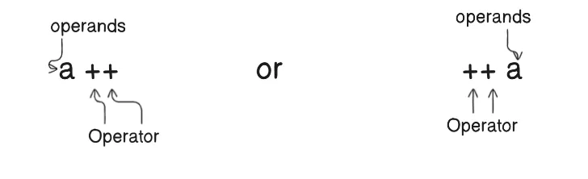
---

## Types of Operators in JavaScript

1. Assignment Operator  
2. Arithmetic Operator  
3. Comparison Operator  
4. Conditional Operator (Special Operator: ternary operator)  
5. Logical Operator  

---

### 1. Assignment Operator

The job of the assignment operator is to assign a value to a variable. The assignment operator is represented by the equal sign (`=`). The assignment operator can also be used to assign values to variables in a single line of code. For example, you can assign a value to a variable and then use that variable in an expression.

**Example:**  
`a = b` which means `a` holds the value of `b` (value of `b` is assigned to `a`).

```js
let a = 10;
let b = 5;

console.log(a); 
a = b; 

a = a + b; // 5 + 5 = 10

a = a - b; // 10 - 5 = 5

a = a * b; // 5 * 5 = 25

a = a / b; // 25 / 5 = 5

console.log(a); 
```

---

### 2. Arithmetic Operator

The job of the arithmetic operator is to perform an arithmetic operation on two numeric operands, which can be literals or variables. After performing the arithmetic operation, it provides a single numerical value.

**Basic Arithmetic Operators:** `+`, `-`, `*`, `/`, `%` (modulus operator), `++`, `--`

```js
a = b + c 
a = b - c
a = b * c
```
```js
a = b / c
a = b % c
```
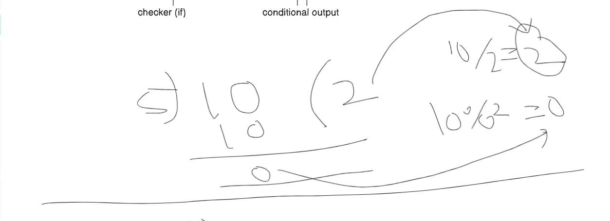

**Example:**

```js
let a = 10;
let b = 5;
let c;

c = a + b;

c = a - b;

c = a * b;

c = a / b;

c = a % b;
```
```js
c = a++;
```
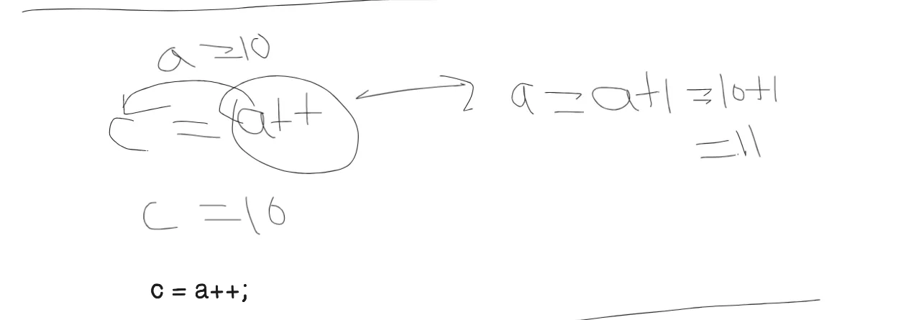

```js
c = ++a;
```
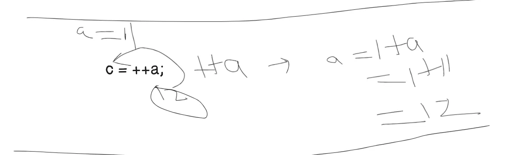

```js
c = a--;
```
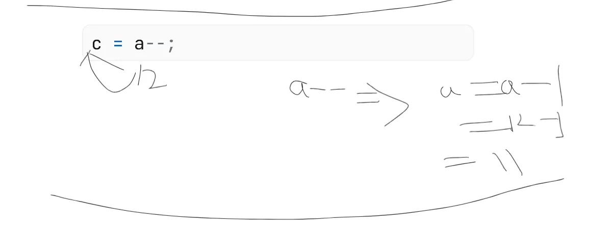

```js
c = --a;
console.log(c); 
```
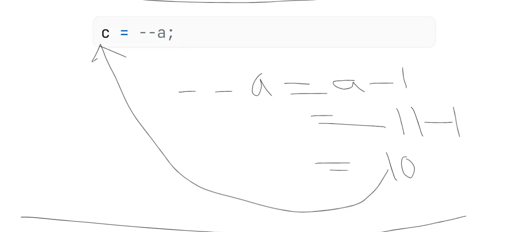
---

### 3. Comparison Operator

As the name suggests, this operator’s job is to compare the values of operands and return a logical value only if the comparison is true. These operands can be anything: string, number, object values. Conditional operators are mostly used with `if-else`, `else if` for comparing and returning required results.

**Basic Comparison Operators:** `==`, `===`, `!=`, `!==`, `>`, `<`, `>=`, `<=`

**Example:**

```js
let a = 7;
let b = 3;
let c = "3";
let d = 7;
let e; // storing output of comparison

e = a == b; // 7 == 3 = false

e = b == c; // 3 == "3" = true

e = a === d; // 7 === 7 = true

e = b === c; // 3 === "3" = false

e = c !== b;  // "3" !== 3 = !true = false

e = a > b;  // 7 > 3 = true

console.log(e); // true
```

---

### 4. Conditional Operator

The conditional operator is also known as the ternary operator. It is a shorthand way of writing an if-else statement. It takes three operands and returns one of the two values based on the condition.

**Example:**

```js
let a = true;
let b = false;

a ? console.log("A") : console.log("B");

b ? console.log("A") : console.log("B");

// Complex condition example for ternary operator:

let a = 10;
let b = 20;
let c = 30;
let d = 40;

a > b ? console.log("A") : b > c ? console.log("B") : c > d ? console.log("C") : console.log("D");
```
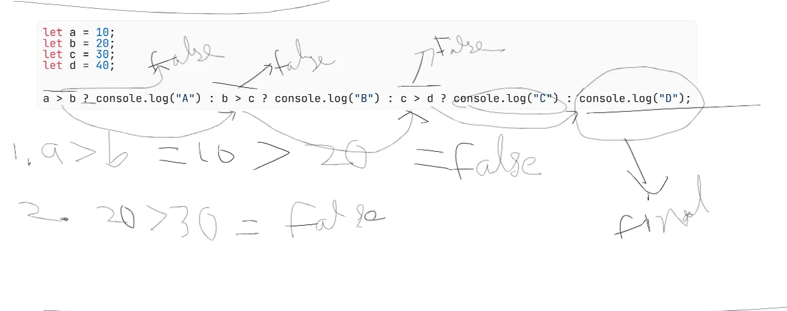
---

### 5. Logical Operator

The job of a logical operator is to compare two sets of operations and then return the Boolean value `true` or `false` depending on the operator.

**Logical operators:** `&&` (AND), `||` (OR), `!` (NOT)

There are three types of logical operators:

1. **Logical AND (`&&`)**: Compares two conditions or operands and returns value only if both of them are true.  
2. **Logical OR (`||`)**: Compares two conditions or operands and returns a value if any one of the two conditions is true.  
3. **Logical NOT (`!`)**: Compares one operand and returns `true` if the condition is not true.

**Example 1 (AND operator):**

```js
let a = 7;
let b = 3;

// AND operator
if (a > 5 && b < 2) {
    console.log("TRUE");
} else {
    console.log("FALSE");
}
```
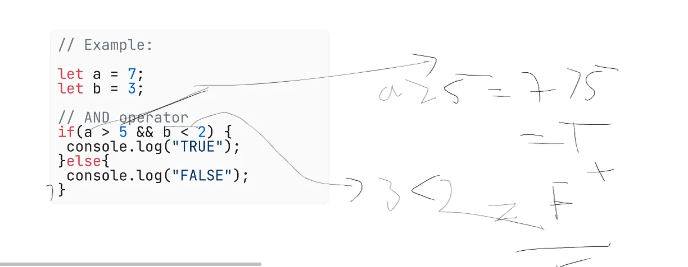

**Example 2 (OR operator):**

```js
let a = 7;
let b = 3;

if (a > 5 || b < 2) {
    console.log("TRUE");
} else {
    console.log("FALSE");
}
```
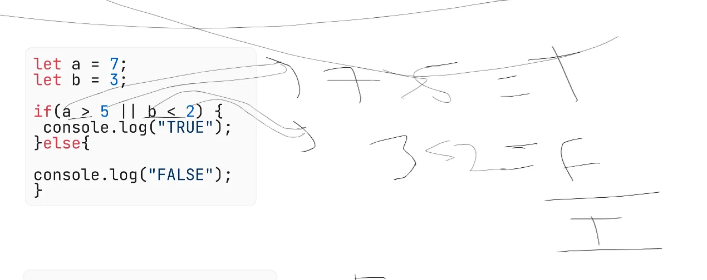
```js
if (b < 2 || a > 5) {
    console.log("TRUE");
} else {
    console.log("FALSE");
}
```
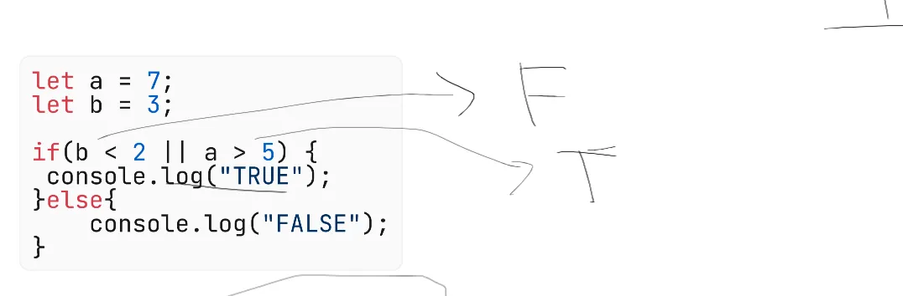
```js
if (b < 2 || a > 8) {
    console.log("TRUE");
} else {
    console.log("FALSE");
}
```


**Example 3 (NOT operator):**

```js
let a = 7;
let b = 3;

if (!(a > 5)) {
    console.log("TRUE");
} else {
    console.log("FALSE");
}
```
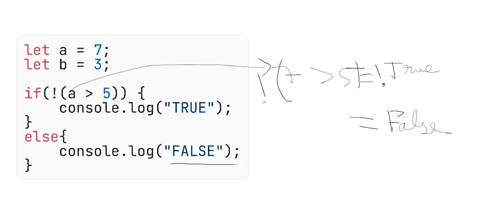
---

### `typeof` Operator

This operator returns the type of the variable value, such as `string`, `number`, `boolean`, `object`, etc.

**Example:**

```js
let a = 10;
let b = "hello";
let c = true;

let e = typeof a;
let f = typeof b;
let g = typeof c;

console.log(e); // number
console.log(f); // string
console.log(g); // boolean
```

---

### Practice Questions

1. What is the difference between `==` and `===` in JavaScript?  
2. Write a small snippet using the ternary operator that checks if a variable is positive, negative, or zero.  
3. Using logical operators (`&&`, `||`, `!`), write an if-else condition that checks if a person is eligible for a discount if they have a membership and a coupon.  

4. What will be the output of the following code? Explain your answer.
   ```js
   let x = "5";
   let y = 5;
   console.log(x == y);
   console.log(x === y);
   ```

5. Write a code snippet using the modulus operator (`%`) to check if a number is even or odd.

6. Use the logical NOT operator (`!`) to invert a boolean variable and print the result.

7. Given two variables, `a` and `b`, write a single line using the ternary operator to print the larger value.

8. What is the result of `typeof null` in JavaScript? Why?

9. Write an if-else statement using logical operators to check if a number is between 10 and 20 (inclusive).

10. Explain the difference between `a++` and `++a` with an example.

**Hint:** For question 3, you can combine conditions using `&&` or `||` and negate them with `!`.