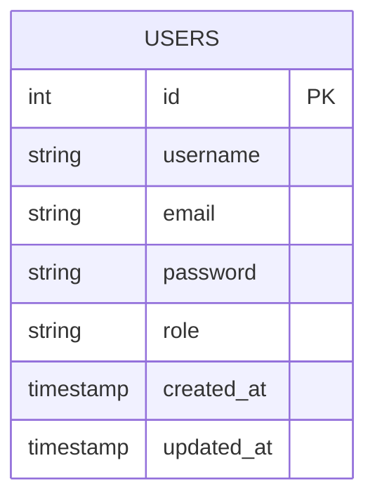

# Day 1: Project Initialization, Express Setup, PostgreSQL Connection, and User Registration Endpoint

## 🎯 Goal

Set up the basic project structure, establish a PostgreSQL connection, and implement the user registration endpoint.

## 📝 Tasks

1. Initialize the project and install necessary dependencies
2. Set up Express server with basic middleware
3. Create PostgreSQL connection pool
4. Design and implement the initial database schema
5. Create user registration endpoint
6. Set up error handling middleware

## 📂 Folder & File Structure

```
express_ecommerce/
├── config/
│   └── db.js
├── controllers/
│   └── authController.js
├── models/
│   └── userQueries.js
├── routes/
│   └── authRoutes.js
├── middleware/
│   └── errorHandler.js
├── utils/
├── app.js
├── server.js
├── .env
├── .env.example
├── .gitignore
└── package.json
```

## 📦 Dependencies to Install

```bash
npm init -y
npm install express pg dotenv cors bcrypt
npm install --save-dev nodemon
```

## 🖥️ Code Snippets

### package.json (Scripts)

```json
"scripts": {
  "start": "node server.js",
  "dev": "nodemon server.js"
}
```

### .env (Environment Variables)

```
PORT=3000
DB_USER=postgres
DB_PASSWORD=your_password
DB_HOST=localhost
DB_PORT=5432
DB_NAME=ecommerce_db
```

### .env.example

```
PORT=3000
DB_USER=your_username
DB_PASSWORD=your_password
DB_HOST=localhost
DB_PORT=5432
DB_NAME=your_database_name
```

### .gitignore

```
node_modules
.env
media/uploads/*
!media/uploads/.gitkeep
```

### config/db.js (PostgreSQL Connection Pool)

```javascript
const { Pool } = require('pg');
require('dotenv').config();

const pool = new Pool({
  user: process.env.DB_USER,
  password: process.env.DB_PASSWORD,
  host: process.env.DB_HOST,
  port: process.env.DB_PORT,
  database: process.env.DB_NAME
});

// Test the connection
pool.query('SELECT NOW()', (err, res) => {
  if (err) {
    console.error('Error connecting to the database:', err.message);
    return;
  }
  console.log('Connected to PostgreSQL database at:', res.rows[0].now);
});

module.exports = pool;
```

### app.js (Express App Setup)

```javascript
const express = require('express');
const cors = require('cors');
const authRoutes = require('./routes/authRoutes');
const errorHandler = require('./middleware/errorHandler');

// Initialize Express app
const app = express();

// Middleware
app.use(cors());
app.use(express.json());
app.use(express.urlencoded({ extended: true }));

// Routes
app.use('/api/auth', authRoutes);

// Basic route for testing
app.get('/', (req, res) => {
  res.json({ message: 'Welcome to the E-commerce API' });
});

// Error handling middleware
app.use(errorHandler);

module.exports = app;
```

### server.js (Server Entry Point)

```javascript
const app = require('./app');
require('dotenv').config();

const PORT = process.env.PORT || 3000;

app.listen(PORT, () => {
  console.log(`Server is running on port ${PORT}`);
});
```

### middleware/errorHandler.js

```javascript
const errorHandler = (err, req, res, next) => {
  console.error(err.stack);
  
  const statusCode = err.statusCode || 500;
  const message = err.message || 'Internal Server Error';
  
  res.status(statusCode).json({
    status: 'error',
    message: message
  });
};

module.exports = errorHandler;
```

### models/userQueries.js

```javascript
const pool = require('../config/db');

const userQueries = {
  // Create a new user
  createUser: async (username, email, password, role = 'user') => {
    const query = `
      INSERT INTO users (username, email, password, role)
      VALUES ($1, $2, $3, $4)
      RETURNING id, username, email, role, created_at
    `;
    
    const values = [username, email, password, role];
    
    try {
      const result = await pool.query(query, values);
      return result.rows[0];
    } catch (error) {
      throw error;
    }
  },
  
  // Check if a user exists by email
  findUserByEmail: async (email) => {
    const query = `
      SELECT * FROM users
      WHERE email = $1
    `;
    
    try {
      const result = await pool.query(query, [email]);
      return result.rows[0];
    } catch (error) {
      throw error;
    }
  }
};

module.exports = userQueries;
```

### controllers/authController.js

```javascript
const bcrypt = require('bcrypt');
const userQueries = require('../models/userQueries');

const authController = {
  // Register a new user
  register: async (req, res, next) => {
    try {
      const { username, email, password } = req.body;
      
      // Check if user already exists
      const existingUser = await userQueries.findUserByEmail(email);
      if (existingUser) {
        return res.status(400).json({ 
          status: 'error',
          message: 'User with this email already exists' 
        });
      }
      
      // Hash password
      const saltRounds = 10;
      const hashedPassword = await bcrypt.hash(password, saltRounds);
      
      // Create user with hashed password
      const newUser = await userQueries.createUser(
        username, 
        email, 
        hashedPassword
      );
      
      res.status(201).json({
        status: 'success',
        message: 'User registered successfully',
        data: {
          id: newUser.id,
          username: newUser.username,
          email: newUser.email,
          role: newUser.role,
          created_at: newUser.created_at
        }
      });
      
    } catch (error) {
      next(error);
    }
  }
};

module.exports = authController;
```

### routes/authRoutes.js

```javascript
const express = require('express');
const router = express.Router();
const authController = require('../controllers/authController');

// Register endpoint
router.post('/register', authController.register);

module.exports = router;
```

## 📊 Database Schema

### Initial Database Creation

```sql
CREATE DATABASE ecommerce_db;
```

### Users Table Creation

```sql
CREATE TABLE users (
  id SERIAL PRIMARY KEY,
  username VARCHAR(50) NOT NULL,
  email VARCHAR(100) UNIQUE NOT NULL,
  password VARCHAR(100) NOT NULL,
  role VARCHAR(20) NOT NULL DEFAULT 'user',
  created_at TIMESTAMP DEFAULT CURRENT_TIMESTAMP,
  updated_at TIMESTAMP DEFAULT CURRENT_TIMESTAMP
);

-- Index on email for faster user lookup
CREATE INDEX idx_users_email ON users(email);
```

## 📈 ER Diagram



## 🔒 Security & Validation Notes

- Passwords are hashed using bcrypt before storing in the database
- Basic validation for required fields (email, username, password)
- Email uniqueness is enforced at the database level

## 🧪 API Testing Tips

### Register User

```bash
# Using curl
curl -X POST http://localhost:3000/api/auth/register \
  -H "Content-Type: application/json" \
  -d '{"username":"testuser","email":"test@example.com","password":"password123"}'
```

## 🚀 Day 1 Implementation Steps

1. **Initialize your project**:
   - Create the project directory structure as shown above
   - Run `npm init -y` to create package.json
   - Install required dependencies

2. **Set up environment variables**:
   - Create `.env` and `.env.example` files
   - Add database configuration

3. **Create the PostgreSQL connection**:
   - Implement the database connection pool

4. **Set up Express app**:
   - Configure middleware
   - Set up error handling

5. **Create database schema**:
   - Connect to PostgreSQL and create the users table

6. **Implement user registration**:
   - Create the registration endpoint
   - Implement password hashing
   - Add basic validation

7. **Test the API**:
   - Use curl or Postman to test the registration endpoint

## 📝 Notes and Best Practices

- Always use parameterized queries to prevent SQL injection attacks
- Handle errors appropriately and provide meaningful error messages
- Use environment variables for sensitive information
- Create indexes for frequently queried fields
- Use proper HTTP status codes for API responses

## 🔄 Next Steps

Tomorrow, we'll implement user authentication with JWT/sessions and create the login endpoint.
