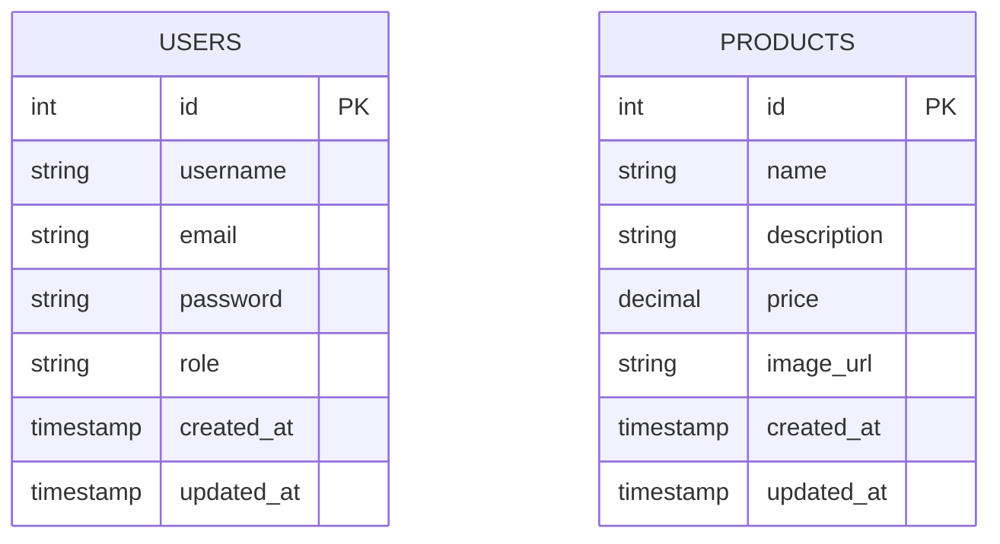

# Day 4: Product Management API with Image Upload

## 🎯 Goal

Implement the product management API, including CRUD operations for products and image upload functionality.

## 📝 Tasks

1. Set up the product table in the database
2. Configure Multer for image uploads
3. Create product model with SQL queries
4. Implement product controller with CRUD operations
5. Set up product routes with proper authorization
6. Create media directory for file uploads
7. Test product management flow

## 📂 Folder & File Structure (New/Updated Files)

```
express_ecommerce/
├── controllers/
│   └── productController.js (new)
├── models/
│   └── productQueries.js (new)
├── routes/
│   └── productRoutes.js (new)
├── utils/
│   └── upload.js (new)
├── media/
│   └── uploads/ (new directory)
└── app.js (updated)
```

## 📦 Dependencies to Install

```bash
npm install multer
```

## 🖥️ Code Snippets

### utils/upload.js (Multer Configuration)

```javascript
const multer = require('multer');
const path = require('path');
const fs = require('fs');

// Ensure uploads directory exists
const uploadDir = path.join(__dirname, '../media/uploads');
if (!fs.existsSync(uploadDir)) {
  fs.mkdirSync(uploadDir, { recursive: true });
}

// Configure storage
const storage = multer.diskStorage({
  destination: (req, file, cb) => {
    cb(null, uploadDir);
  },
  filename: (req, file, cb) => {
    // Create unique filename using timestamp and original extension
    const uniqueSuffix = Date.now() + '-' + Math.round(Math.random() * 1E9);
    const ext = path.extname(file.originalname);
    cb(null, 'product-' + uniqueSuffix + ext);
  }
});

// File filter - only allow images
const fileFilter = (req, file, cb) => {
  // Accept only image files
  if (file.mimetype.startsWith('image/')) {
    cb(null, true);
  } else {
    cb(new Error('Only image files are allowed!'), false);
  }
};

// Create multer upload middleware
const upload = multer({
  storage: storage,
  fileFilter: fileFilter,
  limits: {
    fileSize: 1024 * 1024 * 5 // 5 MB limit
  }
});

module.exports = upload;
```

### models/productQueries.js

```javascript
const pool = require('../config/db');

const productQueries = {
  // Create a new product
  createProduct: async (name, description, price, imageUrl) => {
    const query = `
      INSERT INTO products (name, description, price, image_url)
      VALUES ($1, $2, $3, $4)
      RETURNING *
    `;
    
    try {
      const result = await pool.query(query, [name, description, price, imageUrl]);
      return result.rows[0];
    } catch (error) {
      throw error;
    }
  },
  
  // Find all products (with pagination)
  findAllProducts: async (page = 1, limit = 10) => {
    const offset = (page - 1) * limit;
    
    const query = `
      SELECT * FROM products
      ORDER BY created_at DESC
      LIMIT $1 OFFSET $2
    `;
    
    const countQuery = `
      SELECT COUNT(*) FROM products
    `;
    
    try {
      const [result, countResult] = await Promise.all([
        pool.query(query, [limit, offset]),
        pool.query(countQuery)
      ]);
      
      const totalProducts = parseInt(countResult.rows[0].count);
      const totalPages = Math.ceil(totalProducts / limit);
      
      return {
        products: result.rows,
        pagination: {
          totalProducts,
          totalPages,
          currentPage: page,
          limit
        }
      };
    } catch (error) {
      throw error;
    }
  },
  
  // Find product by ID
  findProductById: async (id) => {
    const query = `
      SELECT * FROM products
      WHERE id = $1
    `;
    
    try {
      const result = await pool.query(query, [id]);
      return result.rows[0];
    } catch (error) {
      throw error;
    }
  },
  
  // Update product
  updateProduct: async (id, updateData) => {
    // Build dynamic query based on provided fields
    const fields = Object.keys(updateData).filter(key => updateData[key] !== undefined);
    
    if (fields.length === 0) {
      throw new Error('No update fields provided');
    }
    
    // Create SET part of query
    const setClause = fields
      .map((field, index) => `${field} = $${index + 1}`)
      .join(', ');
    
    // Add updated_at timestamp
    const query = `
      UPDATE products
      SET ${setClause}, updated_at = CURRENT_TIMESTAMP
      WHERE id = $${fields.length + 1}
      RETURNING *
    `;
    
    // Create values array
    const values = [...fields.map(field => updateData[field]), id];
    
    try {
      const result = await pool.query(query, values);
      return result.rows[0];
    } catch (error) {
      throw error;
    }
  },
  
  // Delete product
  deleteProduct: async (id) => {
    const query = `
      DELETE FROM products
      WHERE id = $1
      RETURNING *
    `;
    
    try {
      const result = await pool.query(query, [id]);
      return result.rows[0];
    } catch (error) {
      throw error;
    }
  },
  
  // Search products by name or description
  searchProducts: async (searchTerm, page = 1, limit = 10) => {
    const offset = (page - 1) * limit;
    
    const query = `
      SELECT * FROM products
      WHERE name ILIKE $1 OR description ILIKE $1
      ORDER BY created_at DESC
      LIMIT $2 OFFSET $3
    `;
    
    const countQuery = `
      SELECT COUNT(*) FROM products
      WHERE name ILIKE $1 OR description ILIKE $1
    `;
    
    const searchPattern = `%${searchTerm}%`;
    
    try {
      const [result, countResult] = await Promise.all([
        pool.query(query, [searchPattern, limit, offset]),
        pool.query(countQuery, [searchPattern])
      ]);
      
      const totalProducts = parseInt(countResult.rows[0].count);
      const totalPages = Math.ceil(totalProducts / limit);
      
      return {
        products: result.rows,
        pagination: {
          totalProducts,
          totalPages,
          currentPage: page,
          limit
        }
      };
    } catch (error) {
      throw error;
    }
  }
};

module.exports = productQueries;
```

### controllers/productController.js

```javascript
const fs = require('fs');
const path = require('path');
const { validationResult } = require('express-validator');
const productQueries = require('../models/productQueries');

const productController = {
  // Create a new product
  createProduct: async (req, res, next) => {
    try {
      const errors = validationResult(req);
      if (!errors.isEmpty()) {
        // Delete the uploaded file if validation fails
        if (req.file) {
          fs.unlinkSync(req.file.path);
        }
        
        return res.status(400).json({
          status: 'error',
          errors: errors.array()
        });
      }
      
      const { name, description, price } = req.body;
      
      // Get image url if file was uploaded
      let imageUrl = null;
      if (req.file) {
        // Store relative path to the file
        imageUrl = `/uploads/${req.file.filename}`;
      }
      
      // Create product in database
      const product = await productQueries.createProduct(
        name,
        description,
        parseFloat(price),
        imageUrl
      );
      
      res.status(201).json({
        status: 'success',
        message: 'Product created successfully',
        data: { product }
      });
      
    } catch (error) {
      // Delete the uploaded file if an error occurs
      if (req.file) {
        fs.unlinkSync(req.file.path);
      }
      
      next(error);
    }
  },
  
  // Get all products
  getAllProducts: async (req, res, next) => {
    try {
      // Parse pagination parameters
      const page = parseInt(req.query.page) || 1;
      const limit = parseInt(req.query.limit) || 10;
      
      if (page < 1 || limit < 1 || limit > 100) {
        return res.status(400).json({
          status: 'error',
          message: 'Invalid pagination parameters'
        });
      }
      
      const result = await productQueries.findAllProducts(page, limit);
      
      res.status(200).json({
        status: 'success',
        data: {
          products: result.products,
          pagination: result.pagination
        }
      });
      
    } catch (error) {
      next(error);
    }
  },
  
  // Get product by ID
  getProductById: async (req, res, next) => {
    try {
      const { id } = req.params;
      
      const product = await productQueries.findProductById(id);
      
      if (!product) {
        return res.status(404).json({
          status: 'error',
          message: 'Product not found'
        });
      }
      
      res.status(200).json({
        status: 'success',
        data: { product }
      });
      
    } catch (error) {
      next(error);
    }
  },
  
  // Update product
  updateProduct: async (req, res, next) => {
    try {
      const errors = validationResult(req);
      if (!errors.isEmpty()) {
        // Delete the uploaded file if validation fails
        if (req.file) {
          fs.unlinkSync(req.file.path);
        }
        
        return res.status(400).json({
          status: 'error',
          errors: errors.array()
        });
      }
      
      const { id } = req.params;
      const { name, description, price } = req.body;
      
      // Check if product exists
      const existingProduct = await productQueries.findProductById(id);
      
      if (!existingProduct) {
        // Delete the uploaded file if product doesn't exist
        if (req.file) {
          fs.unlinkSync(req.file.path);
        }
        
        return res.status(404).json({
          status: 'error',
          message: 'Product not found'
        });
      }
      
      // Prepare update data
      const updateData = {};
      
      if (name !== undefined) updateData.name = name;
      if (description !== undefined) updateData.description = description;
      if (price !== undefined) updateData.price = parseFloat(price);
      
      // Handle image update if file was uploaded
      if (req.file) {
        // Store relative path to the new file
        updateData.image_url = `/uploads/${req.file.filename}`;
        
        // Delete old image if exists
        if (existingProduct.image_url) {
          const oldImagePath = path.join(
            __dirname,
            '..',
            'media',
            existingProduct.image_url
          );
          
          if (fs.existsSync(oldImagePath)) {
            fs.unlinkSync(oldImagePath);
          }
        }
      }
      
      // Update product in database
      const updatedProduct = await productQueries.updateProduct(id, updateData);
      
      res.status(200).json({
        status: 'success',
        message: 'Product updated successfully',
        data: { product: updatedProduct }
      });
      
    } catch (error) {
      // Delete the uploaded file if an error occurs
      if (req.file) {
        fs.unlinkSync(req.file.path);
      }
      
      next(error);
    }
  },
  
  // Delete product
  deleteProduct: async (req, res, next) => {
    try {
      const { id } = req.params;
      
      // Check if product exists
      const existingProduct = await productQueries.findProductById(id);
      
      if (!existingProduct) {
        return res.status(404).json({
          status: 'error',
          message: 'Product not found'
        });
      }
      
      // Delete the product image if it exists
      if (existingProduct.image_url) {
        const imagePath = path.join(
          __dirname,
          '..',
          'media',
          existingProduct.image_url
        );
        
        if (fs.existsSync(imagePath)) {
          fs.unlinkSync(imagePath);
        }
      }
      
      // Delete product from database
      const deletedProduct = await productQueries.deleteProduct(id);
      
      res.status(200).json({
        status: 'success',
        message: 'Product deleted successfully',
        data: { product: deletedProduct }
      });
      
    } catch (error) {
      next(error);
    }
  },
  
  // Search products
  searchProducts: async (req, res, next) => {
    try {
      const { query } = req.query;
      
      if (!query || query.trim() === '') {
        return res.status(400).json({
          status: 'error',
          message: 'Search query is required'
        });
      }
      
      // Parse pagination parameters
      const page = parseInt(req.query.page) || 1;
      const limit = parseInt(req.query.limit) || 10;
      
      if (page < 1 || limit < 1 || limit > 100) {
        return res.status(400).json({
          status: 'error',
          message: 'Invalid pagination parameters'
        });
      }
      
      const result = await productQueries.searchProducts(query, page, limit);
      
      res.status(200).json({
        status: 'success',
        data: {
          products: result.products,
          pagination: result.pagination
        }
      });
      
    } catch (error) {
      next(error);
    }
  }
};

module.exports = productController;
```

### routes/productRoutes.js

```javascript
const express = require('express');
const { body } = require('express-validator');
const router = express.Router();
const productController = require('../controllers/productController');
const authenticate = require('../middleware/auth');
const { checkRole } = require('../middleware/roleCheck');
const upload = require('../utils/upload');

// Product validation middleware
const productValidation = [
  body('name').notEmpty().withMessage('Product name is required'),
  body('description').notEmpty().withMessage('Product description is required'),
  body('price')
    .isFloat({ gt: 0 })
    .withMessage('Product price must be a positive number')
];

// Public routes - anyone can view products
router.get('/', productController.getAllProducts);
router.get('/search', productController.searchProducts);
router.get('/:id', productController.getProductById);

// Protected routes - only admin can manage products
router.post(
  '/',
  authenticate,
  checkRole(['admin']),
  upload.single('image'),
  productValidation,
  productController.createProduct
);

router.patch(
  '/:id',
  authenticate,
  checkRole(['admin']),
  upload.single('image'),
  productController.updateProduct
);

router.delete(
  '/:id',
  authenticate,
  checkRole(['admin']),
  productController.deleteProduct
);

module.exports = router;
```

### app.js (Updated)

```javascript
const express = require('express');
const cors = require('cors');
const path = require('path');
const authRoutes = require('./routes/authRoutes');
const adminRoutes = require('./routes/adminRoutes');
const productRoutes = require('./routes/productRoutes');
const errorHandler = require('./middleware/errorHandler');

// Initialize Express app
const app = express();

// Middleware
app.use(cors());
app.use(express.json());
app.use(express.urlencoded({ extended: true }));

// Serve uploaded files statically
app.use('/uploads', express.static(path.join(__dirname, 'media/uploads')));

// Routes
app.use('/api/auth', authRoutes);
app.use('/api/admin', adminRoutes);
app.use('/api/products', productRoutes);

// Basic route for testing
app.get('/', (req, res) => {
  res.json({ message: 'Welcome to the E-commerce API' });
});

// Error handling middleware
app.use(errorHandler);

module.exports = app;
```

## 📊 Database Schema Update

```sql
-- Create products table
CREATE TABLE products (
  id SERIAL PRIMARY KEY,
  name VARCHAR(100) NOT NULL,
  description TEXT NOT NULL,
  price DECIMAL(10, 2) NOT NULL,
  image_url VARCHAR(255),
  created_at TIMESTAMP DEFAULT CURRENT_TIMESTAMP,
  updated_at TIMESTAMP DEFAULT CURRENT_TIMESTAMP
);

-- Create index on product name for faster search
CREATE INDEX idx_products_name ON products(name);
```

## 📈 ER Diagram



## 🔒 Security & Validation Notes

- Only admin users can create, update, or delete products
- Input validation for product fields ensures data integrity
- File upload validation ensures only images are accepted
- Maximum file size limited to 5MB
- Unique filenames prevent overwriting
- Old images are deleted when updated to prevent storage waste
- All file paths are properly sanitized

## 🧪 API Testing Tips

### Create Product (Admin Only)

```bash
# Using curl (replace ADMIN_JWT_TOKEN with actual token)
curl -X POST http://localhost:3000/api/products \
  -H "Authorization: Bearer ADMIN_JWT_TOKEN" \
  -F "name=Test Product" \
  -F "description=This is a test product" \
  -F "price=29.99" \
  -F "image=@/path/to/image.jpg"
```

### Get All Products (Public)

```bash
# Using curl
curl -X GET "http://localhost:3000/api/products?page=1&limit=10"
```

### Get Product by ID (Public)

```bash
# Using curl (replace PRODUCT_ID with actual ID)
curl -X GET http://localhost:3000/api/products/PRODUCT_ID
```

### Update Product (Admin Only)

```bash
# Using curl (replace ADMIN_JWT_TOKEN and PRODUCT_ID with actual values)
curl -X PATCH http://localhost:3000/api/products/PRODUCT_ID \
  -H "Authorization: Bearer ADMIN_JWT_TOKEN" \
  -F "name=Updated Product" \
  -F "price=39.99"
```

### Delete Product (Admin Only)

```bash
# Using curl (replace ADMIN_JWT_TOKEN and PRODUCT_ID with actual values)
curl -X DELETE http://localhost:3000/api/products/PRODUCT_ID \
  -H "Authorization: Bearer ADMIN_JWT_TOKEN"
```

### Search Products (Public)

```bash
# Using curl
curl -X GET "http://localhost:3000/api/products/search?query=test&page=1&limit=10"
```

## 🚀 Day 4 Implementation Steps

1. **Set up database table**:
   - Create the products table with appropriate fields
   - Add index on product name for faster searches

2. **Set up file uploads**:
   - Install multer package
   - Configure upload storage and file filtering
   - Create uploads directory

3. **Create product model**:
   - Implement SQL queries for CRUD operations
   - Add search functionality
   - Include pagination

4. **Build product controller**:
   - Implement product management operations
   - Handle image uploads and storage
   - Add proper error handling

5. **Create product routes**:
   - Set up public routes for product viewing
   - Protect management routes with authentication and role checks
   - Configure file upload middleware

6. **Update main app**:
   - Register product routes
   - Set up static file serving for uploaded images

7. **Test product functionality**:
   - Create, read, update, and delete products
   - Test image uploads
   - Verify role-based access control

## 📝 Notes and Best Practices

- Store only relative image paths in the database, not absolute paths
- Clean up uploaded files if an error occurs during processing
- Remove old images when updating products to manage storage
- Apply validation both at route level and within the controller
- Use pagination for listing products to improve performance
- Apply proper error handling for file operations

## 🔄 Next Steps

On Day 5, we'll implement the shopping cart functionality.
