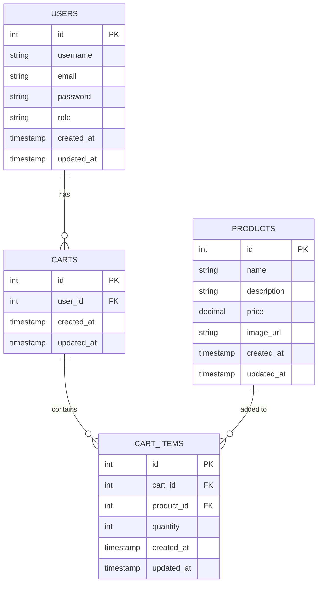

# Day 5: Shopping Cart Implementation

## 🎯 Goal

Implement shopping cart functionality that allows users to add products to their cart, update quantities, and manage cart items.

## 📝 Tasks

1. Create cart and cart_items tables in the database
2. Implement cart model with SQL queries
3. Build cart controller with CRUD operations
4. Set up cart routes with authentication
5. Test cart functionality

## 📂 Folder & File Structure (New/Updated Files)

```
express_ecommerce/
├── controllers/
│   └── cartController.js (new)
├── models/
│   └── cartQueries.js (new)
├── routes/
│   └── cartRoutes.js (new)
└── app.js (updated)
```

## 🖥️ Code Snippets

### models/cartQueries.js

```javascript
const pool = require('../config/db');

const cartQueries = {
  // Get user's cart (will create one if it doesn't exist)
  getUserCart: async (userId) => {
    // First, check if user has a cart
    const cartQuery = `
      SELECT * FROM carts
      WHERE user_id = $1
    `;
    
    try {
      let cartResult = await pool.query(cartQuery, [userId]);
      let cart;
      
      // If cart doesn't exist, create one
      if (cartResult.rows.length === 0) {
        const createCartQuery = `
          INSERT INTO carts (user_id)
          VALUES ($1)
          RETURNING *
        `;
        
        cartResult = await pool.query(createCartQuery, [userId]);
      }
      
      cart = cartResult.rows[0];
      
      // Get cart items with product details
      const cartItemsQuery = `
        SELECT ci.id, ci.product_id, ci.quantity, ci.created_at, 
               p.name, p.description, p.price, p.image_url
        FROM cart_items ci
        JOIN products p ON ci.product_id = p.id
        WHERE ci.cart_id = $1
        ORDER BY ci.created_at DESC
      `;
      
      const cartItemsResult = await pool.query(cartItemsQuery, [cart.id]);
      
      // Calculate total price
      let totalPrice = 0;
      cartItemsResult.rows.forEach(item => {
        totalPrice += parseFloat(item.price) * item.quantity;
      });
      
      return {
        id: cart.id,
        user_id: cart.user_id,
        created_at: cart.created_at,
        updated_at: cart.updated_at,
        items: cartItemsResult.rows,
        total_price: parseFloat(totalPrice.toFixed(2)),
        item_count: cartItemsResult.rows.length
      };
      
    } catch (error) {
      throw error;
    }
  },
  
  // Add item to cart
  addItemToCart: async (cartId, productId, quantity) => {
    // Check if product exists
    const productQuery = `
      SELECT * FROM products
      WHERE id = $1
    `;
    
    try {
      const productResult = await pool.query(productQuery, [productId]);
      
      if (productResult.rows.length === 0) {
        throw new Error('Product not found');
      }
      
      // Check if item already in cart
      const existingItemQuery = `
        SELECT * FROM cart_items
        WHERE cart_id = $1 AND product_id = $2
      `;
      
      const existingItemResult = await pool.query(existingItemQuery, [cartId, productId]);
      
      let cartItem;
      
      if (existingItemResult.rows.length > 0) {
        // Update quantity if item exists
        const newQuantity = existingItemResult.rows[0].quantity + quantity;
        
        const updateQuery = `
          UPDATE cart_items
          SET quantity = $1, updated_at = CURRENT_TIMESTAMP
          WHERE cart_id = $2 AND product_id = $3
          RETURNING *
        `;
        
        const updateResult = await pool.query(updateQuery, [newQuantity, cartId, productId]);
        cartItem = updateResult.rows[0];
        
      } else {
        // Add new item if it doesn't exist
        const insertQuery = `
          INSERT INTO cart_items (cart_id, product_id, quantity)
          VALUES ($1, $2, $3)
          RETURNING *
        `;
        
        const insertResult = await pool.query(insertQuery, [cartId, productId, quantity]);
        cartItem = insertResult.rows[0];
      }
      
      // Update cart's updated_at timestamp
      await pool.query(
        'UPDATE carts SET updated_at = CURRENT_TIMESTAMP WHERE id = $1',
        [cartId]
      );
      
      // Get product details for the response
      const product = productResult.rows[0];
      
      return {
        id: cartItem.id,
        product_id: cartItem.product_id,
        quantity: cartItem.quantity,
        name: product.name,
        price: product.price,
        image_url: product.image_url,
        total_price: parseFloat((product.price * cartItem.quantity).toFixed(2))
      };
      
    } catch (error) {
      throw error;
    }
  },
  
  // Update cart item quantity
  updateCartItemQuantity: async (cartId, itemId, quantity) => {
    // Check if item exists and belongs to the cart
    const checkQuery = `
      SELECT ci.*, p.price, p.name, p.image_url
      FROM cart_items ci
      JOIN products p ON ci.product_id = p.id
      WHERE ci.id = $1 AND ci.cart_id = $2
    `;
    
    try {
      const checkResult = await pool.query(checkQuery, [itemId, cartId]);
      
      if (checkResult.rows.length === 0) {
        throw new Error('Cart item not found');
      }
      
      // Update quantity
      const updateQuery = `
        UPDATE cart_items
        SET quantity = $1, updated_at = CURRENT_TIMESTAMP
        WHERE id = $2
        RETURNING *
      `;
      
      const updateResult = await pool.query(updateQuery, [quantity, itemId]);
      const updatedItem = updateResult.rows[0];
      
      // Update cart's updated_at timestamp
      await pool.query(
        'UPDATE carts SET updated_at = CURRENT_TIMESTAMP WHERE id = $1',
        [cartId]
      );
      
      // Get product details
      const product = checkResult.rows[0];
      
      return {
        id: updatedItem.id,
        product_id: updatedItem.product_id,
        quantity: updatedItem.quantity,
        name: product.name,
        price: product.price,
        image_url: product.image_url,
        total_price: parseFloat((product.price * updatedItem.quantity).toFixed(2))
      };
      
    } catch (error) {
      throw error;
    }
  },
  
  // Remove item from cart
  removeCartItem: async (cartId, itemId) => {
    // Check if item exists and belongs to the cart
    const checkQuery = `
      SELECT *
      FROM cart_items
      WHERE id = $1 AND cart_id = $2
    `;
    
    try {
      const checkResult = await pool.query(checkQuery, [itemId, cartId]);
      
      if (checkResult.rows.length === 0) {
        throw new Error('Cart item not found');
      }
      
      // Delete the item
      const deleteQuery = `
        DELETE FROM cart_items
        WHERE id = $1
        RETURNING *
      `;
      
      const deleteResult = await pool.query(deleteQuery, [itemId]);
      
      // Update cart's updated_at timestamp
      await pool.query(
        'UPDATE carts SET updated_at = CURRENT_TIMESTAMP WHERE id = $1',
        [cartId]
      );
      
      return deleteResult.rows[0];
      
    } catch (error) {
      throw error;
    }
  },
  
  // Clear all items from cart
  clearCart: async (cartId) => {
    const query = `
      DELETE FROM cart_items
      WHERE cart_id = $1
      RETURNING *
    `;
    
    try {
      const result = await pool.query(query, [cartId]);
      
      // Update cart's updated_at timestamp
      await pool.query(
        'UPDATE carts SET updated_at = CURRENT_TIMESTAMP WHERE id = $1',
        [cartId]
      );
      
      return result.rows;
      
    } catch (error) {
      throw error;
    }
  },
  
  // Get cart by ID
  getCartById: async (cartId) => {
    const query = `
      SELECT * FROM carts
      WHERE id = $1
    `;
    
    try {
      const result = await pool.query(query, [cartId]);
      return result.rows[0];
    } catch (error) {
      throw error;
    }
  },
  
  // Check if user owns the cart
  isCartOwner: async (userId, cartId) => {
    const query = `
      SELECT * FROM carts
      WHERE id = $1 AND user_id = $2
    `;
    
    try {
      const result = await pool.query(query, [cartId, userId]);
      return result.rows.length > 0;
    } catch (error) {
      throw error;
    }
  }
};

module.exports = cartQueries;
```

### controllers/cartController.js

```javascript
const { validationResult } = require('express-validator');
const cartQueries = require('../models/cartQueries');
const productQueries = require('../models/productQueries');

const cartController = {
  // Get current user's cart
  getCart: async (req, res, next) => {
    try {
      const userId = req.user.id;
      
      const cart = await cartQueries.getUserCart(userId);
      
      res.status(200).json({
        status: 'success',
        data: { cart }
      });
      
    } catch (error) {
      next(error);
    }
  },
  
  // Add item to cart
  addItem: async (req, res, next) => {
    try {
      const errors = validationResult(req);
      if (!errors.isEmpty()) {
        return res.status(400).json({
          status: 'error',
          errors: errors.array()
        });
      }
      
      const userId = req.user.id;
      const { productId, quantity } = req.body;
      
      // Verify product exists
      const product = await productQueries.findProductById(productId);
      if (!product) {
        return res.status(404).json({
          status: 'error',
          message: 'Product not found'
        });
      }
      
      // Get user's cart (creates one if it doesn't exist)
      const userCart = await cartQueries.getUserCart(userId);
      
      // Add item to cart
      const cartItem = await cartQueries.addItemToCart(
        userCart.id,
        productId,
        quantity || 1
      );
      
      res.status(200).json({
        status: 'success',
        message: 'Item added to cart',
        data: { cartItem }
      });
      
    } catch (error) {
      next(error);
    }
  },
  
  // Update cart item quantity
  updateItemQuantity: async (req, res, next) => {
    try {
      const errors = validationResult(req);
      if (!errors.isEmpty()) {
        return res.status(400).json({
          status: 'error',
          errors: errors.array()
        });
      }
      
      const userId = req.user.id;
      const { itemId } = req.params;
      const { quantity } = req.body;
      
      if (quantity < 1) {
        return res.status(400).json({
          status: 'error',
          message: 'Quantity must be at least 1'
        });
      }
      
      // Get user's cart
      const userCart = await cartQueries.getUserCart(userId);
      
      // Verify cart ownership
      if (!await cartQueries.isCartOwner(userId, userCart.id)) {
        return res.status(403).json({
          status: 'error',
          message: 'You do not have permission to modify this cart'
        });
      }
      
      // Update item quantity
      const updatedItem = await cartQueries.updateCartItemQuantity(
        userCart.id,
        itemId,
        quantity
      );
      
      res.status(200).json({
        status: 'success',
        message: 'Cart item updated',
        data: { cartItem: updatedItem }
      });
      
    } catch (error) {
      if (error.message === 'Cart item not found') {
        return res.status(404).json({
          status: 'error',
          message: 'Cart item not found'
        });
      }
      
      next(error);
    }
  },
  
  // Remove item from cart
  removeItem: async (req, res, next) => {
    try {
      const userId = req.user.id;
      const { itemId } = req.params;
      
      // Get user's cart
      const userCart = await cartQueries.getUserCart(userId);
      
      // Verify cart ownership
      if (!await cartQueries.isCartOwner(userId, userCart.id)) {
        return res.status(403).json({
          status: 'error',
          message: 'You do not have permission to modify this cart'
        });
      }
      
      // Remove item from cart
      await cartQueries.removeCartItem(userCart.id, itemId);
      
      res.status(200).json({
        status: 'success',
        message: 'Item removed from cart'
      });
      
    } catch (error) {
      if (error.message === 'Cart item not found') {
        return res.status(404).json({
          status: 'error',
          message: 'Cart item not found'
        });
      }
      
      next(error);
    }
  },
  
  // Clear cart
  clearCart: async (req, res, next) => {
    try {
      const userId = req.user.id;
      
      // Get user's cart
      const userCart = await cartQueries.getUserCart(userId);
      
      // Clear all items
      await cartQueries.clearCart(userCart.id);
      
      res.status(200).json({
        status: 'success',
        message: 'Cart cleared successfully'
      });
      
    } catch (error) {
      next(error);
    }
  }
};

module.exports = cartController;
```

### routes/cartRoutes.js

```javascript
const express = require('express');
const { body } = require('express-validator');
const router = express.Router();
const cartController = require('../controllers/cartController');
const authenticate = require('../middleware/auth');

// All cart routes require authentication
router.use(authenticate);

// Get current user's cart
router.get('/', cartController.getCart);

// Add item to cart
router.post(
  '/items',
  [
    body('productId').isInt({ min: 1 }).withMessage('Valid product ID is required'),
    body('quantity').optional().isInt({ min: 1 }).withMessage('Quantity must be a positive integer')
  ],
  cartController.addItem
);

// Update cart item quantity
router.patch(
  '/items/:itemId',
  [
    body('quantity').isInt({ min: 1 }).withMessage('Quantity must be a positive integer')
  ],
  cartController.updateItemQuantity
);

// Remove item from cart
router.delete('/items/:itemId', cartController.removeItem);

// Clear cart
router.delete('/', cartController.clearCart);

module.exports = router;
```

### app.js (Updated)

```javascript
const express = require('express');
const cors = require('cors');
const path = require('path');
const authRoutes = require('./routes/authRoutes');
const adminRoutes = require('./routes/adminRoutes');
const productRoutes = require('./routes/productRoutes');
const cartRoutes = require('./routes/cartRoutes');
const errorHandler = require('./middleware/errorHandler');

// Initialize Express app
const app = express();

// Middleware
app.use(cors());
app.use(express.json());
app.use(express.urlencoded({ extended: true }));

// Serve uploaded files statically
app.use('/uploads', express.static(path.join(__dirname, 'media/uploads')));

// Routes
app.use('/api/auth', authRoutes);
app.use('/api/admin', adminRoutes);
app.use('/api/products', productRoutes);
app.use('/api/cart', cartRoutes);

// Basic route for testing
app.get('/', (req, res) => {
  res.json({ message: 'Welcome to the E-commerce API' });
});

// Error handling middleware
app.use(errorHandler);

module.exports = app;
```

## 📊 Database Schema Update

```sql
-- Create carts table
CREATE TABLE carts (
  id SERIAL PRIMARY KEY,
  user_id INTEGER NOT NULL,
  created_at TIMESTAMP DEFAULT CURRENT_TIMESTAMP,
  updated_at TIMESTAMP DEFAULT CURRENT_TIMESTAMP,
  FOREIGN KEY (user_id) REFERENCES users(id) ON DELETE CASCADE
);

-- Create cart_items table
CREATE TABLE cart_items (
  id SERIAL PRIMARY KEY,
  cart_id INTEGER NOT NULL,
  product_id INTEGER NOT NULL,
  quantity INTEGER NOT NULL DEFAULT 1,
  created_at TIMESTAMP DEFAULT CURRENT_TIMESTAMP,
  updated_at TIMESTAMP DEFAULT CURRENT_TIMESTAMP,
  FOREIGN KEY (cart_id) REFERENCES carts(id) ON DELETE CASCADE,
  FOREIGN KEY (product_id) REFERENCES products(id) ON DELETE CASCADE
);

-- Create indexes for faster queries
CREATE INDEX idx_carts_user_id ON carts(user_id);
CREATE INDEX idx_cart_items_cart_id ON cart_items(cart_id);
CREATE INDEX idx_cart_items_product_id ON cart_items(product_id);

-- Add unique constraint to prevent duplicate products in cart
CREATE UNIQUE INDEX idx_cart_items_unique ON cart_items(cart_id, product_id);
```

## 📈 ER Diagram



## 🔒 Security & Validation Notes

- All cart operations require user authentication
- Users can only access and modify their own carts
- Input validation ensures valid product IDs and quantities
- Foreign key constraints maintain data integrity
- Unique constraint prevents duplicate products in cart
- Cart operations are atomic and handle failures gracefully

## 🧪 API Testing Tips

### Get User's Cart

```bash
# Using curl (replace USER_JWT_TOKEN with actual token)
curl -X GET http://localhost:3000/api/cart \
  -H "Authorization: Bearer USER_JWT_TOKEN"
```

### Add Item to Cart

```bash
# Using curl (replace USER_JWT_TOKEN with actual token)
curl -X POST http://localhost:3000/api/cart/items \
  -H "Authorization: Bearer USER_JWT_TOKEN" \
  -H "Content-Type: application/json" \
  -d '{"productId":1,"quantity":2}'
```

### Update Cart Item Quantity

```bash
# Using curl (replace USER_JWT_TOKEN and ITEM_ID with actual values)
curl -X PATCH http://localhost:3000/api/cart/items/ITEM_ID \
  -H "Authorization: Bearer USER_JWT_TOKEN" \
  -H "Content-Type: application/json" \
  -d '{"quantity":3}'
```

### Remove Item from Cart

```bash
# Using curl (replace USER_JWT_TOKEN and ITEM_ID with actual values)
curl -X DELETE http://localhost:3000/api/cart/items/ITEM_ID \
  -H "Authorization: Bearer USER_JWT_TOKEN"
```

### Clear Cart

```bash
# Using curl (replace USER_JWT_TOKEN with actual token)
curl -X DELETE http://localhost:3000/api/cart \
  -H "Authorization: Bearer USER_JWT_TOKEN"
```

## 🚀 Day 5 Implementation Steps

1. **Set up database tables**:
   - Create carts table linked to users
   - Create cart_items table linked to carts and products
   - Add appropriate indexes and constraints

2. **Create cart model**:
   - Implement SQL queries for cart operations
   - Add methods for managing cart items
   - Include calculations for totals and counts

3. **Build cart controller**:
   - Implement cart management operations
   - Handle validation and errors
   - Ensure proper authentication and authorization

4. **Create cart routes**:
   - Set up routes for cart operations
   - Apply authentication middleware
   - Add validation for inputs

5. **Update main app**:
   - Register cart routes

6. **Test cart functionality**:
   - Test adding items to cart
   - Test updating quantities
   - Test removing items
   - Test clearing cart
   - Verify authorization rules

## 📝 Notes and Best Practices

- Design cart system for persistence rather than session-based storage
- Handle edge cases like adding duplicate items by updating quantity
- Use transactions for operations that modify multiple tables
- Create appropriate indexes for frequently queried fields
- Include proper error messages for invalid operations
- Format monetary values consistently with 2 decimal places

## 🔄 Next Steps

On Day 6, we'll implement order processing and management.
