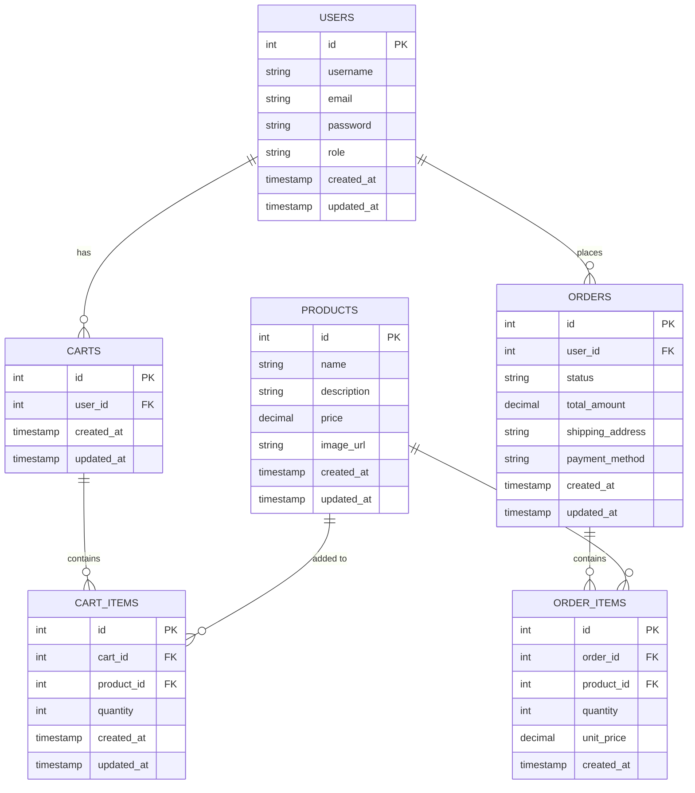

# Day 6: Order Processing and Management

## 🎯 Goal

Implement order processing functionality that allows users to create orders from their cart, and provides administrators with order management capabilities.

## 📝 Tasks

1. Create orders and order_items tables in the database
2. Implement order model with SQL queries
3. Build order controller for creating and viewing orders
4. Set up order routes with authentication and role-based access
5. Implement cart-to-order conversion
6. Test order processing flow

## 📂 Folder & File Structure (New/Updated Files)

```
express_ecommerce/
├── controllers/
│   └── orderController.js (new)
├── models/
│   └── orderQueries.js (new)
├── routes/
│   └── orderRoutes.js (new)
└── app.js (updated)
```

## 🖥️ Code Snippets

### models/orderQueries.js

```javascript
const pool = require('../config/db');

const orderQueries = {
  // Create a new order from cart
  createOrderFromCart: async (userId, cartId, shippingAddress, paymentMethod) => {
    // Start a transaction
    const client = await pool.connect();
    
    try {
      await client.query('BEGIN');
      
      // Get cart with items
      const cartQuery = `
        SELECT c.id as cart_id, c.user_id,
               ci.id as item_id, ci.product_id, ci.quantity,
               p.price, p.name
        FROM carts c
        JOIN cart_items ci ON c.id = ci.cart_id
        JOIN products p ON ci.product_id = p.id
        WHERE c.id = $1 AND c.user_id = $2
      `;
      
      const cartResult = await client.query(cartQuery, [cartId, userId]);
      
      // If cart is empty, throw error
      if (cartResult.rows.length === 0) {
        throw new Error('Cart is empty');
      }
      
      // Calculate total price
      let totalAmount = 0;
      cartResult.rows.forEach(item => {
        totalAmount += parseFloat(item.price) * item.quantity;
      });
      
      // Round to 2 decimal places
      totalAmount = parseFloat(totalAmount.toFixed(2));
      
      // Create order
      const createOrderQuery = `
        INSERT INTO orders (
          user_id, 
          status, 
          total_amount, 
          shipping_address, 
          payment_method
        )
        VALUES ($1, $2, $3, $4, $5)
        RETURNING *
      `;
      
      const orderValues = [
        userId,
        'pending',  // Default status
        totalAmount,
        shippingAddress,
        paymentMethod
      ];
      
      const orderResult = await client.query(createOrderQuery, orderValues);
      const order = orderResult.rows[0];
      
      // Create order items from cart items
      for (const cartItem of cartResult.rows) {
        const createOrderItemQuery = `
          INSERT INTO order_items (
            order_id,
            product_id,
            quantity,
            unit_price
          )
          VALUES ($1, $2, $3, $4)
          RETURNING *
        `;
        
        const orderItemValues = [
          order.id,
          cartItem.product_id,
          cartItem.quantity,
          cartItem.price
        ];
        
        await client.query(createOrderItemQuery, orderItemValues);
      }
      
      // Clear cart after successful order creation
      const clearCartQuery = `
        DELETE FROM cart_items
        WHERE cart_id = $1
      `;
      
      await client.query(clearCartQuery, [cartId]);
      
      // Commit transaction
      await client.query('COMMIT');
      
      // Return created order with items
      return await orderQueries.getOrderById(order.id);
      
    } catch (error) {
      // Rollback transaction on error
      await client.query('ROLLBACK');
      throw error;
    } finally {
      // Release client
      client.release();
    }
  },
  
  // Get all orders for a user
  getUserOrders: async (userId, page = 1, limit = 10) => {
    const offset = (page - 1) * limit;
    
    const query = `
      SELECT o.id, o.status, o.total_amount, 
             o.shipping_address, o.payment_method, 
             o.created_at, o.updated_at,
             COUNT(oi.id) as item_count
      FROM orders o
      LEFT JOIN order_items oi ON o.id = oi.order_id
      WHERE o.user_id = $1
      GROUP BY o.id
      ORDER BY o.created_at DESC
      LIMIT $2 OFFSET $3
    `;
    
    const countQuery = `
      SELECT COUNT(*) FROM orders
      WHERE user_id = $1
    `;
    
    try {
      const [result, countResult] = await Promise.all([
        pool.query(query, [userId, limit, offset]),
        pool.query(countQuery, [userId])
      ]);
      
      const totalOrders = parseInt(countResult.rows[0].count);
      const totalPages = Math.ceil(totalOrders / limit);
      
      return {
        orders: result.rows,
        pagination: {
          totalOrders,
          totalPages,
          currentPage: page,
          limit
        }
      };
    } catch (error) {
      throw error;
    }
  },
  
  // Get all orders (admin)
  getAllOrders: async (page = 1, limit = 10, status = null) => {
    const offset = (page - 1) * limit;
    
    let query = `
      SELECT o.id, o.user_id, o.status, o.total_amount, 
             o.shipping_address, o.payment_method, 
             o.created_at, o.updated_at,
             u.username, u.email,
             COUNT(oi.id) as item_count
      FROM orders o
      LEFT JOIN order_items oi ON o.id = oi.order_id
      LEFT JOIN users u ON o.user_id = u.id
    `;
    
    let countQuery = `
      SELECT COUNT(*) FROM orders
    `;
    
    const queryParams = [];
    
    // Add status filter if provided
    if (status) {
      query += ` WHERE o.status = $1`;
      countQuery += ` WHERE status = $1`;
      queryParams.push(status);
    }
    
    // Complete queries
    query += `
      GROUP BY o.id, u.username, u.email
      ORDER BY o.created_at DESC
      LIMIT $${queryParams.length + 1} OFFSET $${queryParams.length + 2}
    `;
    
    // Add pagination params
    queryParams.push(limit, offset);
    
    try {
      const [result, countResult] = await Promise.all([
        pool.query(query, queryParams),
        pool.query(countQuery, status ? [status] : [])
      ]);
      
      const totalOrders = parseInt(countResult.rows[0].count);
      const totalPages = Math.ceil(totalOrders / limit);
      
      return {
        orders: result.rows,
        pagination: {
          totalOrders,
          totalPages,
          currentPage: page,
          limit
        }
      };
    } catch (error) {
      throw error;
    }
  },
  
  // Get order by ID with items
  getOrderById: async (orderId) => {
    // Get order details
    const orderQuery = `
      SELECT o.*, u.username, u.email 
      FROM orders o
      JOIN users u ON o.user_id = u.id
      WHERE o.id = $1
    `;
    
    // Get order items with product details
    const itemsQuery = `
      SELECT oi.*, p.name, p.description, p.image_url
      FROM order_items oi
      JOIN products p ON oi.product_id = p.id
      WHERE oi.order_id = $1
    `;
    
    try {
      const [orderResult, itemsResult] = await Promise.all([
        pool.query(orderQuery, [orderId]),
        pool.query(itemsQuery, [orderId])
      ]);
      
      if (orderResult.rows.length === 0) {
        return null;
      }
      
      const order = orderResult.rows[0];
      const items = itemsResult.rows;
      
      return {
        id: order.id,
        user_id: order.user_id,
        username: order.username,
        email: order.email,
        status: order.status,
        total_amount: parseFloat(order.total_amount),
        shipping_address: order.shipping_address,
        payment_method: order.payment_method,
        created_at: order.created_at,
        updated_at: order.updated_at,
        items: items.map(item => ({
          id: item.id,
          product_id: item.product_id,
          name: item.name,
          description: item.description,
          image_url: item.image_url,
          quantity: item.quantity,
          unit_price: parseFloat(item.unit_price),
          total_price: parseFloat((item.quantity * item.unit_price).toFixed(2))
        }))
      };
      
    } catch (error) {
      throw error;
    }
  },
  
  // Update order status
  updateOrderStatus: async (orderId, status) => {
    const validStatuses = ['pending', 'processing', 'shipped', 'delivered', 'cancelled'];
    
    if (!validStatuses.includes(status)) {
      throw new Error('Invalid order status');
    }
    
    const query = `
      UPDATE orders
      SET status = $1, updated_at = CURRENT_TIMESTAMP
      WHERE id = $2
      RETURNING *
    `;
    
    try {
      const result = await pool.query(query, [status, orderId]);
      
      if (result.rows.length === 0) {
        return null;
      }
      
      return result.rows[0];
    } catch (error) {
      throw error;
    }
  },
  
  // Check if user owns the order
  isOrderOwner: async (userId, orderId) => {
    const query = `
      SELECT * FROM orders
      WHERE id = $1 AND user_id = $2
    `;
    
    try {
      const result = await pool.query(query, [orderId, userId]);
      return result.rows.length > 0;
    } catch (error) {
      throw error;
    }
  },
  
  // Get order status counts
  getOrderStatusCounts: async () => {
    const query = `
      SELECT status, COUNT(*) as count
      FROM orders
      GROUP BY status
    `;
    
    try {
      const result = await pool.query(query);
      
      // Convert to object with status as key
      const statusCounts = {};
      result.rows.forEach(row => {
        statusCounts[row.status] = parseInt(row.count);
      });
      
      return statusCounts;
    } catch (error) {
      throw error;
    }
  }
};

module.exports = orderQueries;
```

### controllers/orderController.js

```javascript
const { validationResult } = require('express-validator');
const orderQueries = require('../models/orderQueries');
const cartQueries = require('../models/cartQueries');

const orderController = {
  // Create a new order from cart
  createOrder: async (req, res, next) => {
    try {
      const errors = validationResult(req);
      if (!errors.isEmpty()) {
        return res.status(400).json({
          status: 'error',
          errors: errors.array()
        });
      }
      
      const userId = req.user.id;
      const { shippingAddress, paymentMethod } = req.body;
      
      // Get user's cart
      const userCart = await cartQueries.getUserCart(userId);
      
      // Verify cart has items
      if (!userCart.items || userCart.items.length === 0) {
        return res.status(400).json({
          status: 'error',
          message: 'Cannot create order with empty cart'
        });
      }
      
      // Create order from cart
      const order = await orderQueries.createOrderFromCart(
        userId,
        userCart.id,
        shippingAddress,
        paymentMethod
      );
      
      res.status(201).json({
        status: 'success',
        message: 'Order created successfully',
        data: { order }
      });
      
    } catch (error) {
      next(error);
    }
  },
  
  // Get current user's orders
  getUserOrders: async (req, res, next) => {
    try {
      const userId = req.user.id;
      
      // Parse pagination parameters
      const page = parseInt(req.query.page) || 1;
      const limit = parseInt(req.query.limit) || 10;
      
      if (page < 1 || limit < 1 || limit > 100) {
        return res.status(400).json({
          status: 'error',
          message: 'Invalid pagination parameters'
        });
      }
      
      const result = await orderQueries.getUserOrders(userId, page, limit);
      
      res.status(200).json({
        status: 'success',
        data: {
          orders: result.orders,
          pagination: result.pagination
        }
      });
      
    } catch (error) {
      next(error);
    }
  },
  
  // Get user's order by ID
  getUserOrderById: async (req, res, next) => {
    try {
      const userId = req.user.id;
      const { id } = req.params;
      
      // Get the order
      const order = await orderQueries.getOrderById(id);
      
      if (!order) {
        return res.status(404).json({
          status: 'error',
          message: 'Order not found'
        });
      }
      
      // Check if the order belongs to the user
      if (order.user_id !== userId) {
        return res.status(403).json({
          status: 'error',
          message: 'You do not have permission to view this order'
        });
      }
      
      res.status(200).json({
        status: 'success',
        data: { order }
      });
      
    } catch (error) {
      next(error);
    }
  },
  
  // Admin: Get all orders
  getAllOrders: async (req, res, next) => {
    try {
      // Parse pagination parameters
      const page = parseInt(req.query.page) || 1;
      const limit = parseInt(req.query.limit) || 10;
      const status = req.query.status || null;
      
      if (page < 1 || limit < 1 || limit > 100) {
        return res.status(400).json({
          status: 'error',
          message: 'Invalid pagination parameters'
        });
      }
      
      const result = await orderQueries.getAllOrders(page, limit, status);
      
      res.status(200).json({
        status: 'success',
        data: {
          orders: result.orders,
          pagination: result.pagination
        }
      });
      
    } catch (error) {
      next(error);
    }
  },
  
  // Admin: Get order by ID
  getOrderById: async (req, res, next) => {
    try {
      const { id } = req.params;
      
      const order = await orderQueries.getOrderById(id);
      
      if (!order) {
        return res.status(404).json({
          status: 'error',
          message: 'Order not found'
        });
      }
      
      res.status(200).json({
        status: 'success',
        data: { order }
      });
      
    } catch (error) {
      next(error);
    }
  },
  
  // Get order status counts (admin)
  getOrderStatusCounts: async (req, res, next) => {
    try {
      const statusCounts = await orderQueries.getOrderStatusCounts();
      
      res.status(200).json({
        status: 'success',
        data: { statusCounts }
      });
      
    } catch (error) {
      next(error);
    }
  }
};

module.exports = orderController;
```

### routes/orderRoutes.js

```javascript
const express = require('express');
const { body } = require('express-validator');
const router = express.Router();
const orderController = require('../controllers/orderController');
const authenticate = require('../middleware/auth');
const { checkRole } = require('../middleware/roleCheck');

// All order routes require authentication
router.use(authenticate);

// User routes
router.post(
  '/',
  [
    body('shippingAddress').notEmpty().withMessage('Shipping address is required'),
    body('paymentMethod').notEmpty().withMessage('Payment method is required')
  ],
  orderController.createOrder
);

router.get('/user', orderController.getUserOrders);
router.get('/user/:id', orderController.getUserOrderById);

// Admin routes
router.get(
  '/admin',
  checkRole(['admin']),
  orderController.getAllOrders
);

router.get(
  '/admin/status-counts',
  checkRole(['admin']),
  orderController.getOrderStatusCounts
);

router.get(
  '/admin/:id',
  checkRole(['admin']),
  orderController.getOrderById
);

module.exports = router;
```

### app.js (Updated)

```javascript
const express = require('express');
const cors = require('cors');
const path = require('path');
const authRoutes = require('./routes/authRoutes');
const adminRoutes = require('./routes/adminRoutes');
const productRoutes = require('./routes/productRoutes');
const cartRoutes = require('./routes/cartRoutes');
const orderRoutes = require('./routes/orderRoutes');
const errorHandler = require('./middleware/errorHandler');

// Initialize Express app
const app = express();

// Middleware
app.use(cors());
app.use(express.json());
app.use(express.urlencoded({ extended: true }));

// Serve uploaded files statically
app.use('/uploads', express.static(path.join(__dirname, 'media/uploads')));

// Routes
app.use('/api/auth', authRoutes);
app.use('/api/admin', adminRoutes);
app.use('/api/products', productRoutes);
app.use('/api/cart', cartRoutes);
app.use('/api/orders', orderRoutes);

// Basic route for testing
app.get('/', (req, res) => {
  res.json({ message: 'Welcome to the E-commerce API' });
});

// Error handling middleware
app.use(errorHandler);

module.exports = app;
```

## 📊 Database Schema Update

```sql
-- Create orders table
CREATE TABLE orders (
  id SERIAL PRIMARY KEY,
  user_id INTEGER NOT NULL,
  status VARCHAR(20) NOT NULL DEFAULT 'pending',
  total_amount DECIMAL(10, 2) NOT NULL,
  shipping_address TEXT NOT NULL,
  payment_method VARCHAR(50) NOT NULL,
  created_at TIMESTAMP DEFAULT CURRENT_TIMESTAMP,
  updated_at TIMESTAMP DEFAULT CURRENT_TIMESTAMP,
  FOREIGN KEY (user_id) REFERENCES users(id) ON DELETE CASCADE,
  CONSTRAINT valid_status CHECK (status IN ('pending', 'processing', 'shipped', 'delivered', 'cancelled'))
);

-- Create order_items table
CREATE TABLE order_items (
  id SERIAL PRIMARY KEY,
  order_id INTEGER NOT NULL,
  product_id INTEGER NOT NULL,
  quantity INTEGER NOT NULL,
  unit_price DECIMAL(10, 2) NOT NULL,
  created_at TIMESTAMP DEFAULT CURRENT_TIMESTAMP,
  FOREIGN KEY (order_id) REFERENCES orders(id) ON DELETE CASCADE,
  FOREIGN KEY (product_id) REFERENCES products(id)
);

-- Create indexes for faster queries
CREATE INDEX idx_orders_user_id ON orders(user_id);
CREATE INDEX idx_orders_status ON orders(status);
CREATE INDEX idx_order_items_order_id ON order_items(order_id);
CREATE INDEX idx_order_items_product_id ON order_items(product_id);
```

## 📈 ER Diagram



## 🔒 Security & Validation Notes

- Orders require user authentication
- Users can only view their own orders
- Admin role has access to all orders
- Input validation ensures required fields are provided
- Database CHECK constraints enforce valid order statuses
- Transaction handling ensures order creation is atomic
- Cart is cleared only after successful order creation

## 🧪 API Testing Tips

### Create Order from Cart

```bash
# Using curl (replace USER_JWT_TOKEN with actual token)
curl -X POST http://localhost:3000/api/orders \
  -H "Authorization: Bearer USER_JWT_TOKEN" \
  -H "Content-Type: application/json" \
  -d '{"shippingAddress":"123 Main St, City, Country","paymentMethod":"Credit Card"}'
```

### Get User's Orders

```bash
# Using curl (replace USER_JWT_TOKEN with actual token)
curl -X GET "http://localhost:3000/api/orders/user?page=1&limit=10" \
  -H "Authorization: Bearer USER_JWT_TOKEN"
```

### Get Specific Order (User)

```bash
# Using curl (replace USER_JWT_TOKEN and ORDER_ID with actual values)
curl -X GET http://localhost:3000/api/orders/user/ORDER_ID \
  -H "Authorization: Bearer USER_JWT_TOKEN"
```

### Get All Orders (Admin)

```bash
# Using curl (replace ADMIN_JWT_TOKEN with actual token)
curl -X GET "http://localhost:3000/api/orders/admin?page=1&limit=10" \
  -H "Authorization: Bearer ADMIN_JWT_TOKEN"
```

### Get Orders by Status (Admin)

```bash
# Using curl (replace ADMIN_JWT_TOKEN with actual token)
curl -X GET "http://localhost:3000/api/orders/admin?status=processing" \
  -H "Authorization: Bearer ADMIN_JWT_TOKEN"
```

### Get Order Status Counts (Admin)

```bash
# Using curl (replace ADMIN_JWT_TOKEN with actual token)
curl -X GET http://localhost:3000/api/orders/admin/status-counts \
  -H "Authorization: Bearer ADMIN_JWT_TOKEN"
```

## 🚀 Day 6 Implementation Steps

1. **Set up database tables**:
   - Create orders table with user reference
   - Create order_items table with references to orders and products
   - Add appropriate indexes and constraints

2. **Create order model**:
   - Implement SQL queries for order operations
   - Use transactions for cart-to-order conversion
   - Add methods for retrieving and filtering orders

3. **Build order controller**:
   - Implement order creation from cart
   - Create endpoints for viewing orders
   - Add admin-specific functionality

4. **Create order routes**:
   - Set up user routes for creating and viewing own orders
   - Add admin routes for managing all orders
   - Apply authentication and role checks

5. **Update main app**:
   - Register order routes

6. **Test order functionality**:
   - Test creating orders from cart
   - Test viewing orders as user
   - Test viewing all orders as admin
   - Test viewing order status counts

## 📝 Notes and Best Practices

- Use database transactions to ensure data consistency
- Store unit prices in order items to handle product price changes
- Include appropriate status constraints at the database level
- Separate user and admin endpoints for proper authorization
- Add pagination for order listings
- Format monetary values consistently
- Provide detailed order information including items

## 🔄 Next Steps

On Day 7, we'll implement order status management and admin controls.
