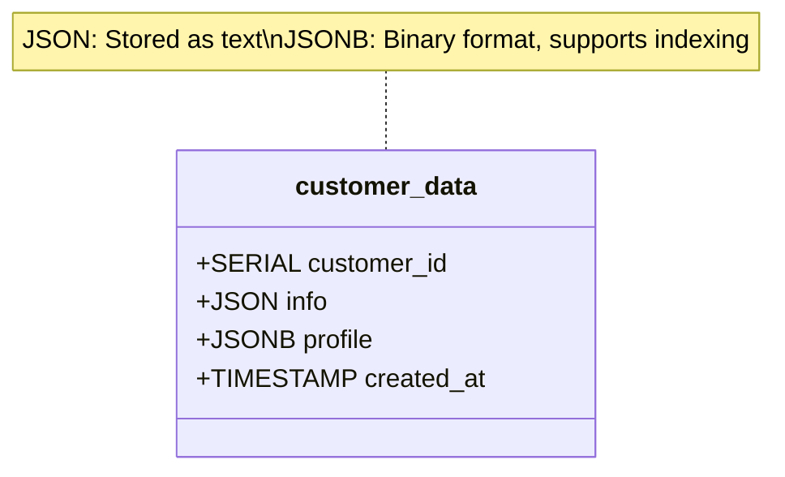
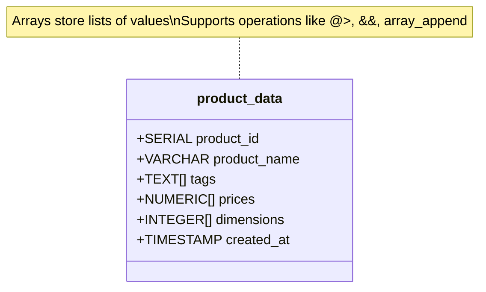
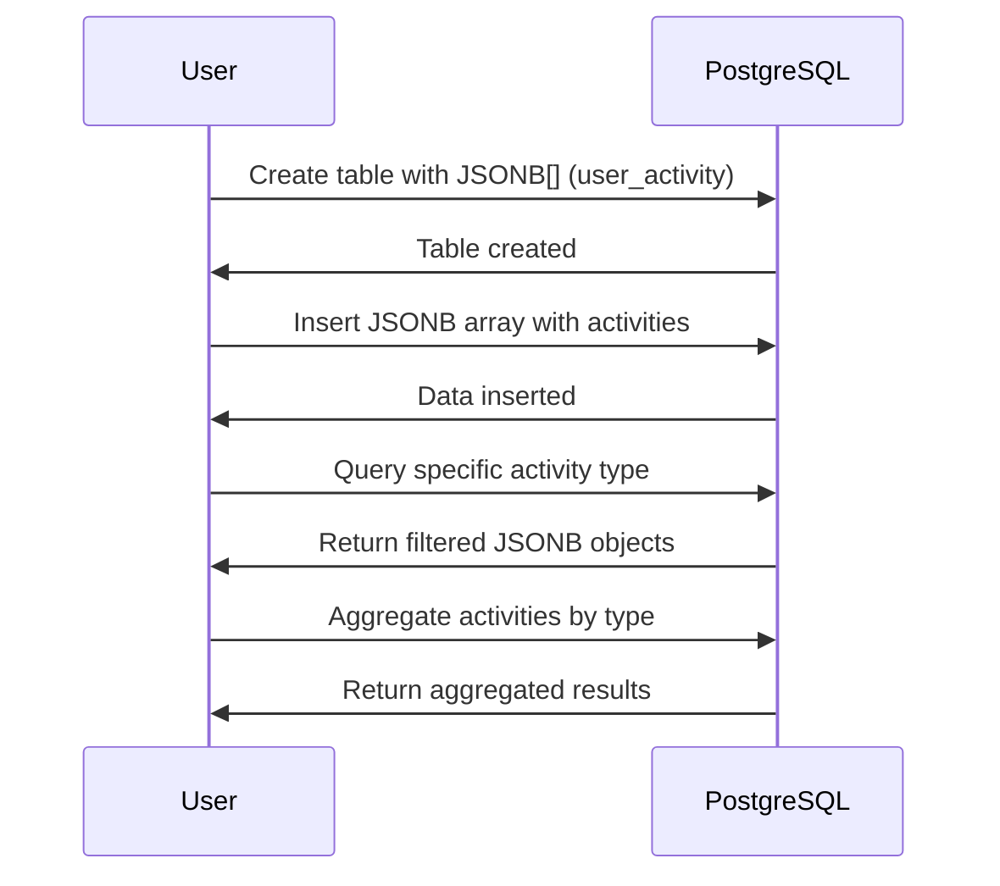
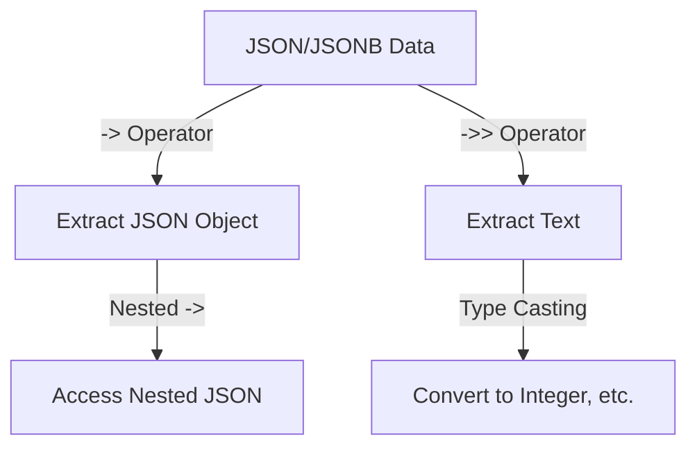
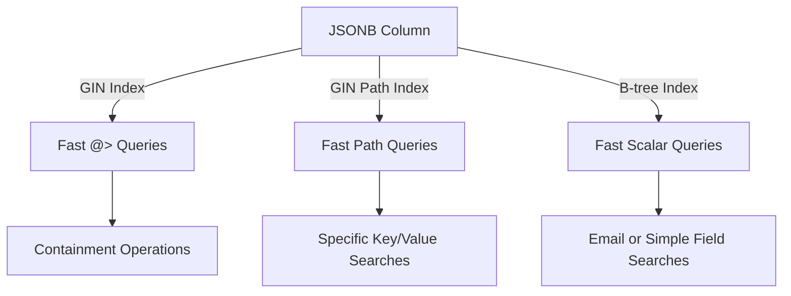
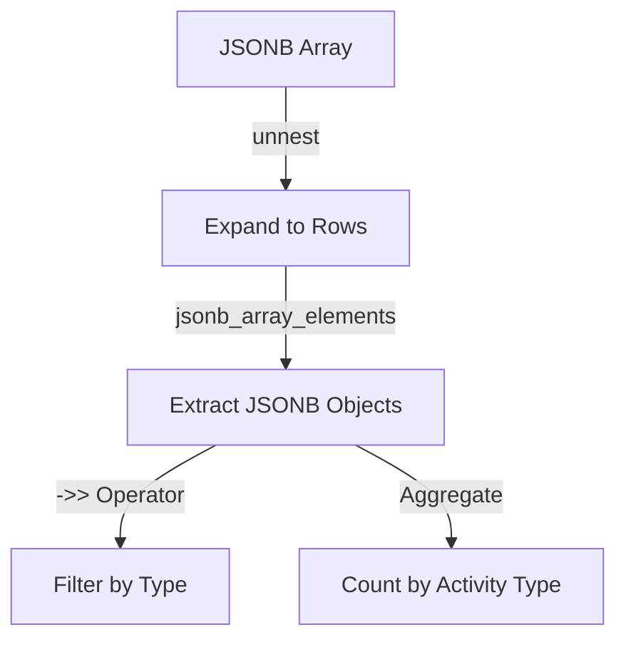
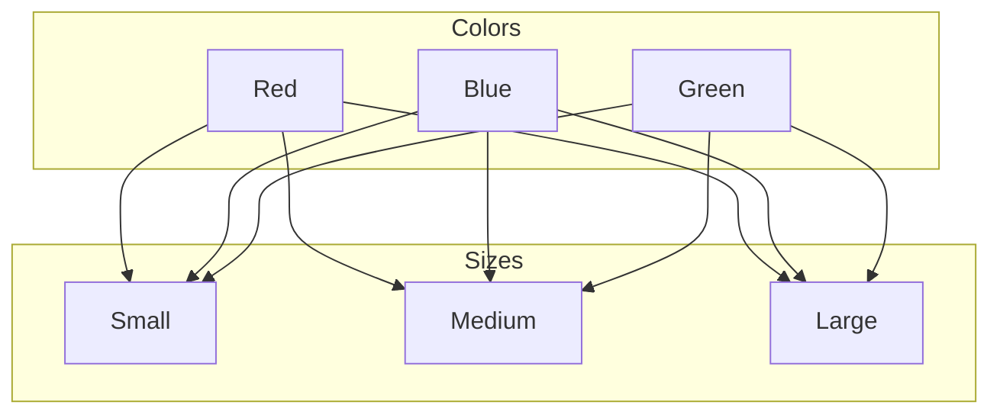

# Day 5: JSON and Arrays in PostgreSQL

## Overview

## Topics Covered

1. **Working with JSON and JSONB Data Types**
2. **JSON Operators and Functions**
3. **Indexing JSON Data**
4. **Arrays in PostgreSQL**
5. **Array Functions and Operators**
6. **Combining Arrays and JSON for Complex Data**
7. **Performance Considerations**

## Visualizing Data Structures with Mermaid.js

Below are Mermaid.js diagrams to illustrate the key concepts of JSON, JSONB, and arrays in PostgreSQL, making it easier for students to grasp the relationships and operations.

### JSON and JSONB Table Structure



### Array Table Structure



### JSON and Array Combined Workflow



## Examples and Exercises

### Example 1: JSON Basics

Demonstrates creating tables with JSON and JSONB columns, inserting data, and extracting values.

```sql
-- Create a table with JSON and JSONB columns
CREATE TABLE customer_data (
    customer_id SERIAL PRIMARY KEY,
    info JSON,              -- JSON datatype (stored as text)
    profile JSONB,          -- JSONB datatype (stored in binary format, more efficient)
    created_at TIMESTAMP DEFAULT current_timestamp
);

-- Insert data using JSON literals
INSERT INTO customer_data (info, profile)
VALUES 
(
    '{"name": "John Smith", "email": "john@example.com", "age": 35}',
    '{"address": {"street": "123 Main St", "city": "Boston", "state": "MA", "zip": "02101"}, 
      "preferences": {"theme": "dark", "notifications": true}}'
),
(
    '{"name": "Jane Doe", "email": "jane@example.com", "age": 28}',
    '{"address": {"street": "456 Park Ave", "city": "New York", "state": "NY", "zip": "10022"}, 
      "preferences": {"theme": "light", "notifications": false}}'
),
(
    '{"name": "Bob Johnson", "email": "bob@example.com", "age": 42}',
    '{"address": {"street": "789 Broad St", "city": "Chicago", "state": "IL", "zip": "60601"}, 
      "preferences": {"theme": "light", "notifications": true}}'
);

-- Extract values from JSON
SELECT 
    customer_id,
    info->>'name' AS name,
    info->>'email' AS email,
    (info->>'age')::INTEGER AS age  -- Cast to integer
FROM 
    customer_data;

-- Extract nested values from JSONB
SELECT 
    customer_id,
    profile->'address'->>'city' AS city,
    profile->'address'->>'state' AS state,
    profile->'preferences'->>'theme' AS theme
FROM 
    customer_data;

-- Difference between -> and ->>
-- -> returns a JSON object
-- ->> returns text
SELECT 
    customer_id,
    profile->'address' AS address_json,       -- Returns JSON
    profile->>'address' AS address_text       -- Returns text
FROM 
    customer_data;
```

**Diagram: JSON Query Flow**



### Example 2: JSON Operations and Querying

Shows filtering, checking key existence, and modifying JSONB data.

```sql
-- Filter records based on JSON values
SELECT 
    customer_id,
    info->>'name' AS name
FROM 
    customer_data
WHERE 
    (info->>'age')::INTEGER > 30;

-- Filter by nested JSONB values
SELECT 
    customer_id,
    info->>'name' AS name,
    profile->'address'->>'city' AS city
FROM 
    customer_data
WHERE 
    profile->'address'->>'state' = 'NY';

-- Check for key existence
SELECT 
    customer_id,
    info->>'name' AS name
FROM 
    customer_data
WHERE 
    profile ? 'preferences';

-- Check for path existence
SELECT 
    customer_id,
    info->>'name' AS name
FROM 
    customer_data
WHERE 
    profile @> '{"preferences": {"theme": "light"}}';

-- Update JSON values
UPDATE customer_data
SET profile = profile || '{"preferences": {"theme": "dark"}}'::jsonb
WHERE customer_id = 2;

-- Remove a key from JSONB
UPDATE customer_data
SET profile = profile - 'preferences'
WHERE customer_id = 3;

-- Add a new key to JSONB
UPDATE customer_data
SET profile = profile || '{"last_login": "2023-05-15T14:30:00"}'::jsonb;
```

### Example 3: Indexing JSON

Illustrates creating GIN and B-tree indexes for efficient JSON queries.

```sql
-- Create a GIN index for JSONB containment operations
CREATE INDEX idx_profile_gin ON customer_data USING GIN (profile);

-- Create a GIN index for specific JSONB path
CREATE INDEX idx_profile_preferences_gin ON customer_data USING GIN ((profile->'preferences'));

-- Create a GIN index with the jsonb_path_ops operator class (more efficient for @> operator)
CREATE INDEX idx_profile_path_ops ON customer_data USING GIN (profile jsonb_path_ops);

-- Create a btree index on a JSON field (extracted as text)
CREATE INDEX idx_customer_email ON customer_data ((info->>'email'));

-- Query using the GIN index
EXPLAIN ANALYZE
SELECT * FROM customer_data
WHERE profile @> '{"preferences": {"theme": "light"}}';

-- Compare with a query that can't use the index efficiently
EXPLAIN ANALYZE
SELECT * FROM customer_data
WHERE profile->'preferences'->>'notifications' = 'true';
```

**Diagram: Indexing Strategy**



### Example 4: Working with Arrays

Demonstrates array creation, querying, and modification.

```sql
-- Create a table with array columns
CREATE TABLE product_data (
    product_id SERIAL PRIMARY KEY,
    product_name VARCHAR(100),
    tags TEXT[],              -- Array of text
    prices NUMERIC[],         -- Array of numbers
    dimensions INTEGER[],     -- Array of integers
    created_at TIMESTAMP DEFAULT current_timestamp
);

-- Insert data with arrays
INSERT INTO product_data (product_name, tags, prices, dimensions)
VALUES 
    ('Laptop Pro', 
     ARRAY['electronics', 'computer', 'premium'], 
     ARRAY[999.99, 1099.99, 1299.99],
     ARRAY[13, 9, 1]),
     
    ('Smartphone X', 
     ARRAY['electronics', 'phone', 'mobile'], 
     ARRAY[799.99, 849.99],
     ARRAY[6, 3, 0]),
     
    ('Desk Chair', 
     ARRAY['furniture', 'office', 'ergonomic'], 
     ARRAY[199.99, 249.99, 299.99],
     ARRAY[30, 25, 45]),
     
    ('Coffee Maker', 
     ARRAY['appliance', 'kitchen', 'coffee'], 
     ARRAY[49.99, 69.99],
     ARRAY[10, 8, 12]);

-- Access array elements (1-based indexing)
SELECT 
    product_name,
    tags[1] AS first_tag,
    prices[1] AS base_price,
    dimensions[1] AS width,
    dimensions[2] AS depth,
    dimensions[3] AS height
FROM 
    product_data;

-- Array length
SELECT 
    product_name,
    array_length(tags, 1) AS tag_count,
    array_length(prices, 1) AS price_count
FROM 
    product_data;

-- Contains operator
SELECT 
    product_name,
    tags
FROM 
    product_data
WHERE 
    tags @> ARRAY['electronics'];

-- Overlap operator
SELECT 
    product_name,
    tags
FROM 
    product_data
WHERE 
    tags && ARRAY['kitchen', 'office'];

-- Unnest arrays (convert to rows)
SELECT 
    product_name,
    unnest(tags) AS tag
FROM 
    product_data;

-- Array modification
UPDATE product_data
SET tags = array_append(tags, 'sale')
WHERE product_id = 1;

UPDATE product_data
SET prices = array_prepend(599.99, prices)
WHERE product_id = 2;

UPDATE product_data
SET tags = array_remove(tags, 'office')
WHERE product_id = 3;
```

**Diagram: Array Operations**

```mermaid
graph TD
    A[Array Column] -->|Access| B[tags[1]]
    A -->|Contains| C[@> Operator]
    A -->|Overlap| D[&& Operator]
    A -->|Unnest| E[Rows from Array]
    A -->|Modify| F[array_append, array_remove]
```

### Example 5: Array Functions and Aggregation

Shows advanced array operations and joins.

```sql
-- Create a sample orders table
CREATE TABLE orders (
    order_id SERIAL PRIMARY KEY,
    customer_id INTEGER,
    products INTEGER[],  -- Array of product IDs
    quantities INTEGER[],  -- Corresponding quantities
    order_date TIMESTAMP DEFAULT current_timestamp
);

-- Insert sample data
INSERT INTO orders (customer_id, products, quantities)
VALUES 
    (1, ARRAY[1, 3, 4], ARRAY[1, 2, 1]),
    (2, ARRAY[2, 3], ARRAY[1, 1]),
    (1, ARRAY[1, 2], ARRAY[1, 1]),
    (3, ARRAY[4], ARRAY[3]);

-- Count array elements
SELECT 
    order_id,
    array_length(products, 1) AS product_count,
    array_to_string(products, ', ') AS products_list
FROM 
    orders;

-- Find orders containing specific products
SELECT 
    order_id,
    customer_id
FROM 
    orders
WHERE 
    products @> ARRAY[3];  -- Orders that include product ID 3

-- Aggregate arrays from multiple rows
SELECT 
    customer_id,
    array_agg(order_id) AS order_ids,
    array_agg(DISTINCT unnest(products)) AS all_products_ordered
FROM 
    orders
GROUP BY 
    customer_id;

-- Sum array elements
SELECT
    order_id,
    customer_id,
    (SELECT SUM(e) FROM unnest(quantities) AS e) AS total_quantity
FROM
    orders;

-- Join tables with arrays
SELECT 
    o.order_id,
    o.customer_id,
    p.product_name,
    p.tags
FROM 
    orders o
JOIN 
    product_data p ON p.product_id = ANY(o.products);
```

### Example 6: Combining JSON and Arrays

Demonstrates combining JSONB arrays for complex data storage and querying.

```sql
-- Create a table with both JSON and array data
CREATE TABLE user_activity (
    activity_id SERIAL PRIMARY KEY,
    user_id INTEGER,
    activities JSONB[],  -- Array of JSONB objects
    log_date DATE DEFAULT current_date
);

-- Insert data
INSERT INTO user_activity (user_id, activities)
VALUES 
    (1, ARRAY[
        '{"type": "login", "time": "09:00:00", "device": "mobile"}',
        '{"type": "search", "time": "09:15:00", "query": "laptops"}',
        '{"type": "view", "time": "09:20:00", "product_id": 1}'
    ]::jsonb[]),
    
    (2, ARRAY[
        '{"type": "login", "time": "10:30:00", "device": "desktop"}',
        '{"type": "view", "time": "10:35:00", "product_id": 3}',
        '{"type": "add_to_cart", "time": "10:40:00", "product_id": 3, "quantity": 1}'
    ]::jsonb[]),
    
    (1, ARRAY[
        '{"type": "login", "time": "14:00:00", "device": "desktop"}',
        '{"type": "view", "time": "14:10:00", "product_id": 2}',
        '{"type": "checkout", "time": "14:30:00", "total": 1399.98}'
    ]::jsonb[]);

-- Query for specific activity types
SELECT 
    activity_id,
    user_id,
    jsonb_array_elements(activities::jsonb) AS activity
FROM 
    user_activity,
    unnest(activities) AS activity
WHERE 
    activity->>'type' = 'checkout';

-- Find users who viewed a specific product
SELECT DISTINCT
    user_id
FROM 
    user_activity,
    jsonb_array_elements(activities::jsonb) AS activity
WHERE 
    activity->>'type' = 'view' 
    AND (activity->>'product_id')::INTEGER = 3;

-- Count activities by type for each user
SELECT 
    user_id,
    activity->>'type' AS activity_type,
    COUNT(*) AS activity_count
FROM 
    user_activity,
    jsonb_array_elements(activities::jsonb) AS activity
GROUP BY 
    user_id, activity->>'type'
ORDER BY 
    user_id, activity_count DESC;
```

**Diagram: JSONB Array Query Flow**



## Practice Exercises

1. **Contacts Table with JSON Data**
   - Create a table to store contact information with multiple addresses and phone numbers in JSONB.
   - Write queries to extract specific details (e.g., primary phone number).
   - Update contact information (e.g., add a new address).
   - Search for contacts in a specific city.

2. **Product Inventory**
   - Create a product table with an array of available sizes.
   - Create an inventory table with JSONB for stock levels by location.
   - Query products available in specific sizes.
   - Update inventory levels for a specific location.
   - Find products with low stock at any location.

3. **Blog System**
   - Create a posts table with tags stored as an array.
   - Create a comments table with JSONB for nested comments.
   - Query posts with specific tags.
   - Count comments per post, including nested comments.
   - Identify the most active commenters.

4. **Restaurant Menu System**
   - Store menu items with variations (sizes, options) as JSONB.
   - Store ingredients as arrays.
   - Query items containing specific ingredients.
   - Find items within a price range.
   - Update prices for specific variations.

5. **Analytics Challenge**
   - Create a user_events table with JSONB data for various events.
   - Analyze user behavior patterns (e.g., most common actions).
   - Aggregate events by type, date, and user.
   - Identify the most common event sequences.

See the [exercises.sql](exercises.sql) file for detailed examples and solutions to these exercises.

## Performance Considerations

- **JSON vs. JSONB**: JSONB is more efficient for querying and indexing but requires more storage.
- **Indexing**: Use GIN indexes for JSONB containment queries (`@>`) and B-tree indexes for scalar fields (e.g., `info->>'email'`).
- **Arrays**: Use `@>` for containment checks and `&&` for overlap checks to leverage indexes.
- **Query Optimization**: Avoid unnecessary unnesting of large arrays or JSONB arrays in queries to prevent performance bottlenecks.
- **Normalization vs. Denormalization**: Balance between storing data in JSONB/arrays vs. normalized tables based on query patterns and update frequency.


