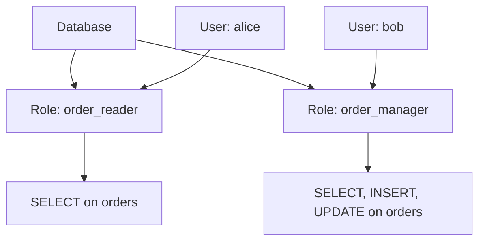
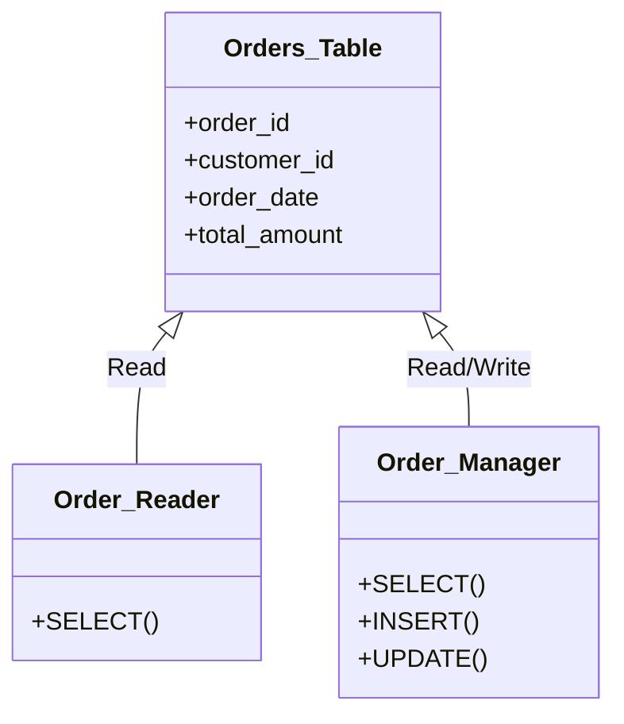
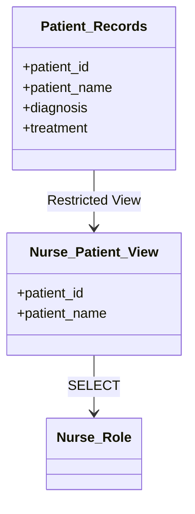

# Database Security and User Management in PostgreSQL

## Introduction

This guide provides a comprehensive overview of database security and user management in PostgreSQL, tailored for SQL instructors to teach students. It includes practical examples, visual aids, and data population examples to demonstrate key concepts, ensuring students understand how to secure a PostgreSQL database and manage user access effectively.

## Table of Contents

1. Why Security and User Management Matter
2. Authentication Methods
3. Role-Based Access Control (RBAC)
4. Managing Users and Roles
5. Granting and Revoking Privileges
6. Populating the Orders Table
7. Best Practices for Security
8. Common Security Problems and Fixes
9. Conclusion

## 1. Why Security and User Management Matter

Database security protects sensitive data from unauthorized access or modification, while user management ensures only authorized individuals can perform specific actions, such as reading or updating data. Together, they maintain data integrity, confidentiality, and availability.

**Real Example**: A university database stores student grades. Without security, anyone could alter grades, leading to inaccurate records. User management ensures only professors can update grades, while students can only view their own.

## 2. Authentication Methods

Authentication verifies a user’s identity. PostgreSQL supports several methods:

- **Password Authentication**: Users provide a username and password.
- **Certificate Authentication**: Uses SSL certificates for identity.
- **Kerberos Authentication**: Secure network authentication.
- **LDAP Authentication**: Integrates with a centralized directory.

The `pg_hba.conf` file controls access. Example configuration:

```plaintext
# Allow users from 192.168.1.0/24 to connect with MD5 password
host all all 192.168.1.0/24 md5
```

**Real Example**: A company configures `pg_hba.conf` to allow only employees on the internal network (192.168.1.0/24) to access the database with passwords, preventing external access.

## 3. Role-Based Access Control (RBAC)

RBAC uses roles to manage permissions. Roles can represent users or groups and can inherit permissions.

**Real Example**: In an e-commerce database, you create roles for different departments:

```sql
-- Create roles for different access levels
CREATE ROLE order_reader;
CREATE ROLE order_manager;

-- Grant read-only access to orders table
GRANT SELECT ON orders TO order_reader;

-- Grant read and write access to orders table
GRANT SELECT, INSERT, UPDATE ON orders TO order_manager;
```

**Mermaid Diagram: RBAC Structure**



**Explanation**: `alice` (a customer service rep) gets read-only access via `order_reader`, while `bob` (a manager) gets broader access via `order_manager`.

## 4. Managing Users and Roles

Users are roles with login privileges. Here’s how to manage them:

**Create a User**

```sql
CREATE USER alice WITH PASSWORD 'SecurePass2025!';
```

**Change a User**

```sql
ALTER USER alice WITH PASSWORD 'NewSecurePass2025!';
```

**Delete a User**

```sql
DROP USER alice;
```

**Manage Roles**

```sql
-- Assign user to role
GRANT order_reader TO alice;

-- Remove user from role
REVOKE order_reader FROM alice;
```

**Real Example**: A library database creates a user `librarian1` and assigns them to a `catalog_manager` role to update book records:

```sql
CREATE ROLE catalog_manager;
GRANT SELECT, INSERT, UPDATE ON books TO catalog_manager;
CREATE USER librarian1 WITH PASSWORD 'Library2025!';
GRANT catalog_manager TO librarian1;
```

## 5. Granting and Revoking Privileges

Privileges control actions like SELECT (read), INSERT (create), UPDATE (modify), and DELETE (remove).

**Grant Privileges**

```sql
-- Allow order_reader to read orders
GRANT SELECT ON orders TO order_reader;

-- Allow order_manager to modify orders
GRANT INSERT, UPDATE ON orders TO order_manager;
```

**Revoke Privileges**

```sql
-- Remove update permission from order_manager
REVOKE UPDATE ON orders FROM order_manager;
```

**Mermaid Diagram: CRUD Operations**



**Real Example**: In a hospital database, `nurse` role can read patient records, while `doctor` role can update them:

```sql
GRANT SELECT ON patient_records TO nurse;
GRANT SELECT, UPDATE ON patient_records TO doctor;
```

**User View Example**

Views restrict data visibility. Create a view for nurses to see only patient names and IDs:

```sql
CREATE VIEW nurse_patient_view AS
SELECT patient_id, patient_name
FROM patient_records;

GRANT SELECT ON nurse_patient_view TO nurse;
```

**Mermaid Diagram: User View**



**Explanation**: Nurses see only `patient_id` and `patient_name`, not sensitive data like `diagnosis`.

## 6. Populating the Orders Table

To demonstrate practical usage, let’s create and populate the `orders` table with 20 records. This table is referenced in earlier examples for RBAC and privileges.

**Create the Orders Table**

```sql
CREATE TABLE orders (
    order_id SERIAL PRIMARY KEY,
    customer_id INTEGER NOT NULL,
    order_date DATE NOT NULL,
    total_amount DECIMAL(10, 2) NOT NULL
);
```

**Insert 20 Records**

```sql
INSERT INTO orders (customer_id, order_date, total_amount) VALUES
(101, '2025-01-01', 150.25),
(102, '2025-01-02', 89.99),
(103, '2025-01-03', 245.50),
(101, '2025-01-04', 45.00),
(104, '2025-01-05', 300.75),
(105, '2025-01-06', 120.00),
(102, '2025-01-07', 65.30),
(106, '2025-01-08', 500.00),
(107, '2025-01-09', 75.25),
(108, '2025-01-10', 200.00),
(109, '2025-01-11', 99.99),
(110, '2025-01-12', 350.45),
(101, '2025-01-13', 180.00),
(104, '2025-01-14', 60.50),
(111, '2025-01-15', 275.00),
(112, '2025-01-16', 130.75),
(113, '2025-01-17', 400.00),
(114, '2025-01-18', 55.25),
(115, '2025-01-19', 220.00),
(116, '2025-01-20', 95.00);
```

**Verify Data**

```sql
SELECT * FROM orders LIMIT 5;
```

**Explanation**: The `orders` table now contains 20 records with varied `customer_id`, `order_date`, and `total_amount` values, simulating real e-commerce data. The `order_reader` role can query this data, while `order_manager` can insert or update records.

## 7. Best Practices for Security

1. **Strong Passwords**: Use complex passwords (e.g., `SecurePass2025!`).
2. **Least Privilege**: Grant only necessary permissions.
3. **Regular Audits**: Review roles and privileges periodically.
4. **Encryption**: Use SSL/TLS for connections.
5. **Updates**: Keep PostgreSQL updated to patch vulnerabilities.

**Real Example**: A bank database enforces SSL connections and audits privileges quarterly to ensure only tellers can view account balances and only managers can approve transactions.

## 8. Common Security Problems and Fixes

**SQL Injection**

Attackers inject malicious SQL. Prevent it with parameterized queries:

```sql
-- Vulnerable query
SELECT * FROM users WHERE username = 'user_input';

-- Safe query
PREPARE safe_query AS SELECT * FROM users WHERE username = $1;
EXECUTE safe_query('user_input');
```

**Weak Passwords**

Enforce strong passwords and periodic changes:

```sql
ALTER USER alice WITH PASSWORD 'ComplexPass2025!' VALID UNTIL '2026-01-01';
```

**Excessive Privileges**

Regularly review permissions:

```sql
SELECT * FROM information_schema.table_privileges WHERE table_name = 'orders';
```

**Real Example**: A retail database was vulnerable to SQL injection. Switching to parameterized queries and limiting `cashier` role to `SELECT` and `INSERT` reduced risks.

## 9. Conclusion

Mastering PostgreSQL security and user management ensures data protection and controlled access. This guide, with practical examples, diagrams, and data population, equips instructors to teach students how to secure databases and manage users effectively, preparing them for real-world SQL challenges.