# Week 2, Day 3: PostgreSQL Indexes and Query Optimization


## Table of Contents
1. [What Are Indexes?](#what-are-indexes)
2. [Types of Indexes](#types-of-indexes)
3. [Creating and Managing Indexes](#creating-and-managing-indexes)
4. [Analyzing Queries](#analyzing-queries)
5. [Improving Query Speed](#improving-query-speed)
6. [Maintaining Indexes](#maintaining-indexes)
7. [Partial Indexes](#partial-indexes)
8. [Functional Indexes](#functional-indexes)
9. [Summary](#summary)
10. [Exercises](#exercises)

---

## What Are Indexes?

Indexes are like a book's index—they help PostgreSQL find data quickly without checking every row. They make queries faster but use extra space and slow down updates.

### Why Use Indexes?
- **Faster searches**: Speed up `WHERE`, `JOIN`, and `ORDER BY` queries.
- **Trade-offs**: More storage and slower `INSERT`, `UPDATE`, `DELETE`.
- **Best for**: Columns you search often, like IDs or emails.

### Diagram: How Indexes Work
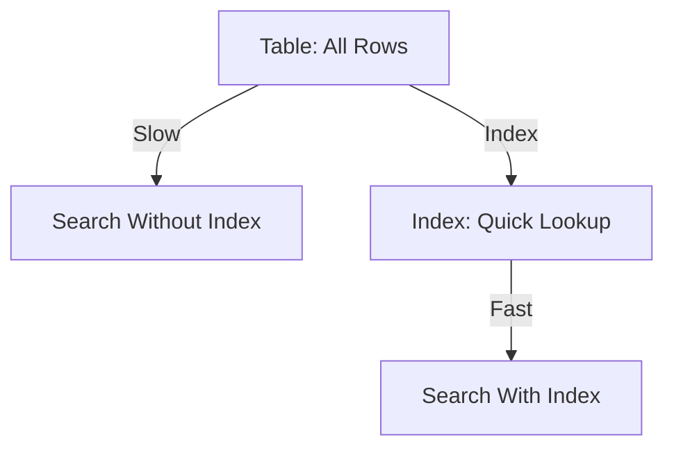

### Example 1: Index on Email
Speed up searches by email.

```sql
CREATE TABLE employees (
    employee_id SERIAL PRIMARY KEY,
    email VARCHAR(100),
    name VARCHAR(50)
);

CREATE INDEX idx_employees_email ON employees(email);

EXPLAIN ANALYZE SELECT * FROM employees WHERE email = 'john.doe@example.com';
```

**Diagram: Email Index**
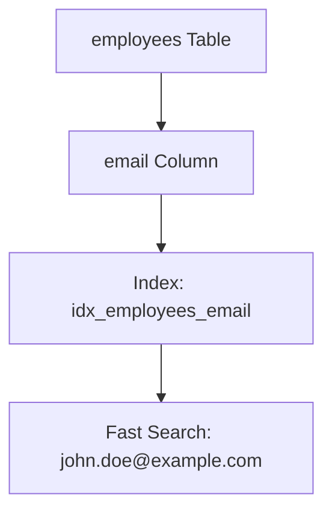

**Explanation**: The index lets PostgreSQL find the email quickly without scanning all rows.

### Example 2: Index on Large Table
See how an index helps with many rows.

```sql
CREATE TABLE orders_log (
    log_id SERIAL PRIMARY KEY,
    order_id INTEGER,
    log_message TEXT
);

INSERT INTO orders_log (order_id, log_message)
SELECT generate_series(1, 10000), 'Log ' || generate_series(1, 10000);

EXPLAIN ANALYZE SELECT * FROM orders_log WHERE order_id = 5000;

CREATE INDEX idx_orders_log_order_id ON orders_log(order_id);

EXPLAIN ANALYZE SELECT * FROM orders_log WHERE order_id = 5000;
```

**Diagram: Large Table Index**
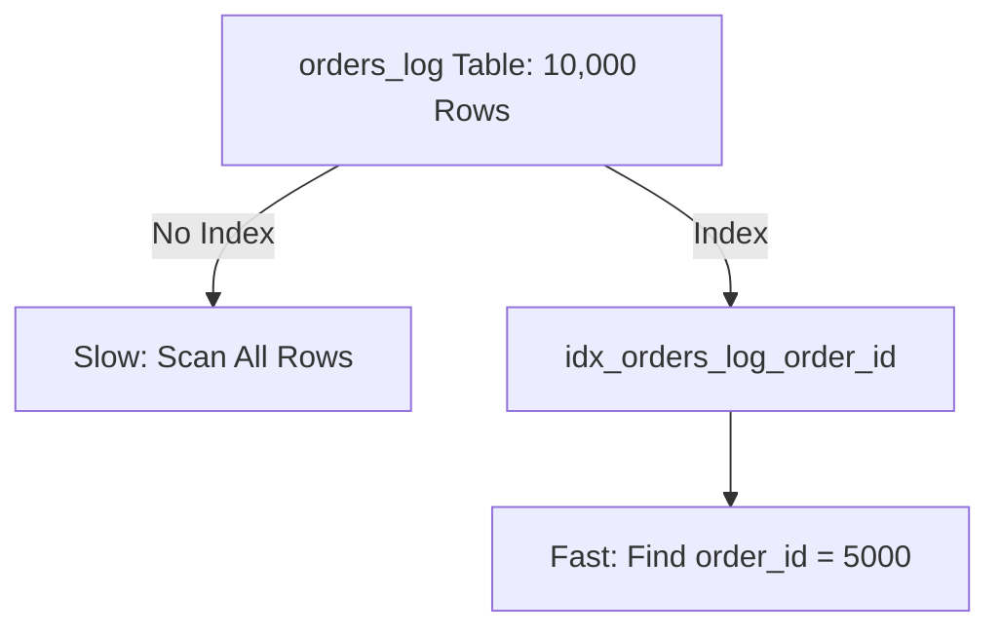

**Explanation**: Without an index, PostgreSQL checks every row. The index makes it faster.

---

## Types of Indexes

PostgreSQL has different index types for different needs. Here’s a simple overview.

### Diagram: Index Types
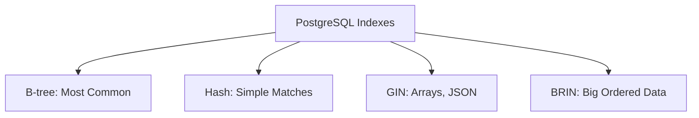

### B-tree Index
- **Use for**: Equal (`=`), range (`>`, `<`), sorting (`ORDER BY`).
- **Why**: Works for most queries.

**Example: B-tree on Price**

```sql
CREATE TABLE products (
    product_id SERIAL PRIMARY KEY,
    price INTEGER
);

CREATE INDEX idx_products_price ON products(price);

EXPLAIN ANALYZE SELECT * FROM products WHERE price BETWEEN 100 AND 500;
```

**Diagram: B-tree Index**
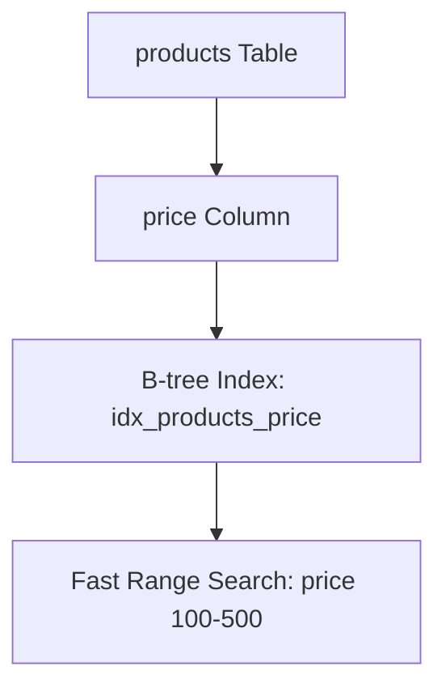

**Explanation**: B-tree indexes make range searches fast.

### Hash Index
- **Use for**: Only equal (`=`) searches.
- **Why**: Fast for simple matches.

**Example: Hash on Status**

```sql
CREATE INDEX idx_products_status_hash ON products USING HASH (status);

EXPLAIN ANALYZE SELECT * FROM products WHERE status = 'In Stock';
```

**Diagram: Hash Index**
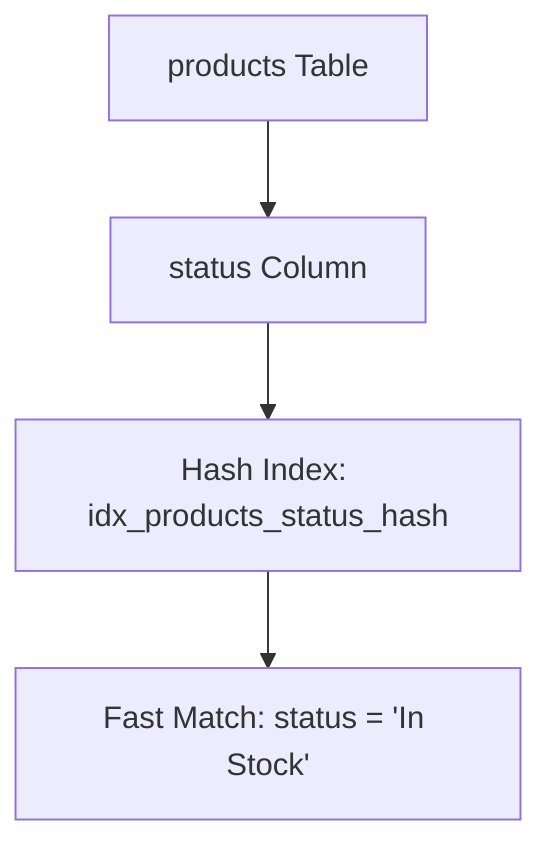

**Explanation**: Hash indexes are quick for exact matches like status checks.

### GIN Index
- **Use for**: Arrays, JSONB, or text searches.
- **Why**: Good for complex data like tags.

**Example: GIN on Tags**

```sql
CREATE INDEX idx_products_tags ON products USING GIN (tags);

EXPLAIN ANALYZE SELECT * FROM products WHERE tags @> ARRAY['tech'];
```

**Diagram: GIN Index**
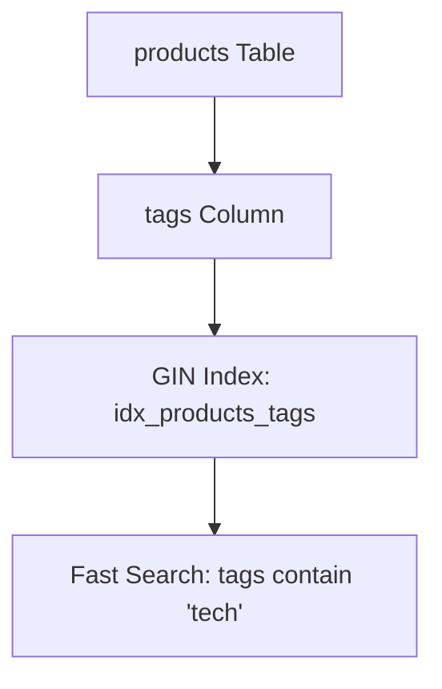

**Explanation**: GIN indexes speed up searches in arrays or JSON data.

### BRIN Index
- **Use for**: Large tables with ordered data (e.g., dates).
- **Why**: Uses less space for big datasets.

**Example: BRIN on Dates**

```sql
CREATE INDEX idx_orders_log_date_brin ON orders_log USING BRIN (created_at);

EXPLAIN ANALYZE SELECT * FROM orders_log WHERE created_at > '2025-01-01';
```

**Diagram: BRIN Index**
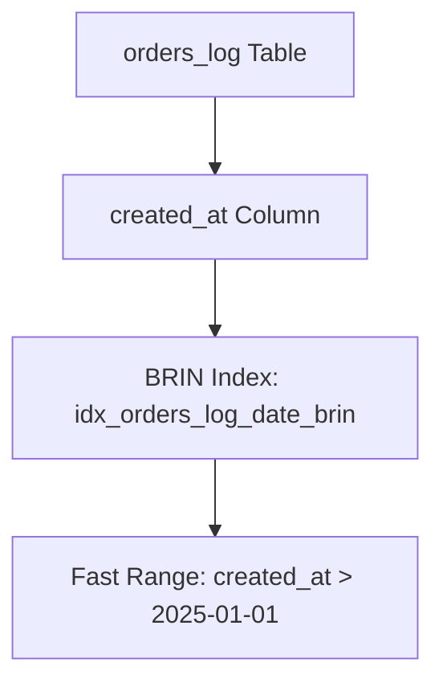

**Explanation**: BRIN indexes are small and fast for ordered data like dates.

---

## Creating and Managing Indexes

Learn how to create and manage indexes to keep your database fast.

### Diagram: Index Management
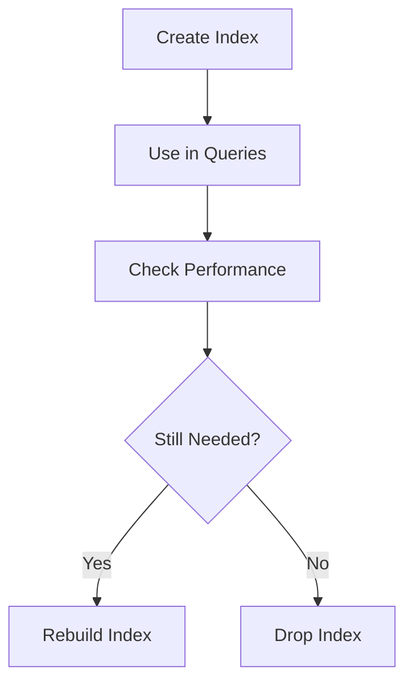

### Example 1: Create Index

```sql
CREATE INDEX idx_customers_city ON customers(city);

EXPLAIN ANALYZE SELECT * FROM customers WHERE city = 'New York';
```

**Diagram: Create Index**
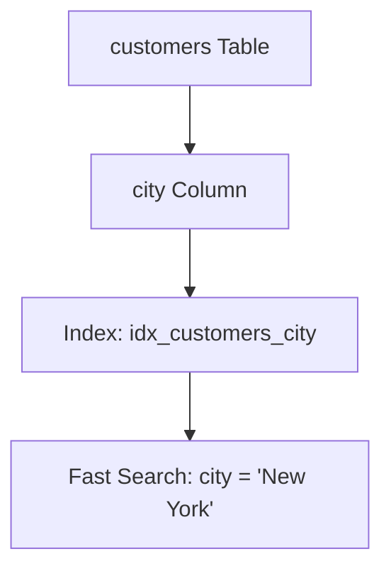

**Explanation**: Creates an index to speed up city searches.

### Example 2: Drop Index

```sql
DROP INDEX IF EXISTS idx_customers_city;

EXPLAIN ANALYZE SELECT * FROM customers WHERE city = 'New York';
```

**Diagram: Drop Index**
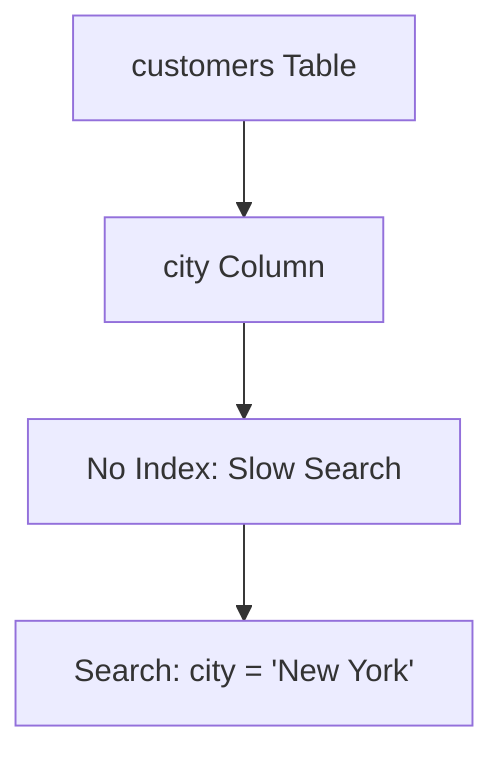

**Explanation**: Dropping an index saves space but may slow queries.

---

## Analyzing Queries

Use `EXPLAIN` to see how PostgreSQL runs your query and `EXPLAIN ANALYZE` to check actual performance.

### Diagram: Query Analysis
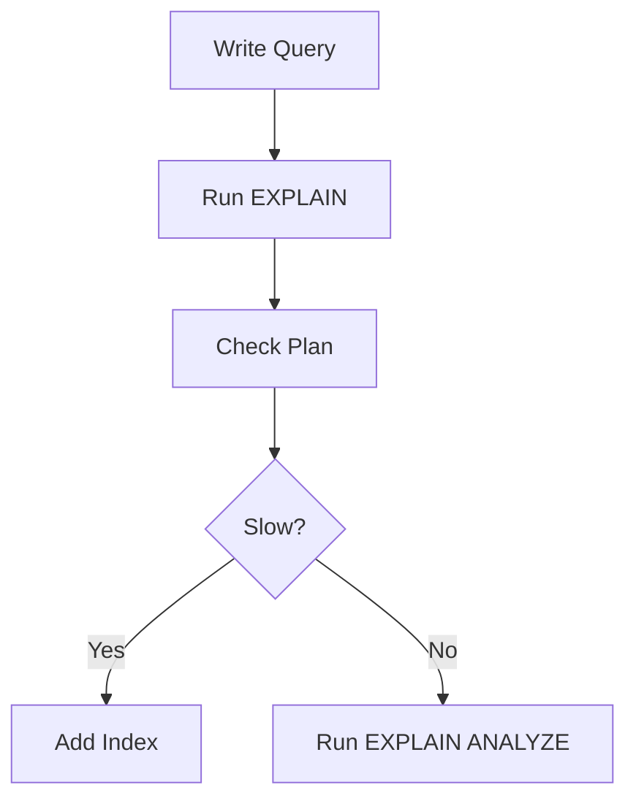

### Example: EXPLAIN ANALYZE

```sql
EXPLAIN ANALYZE SELECT * FROM customers WHERE city = 'New York';
```

**Diagram: EXPLAIN ANALYZE**
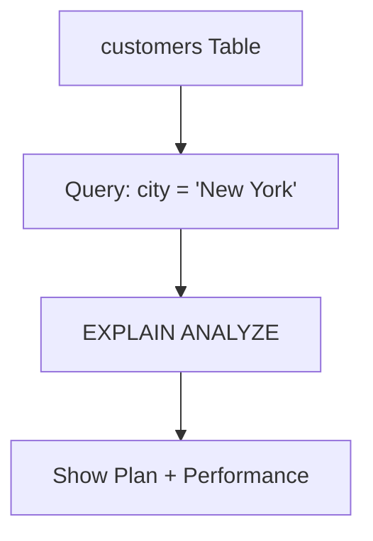

**Explanation**: Shows how the query runs and how long it takes.

---

## Improving Query Speed

Make queries faster with the right indexes and query tweaks.

### Diagram: Optimization Steps
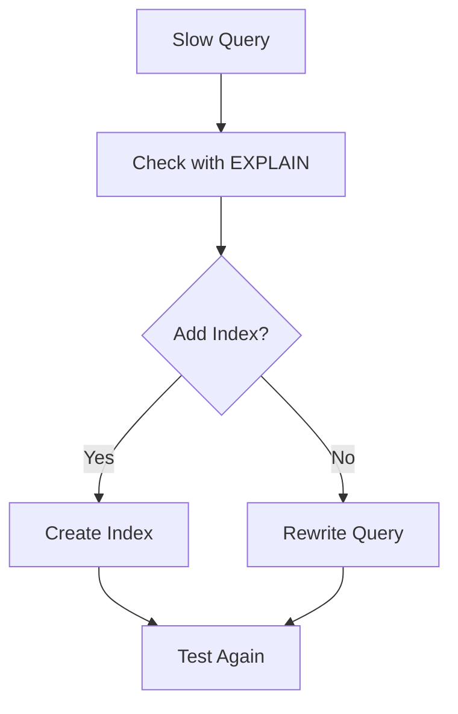

### Example: Rewrite Query

```sql
-- Slow: LIKE with wildcard
EXPLAIN ANALYZE SELECT * FROM products WHERE product_name LIKE '%Laptop%';

-- Faster: Exact match
EXPLAIN ANALYZE SELECT * FROM products WHERE product_name = 'Laptop Pro';
```

**Diagram: Query Rewrite**
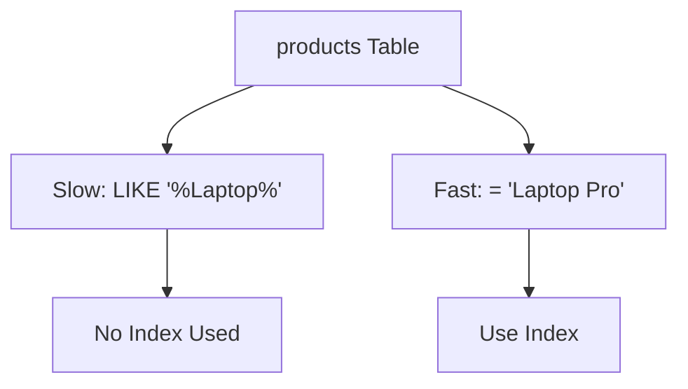

**Explanation**: Exact matches use indexes better than wildcards.

---

## Maintaining Indexes

Keep indexes efficient by checking their size and usage.

### Diagram: Maintenance Cycle
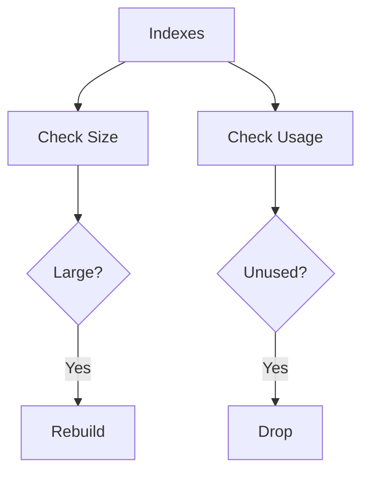

### Example: Check Index Size

```sql
SELECT
    pg_size_pretty(pg_relation_size(indexname::text)) as index_size,
    indexname
FROM pg_indexes
WHERE tablename = 'customers';
```

**Diagram: Index Size Check**
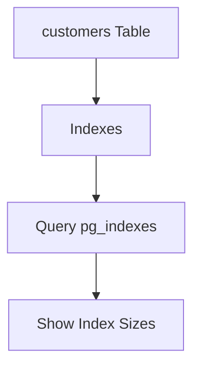

**Explanation**: Lists index sizes to find ones using too much space.

---

## Partial Indexes

Partial indexes only cover some rows, saving space and speeding up queries.

### Diagram: Partial Index
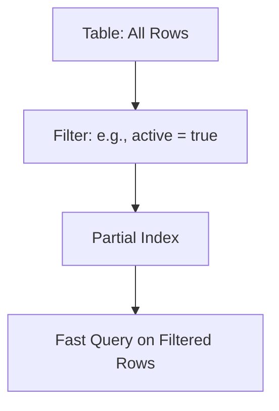

### Example: Index Active Customers

```sql
CREATE INDEX idx_customers_active ON customers(customer_id) WHERE active = true;

EXPLAIN ANALYZE SELECT * FROM customers WHERE active = true AND customer_id < 1000;
```

**Diagram: Partial Index**
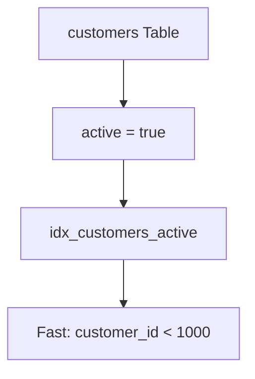

**Explanation**: Indexes only active customers, making it smaller and faster.

---

## Functional Indexes

Index the result of a function, like lowercase names, for faster searches.

### Diagram: Functional Index
```mermaid
graph TD
    A[Table Column] --> B[Function: e.g., LOWER(name)]
    B --> C[Functional Index]
    C --> D[Fast Query on Function]
```

### Example: Case-Insensitive Search

```sql
CREATE INDEX idx_customers_name_lower ON customers(LOWER(name));

EXPLAIN ANALYZE SELECT * FROM customers WHERE LOWER(name) = 'john doe';
```

**Diagram: Functional Index**
```mermaid
graph TD
    A[customers Table] --> B[LOWER(name)]
    B --> C[idx_customers_name_lower]
    C --> D[Fast: LOWER(name) = 'john doe']
```

**Explanation**: Indexes lowercase names for case-insensitive searches.

---

## Summary

Indexes make queries faster but need careful use:
- **B-tree**: Best for most searches.
- **Hash**: For simple equal checks.
- **GIN**: For arrays or JSON.
- **BRIN**: For big, ordered data.
- **Partial**: Index only some rows.
- **Functional**: Index function results.
- **Maintenance**: Check size and usage.

Use `EXPLAIN ANALYZE` to test queries and choose the right indexes.

## Exercises

Try these in `exercises.sql`:
1. Test queries without indexes.
2. Add indexes and compare speed.
3. Create partial and functional indexes.
4. Check index sizes and usage.

