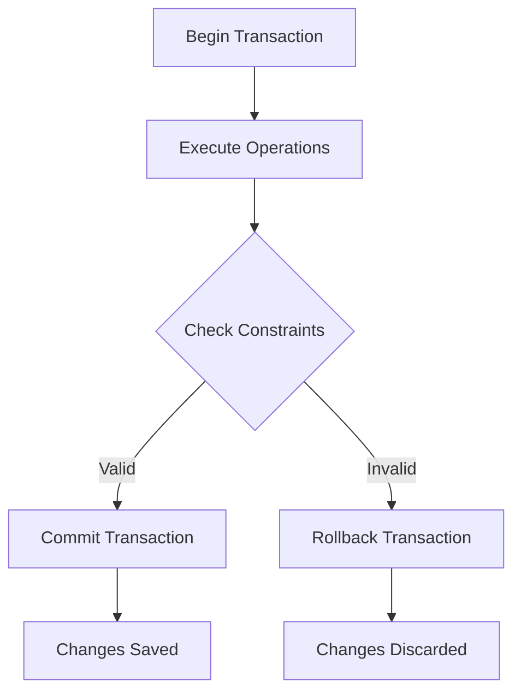
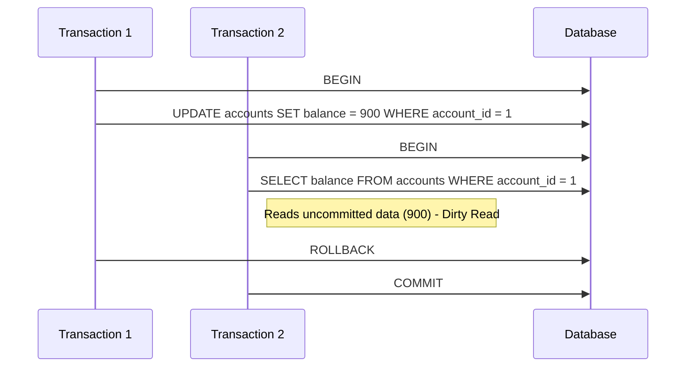
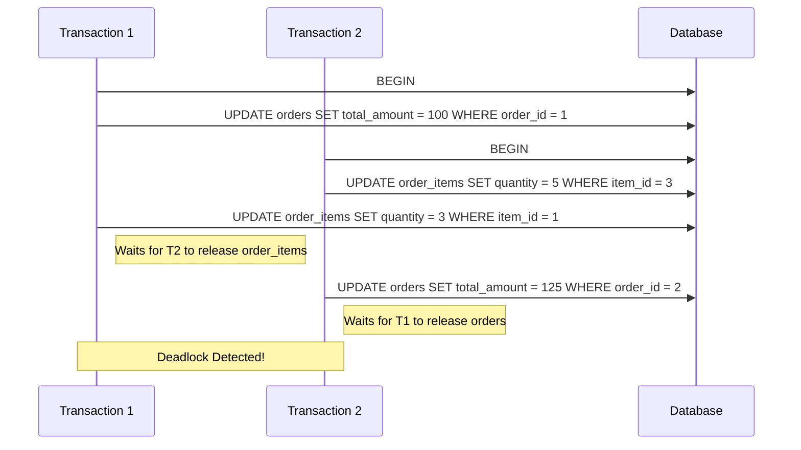

# Day 4: Transactions and Concurrency Control

This document provides an overview of database transactions and concurrency control, including definitions, examples, and visualizations using Mermaid.js diagrams to help students understand these concepts more effectively.

## Topics Covered

1. **Understanding Database Transactions**  
   A transaction is a sequence of database operations that are treated as a single unit of work, ensuring data integrity. Transactions either complete fully or not at all.

2. **ACID Properties**  
   - **Atomicity**: Ensures all operations in a transaction are completed; if any fail, the entire transaction is rolled back.  
   - **Consistency**: Guarantees the database remains in a valid state before and after a transaction.  
   - **Isolation**: Ensures transactions are executed independently of one another.  
   - **Durability**: Guarantees that committed transactions are permanently saved, even in case of a system failure.

3. **Transaction Isolation Levels**  
   Isolation levels define how transactions interact and control visibility of changes. Supported levels in PostgreSQL:  
   - READ UNCOMMITTED (behaves like READ COMMITTED in PostgreSQL)  
   - READ COMMITTED (default)  
   - REPEATABLE READ  
   - SERIALIZABLE  

4. **Concurrency Issues**  
   - **Dirty Reads**: Reading uncommitted changes from another transaction.  
   - **Non-repeatable Reads**: Data changes between reads within the same transaction.  
   - **Phantom Reads**: New rows appear in a query’s result set during a transaction.

5. **Locking Mechanisms**  
   Locks control access to database resources to prevent conflicts during concurrent transactions. Examples include row-level locks (`FOR UPDATE`) and table-level locks.

6. **Deadlocks and How to Avoid Them**  
   A deadlock occurs when two transactions wait indefinitely for each other to release resources. Prevention includes consistent lock ordering and timeouts.

7. **Optimistic vs. Pessimistic Concurrency Control**  
   - **Optimistic**: Assumes conflicts are rare, checks for conflicts at commit time (e.g., using version numbers).  
   - **Pessimistic**: Locks resources during the transaction to prevent conflicts.

## Mermaid.js Diagrams

### Transaction Flow
This diagram illustrates the basic flow of a database transaction.



### Concurrency Issues
This diagram shows how different transactions can lead to concurrency issues like dirty reads.



### Deadlock Scenario
This diagram demonstrates a deadlock caused by inconsistent lock ordering.



## Examples and Exercises

### Example 1: Basic Transaction Structure

```sql
-- Create a sample banking database
CREATE TABLE accounts (
    account_id SERIAL PRIMARY KEY,
    customer_name VARCHAR(100),
    balance NUMERIC(12, 2) CHECK (balance >= 0)
);

-- Insert sample data
INSERT INTO accounts (customer_name, balance)
VALUES 
    ('Alice', 1000.00),
    ('Bob', 500.00),
    ('Charlie', 1500.00),
    ('Diana', 2000.00);

-- Basic transaction to transfer money between accounts
BEGIN;
    -- Deduct from sender
    UPDATE accounts 
    SET balance = balance - 100.00 
    WHERE account_id = 1;
    
    -- Add to recipient
    UPDATE accounts 
    SET balance = balance + 100.00 
    WHERE account_id = 2;
    
    -- Check if sender's balance is still valid
    -- If the CHECK constraint fails, the entire transaction will be rolled back
COMMIT;

-- Check the results
SELECT * FROM accounts WHERE account_id IN (1, 2);

-- Transaction with explicit savepoints
BEGIN;
    UPDATE accounts SET balance = balance - 50.00 WHERE account_id = 3;
    
    SAVEPOINT before_second_update;
    
    UPDATE accounts SET balance = balance + 50.00 WHERE account_id = 4;
    
    -- Decide to revert just the second update
    ROLLBACK TO SAVEPOINT before_second_update;
    
    -- Do something else instead
    UPDATE accounts SET balance = balance + 50.00 WHERE account_id = 1;
COMMIT;

-- Check the results
SELECT * FROM accounts WHERE account_id IN (1, 3, 4);
```

### Example 2: Transaction Isolation Levels

```sql
-- Understand the available isolation levels
-- PostgreSQL supports four isolation levels:
-- READ UNCOMMITTED (behaves like READ COMMITTED in PostgreSQL)
-- READ COMMITTED (default)
-- REPEATABLE READ
-- SERIALIZABLE

-- Show the current isolation level
SHOW transaction_isolation;

-- Example with READ COMMITTED (default)
-- Terminal 1
BEGIN;
    SELECT balance FROM accounts WHERE account_id = 1;
    -- See: 1000.00
    
    -- Meanwhile, Terminal 2 runs:
    -- BEGIN;
    -- UPDATE accounts SET balance = balance + 200 WHERE account_id = 1;
    -- COMMIT;
    
    -- Now when Terminal 1 runs the same query again:
    SELECT balance FROM accounts WHERE account_id = 1;
    -- Will see: 1200.00 (because it reads the committed change)
COMMIT;

-- Example with REPEATABLE READ
-- Terminal 1
BEGIN TRANSACTION ISOLATION LEVEL REPEATABLE READ;
    SELECT balance FROM accounts WHERE account_id = 1;
    -- See: 1200.00
    
    -- Meanwhile, Terminal 2 runs:
    -- BEGIN;
    -- UPDATE accounts SET balance = balance + 100 WHERE account_id = 1;
    -- COMMIT;
    
    -- Now when Terminal 1 runs the same query again:
    SELECT balance FROM accounts WHERE account_id = 1;
    -- Will still see: 1200.00 (not 1300.00) because it uses the same snapshot
COMMIT;

-- Example with SERIALIZABLE
-- Terminal 1
BEGIN TRANSACTION ISOLATION LEVEL SERIALIZABLE;
    SELECT SUM(balance) FROM accounts;
    
    -- Meanwhile, Terminal 2 runs:
    -- BEGIN TRANSACTION ISOLATION LEVEL SERIALIZABLE;
    -- INSERT INTO accounts (customer_name, balance) VALUES ('Eve', 300.00);
    -- COMMIT;
    
    -- When Terminal 1 tries to do something based on its view:
    UPDATE accounts SET balance = balance * 1.1;
    -- This might fail with: ERROR: could not serialize access due to concurrent update
COMMIT;
```

### Example 3: Handling Concurrency Issues

```sql
-- Create a simple inventory table
CREATE TABLE inventory (
    product_id SERIAL PRIMARY KEY,
    product_name VARCHAR(100),
    quantity INTEGER CHECK (quantity >= 0)
);

INSERT INTO inventory (product_name, quantity)
VALUES 
    ('Laptop', 10),
    ('Smartphone', 20),
    ('Headphones', 30);

-- Simulate a concurrency issue with READ COMMITTED
-- Terminal 1: Customer 1 checks product availability
BEGIN;
    SELECT quantity FROM inventory WHERE product_id = 1;
    -- See: 10 laptops available
    
    -- Terminal 1 pauses to think...
    
    -- Meanwhile, Terminal 2: Customer 2 buys 3 laptops
    -- BEGIN;
    -- UPDATE inventory SET quantity = quantity - 3 WHERE product_id = 1;
    -- COMMIT;
    
    -- Terminal 1 resumes and tries to buy 8 laptops
    UPDATE inventory SET quantity = quantity - 8 WHERE product_id = 1;
    -- This succeeds but leaves -1 laptops! (if no CHECK constraint)
COMMIT;

-- Fix with explicit locking
-- Terminal 1: Customer 1 checks product availability
BEGIN;
    -- Lock the row with FOR UPDATE to prevent other transactions from modifying it
    SELECT quantity FROM inventory WHERE product_id = 1 FOR UPDATE;
    -- See: 7 laptops available
    
    -- Terminal 1 pauses to think...
    
    -- Meanwhile, Terminal 2: Customer 2 tries to buy 3 laptops
    -- BEGIN;
    -- The following will wait until Terminal 1's transaction completes:
    -- SELECT quantity FROM inventory WHERE product_id = 1 FOR UPDATE;
    
    -- Terminal 1 resumes and buys 7 laptops
    UPDATE inventory SET quantity = quantity - 7 WHERE product_id = 1;
COMMIT;

-- After Terminal 1 commits, Terminal 2 will see the updated quantity
-- and can make its decision based on accurate data
```

### Example 4: Deadlock Prevention and Handling

```sql
-- Create tables for deadlock demonstration
CREATE TABLE orders (
    order_id SERIAL PRIMARY KEY,
    customer_id INTEGER,
    total_amount NUMERIC(10, 2)
);

CREATE TABLE order_items (
    item_id SERIAL PRIMARY KEY,
    order_id INTEGER REFERENCES orders(order_id),
    product_id INTEGER,
    quantity INTEGER,
    unit_price NUMERIC(10, 2)
);

-- Insert sample data
INSERT INTO orders (customer_id, total_amount)
VALUES 
    (101, 0),
    (102, 0);

INSERT INTO order_items (order_id, product_id, quantity, unit_price)
VALUES 
    (1, 1, 2, 25.00),
    (1, 2, 1, 50.00),
    (2, 1, 3, 25.00),
    (2, 3, 2, 15.00);

-- Situation that could lead to a deadlock:
-- Terminal 1
BEGIN;
    UPDATE orders SET total_amount = 100.00 WHERE order_id = 1;
    
    -- Meanwhile, Terminal 2 runs:
    -- BEGIN;
    -- UPDATE order_items SET quantity = 5 WHERE item_id = 3;
    
    -- Terminal 1 now tries to update order_items:
    UPDATE order_items SET quantity = 3 WHERE item_id = 1;
    
    -- While Terminal 2 tries to update orders:
    -- UPDATE orders SET total_amount = 125.00 WHERE order_id = 2;
    
    -- Deadlock! One transaction will be chosen as the victim and rolled back
COMMIT;

-- Preventing deadlocks by consistent lock ordering
-- Always update tables in the same order (e.g., always update orders before order_items)

-- Terminal 1
BEGIN;
    -- First, lock any rows in orders that will be modified
    UPDATE orders SET total_amount = 100.00 WHERE order_id = 1;
    
    -- Then lock rows in order_items
    UPDATE order_items SET quantity = 3 WHERE item_id = 1;
COMMIT;

-- Terminal 2 (follows the same pattern)
BEGIN;
    -- First, lock any rows in orders that will be modified
    UPDATE orders SET total_amount = 125.00 WHERE order_id = 2;
    
    -- Then lock rows in order_items
    UPDATE order_items SET quantity = 5 WHERE item_id = 3;
COMMIT;
```

### Example 5: Advisory Locks

```sql
-- PostgreSQL advisory locks are application-defined locks that can be used
-- to coordinate access to resources not directly tied to a database row

-- Create a function that simulates a long-running process
CREATE OR REPLACE FUNCTION process_data(process_id INTEGER)
RETURNS VOID AS $$
BEGIN
    -- Try to acquire an advisory lock
    IF pg_try_advisory_lock(process_id) THEN
        -- Got the lock, do the work
        RAISE NOTICE 'Processing data for process %', process_id;
        
        -- Simulate work by sleeping
        PERFORM pg_sleep(10);
        
        -- Release the lock when done
        PERFORM pg_advisory_unlock(process_id);
        RAISE NOTICE 'Process % completed', process_id;
    ELSE
        -- Could not get the lock, process already running
        RAISE NOTICE 'Process % is already running', process_id;
    END IF;
END;
$$ LANGUAGE plpgsql;

-- Call the function (open multiple sessions to test)
SELECT process_data(1);
```

### Example 6: Optimistic Concurrency Control

```sql
-- Create a table with a version column for optimistic concurrency control
CREATE TABLE documents (
    document_id SERIAL PRIMARY KEY,
    title VARCHAR(100),
    content TEXT,
    version INTEGER DEFAULT 1
);

INSERT INTO documents (title, content)
VALUES ('Meeting Notes', 'Initial meeting notes content.');

-- Optimistic concurrency approach:
-- Terminal 1: User 1 reads the document
BEGIN;
    SELECT document_id, title, content, version 
    FROM documents 
    WHERE document_id = 1;
    -- Gets version 1
    
    -- Meanwhile, Terminal 2: User 2 updates the document
    -- BEGIN;
    -- UPDATE documents 
    -- SET content = 'Updated by User 2.', version = version + 1
    -- WHERE document_id = 1 AND version = 1;
    -- COMMIT;
    -- Document now has version 2
    
    -- Terminal 1: User 1 tries to update with outdated version
    UPDATE documents 
    SET content = 'Updated by User 1.', version = version + 1
    WHERE document_id = 1 AND version = 1;
    
    -- This will update 0 rows because version is now 2
    GET DIAGNOSTICS rowcount = ROW_COUNT;
    IF rowcount = 0 THEN
        ROLLBACK;
        RAISE EXCEPTION 'Document was modified by another user';
    ELSE
        COMMIT;
    END IF;
END;
```

## Practice Exercises

1. **Simulate a Bank Transfer System**  
   - Create tables for accounts and transactions.  
   - Implement transactions to transfer money between accounts.  
   - Ensure accounts never go negative.  
   - Handle concurrent transfer scenarios.

2. **Implement an Inventory Management System**  
   - Create tables for products, inventory, and orders.  
   - Implement transactions for order processing.  
   - Ensure inventory is checked and updated atomically.  
   - Handle concurrent orders for the same product.

3. **Experiment with Different Isolation Levels**  
   - Compare the behavior of READ COMMITTED, REPEATABLE READ, and SERIALIZABLE.  
   - Identify scenarios where each isolation level is appropriate.  
   - Simulate the concurrency issues each level addresses.

4. **Implement Optimistic Concurrency Control**  
   - Create a wiki-like system with versioned documents.  
   - Allow multiple users to edit documents concurrently.  
   - Implement version checking to prevent lost updates.

5. **Simulate and Resolve Deadlocks**  
   - Create a scenario that produces a deadlock.  
   - Implement a solution using proper lock ordering.  
   - Use timeouts and retry logic to handle deadlocks gracefully.

See the [exercises.sql](exercises.sql) file for detailed examples and solutions to these exercises.

