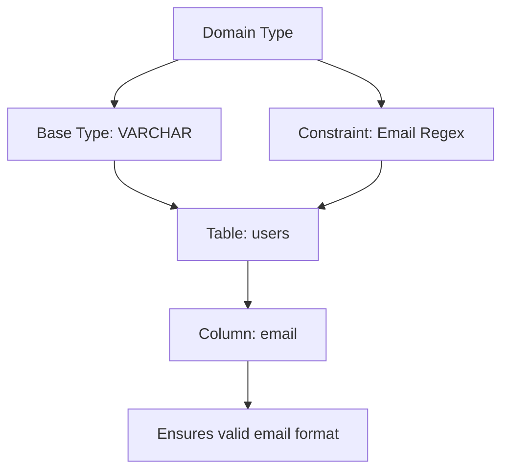
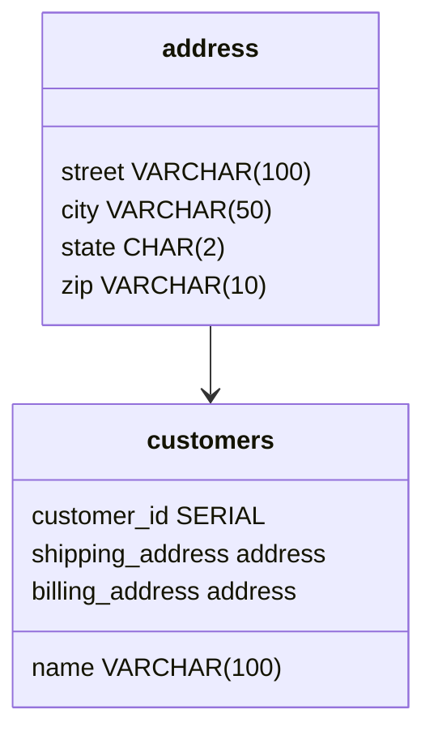
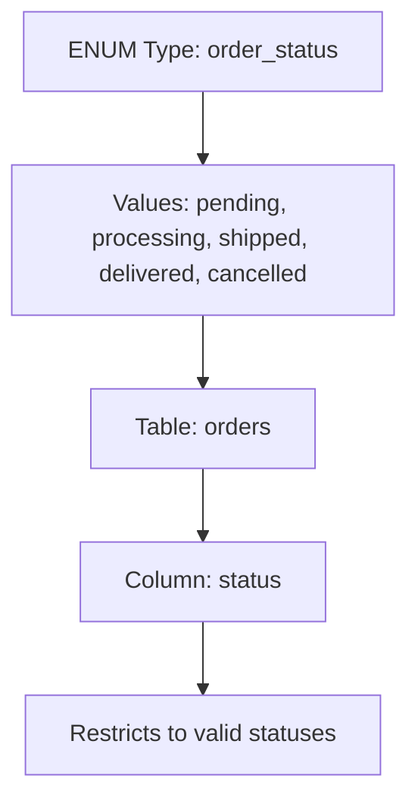
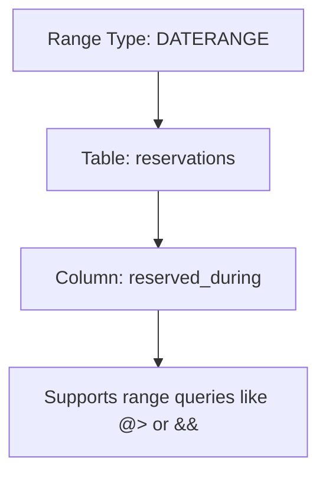
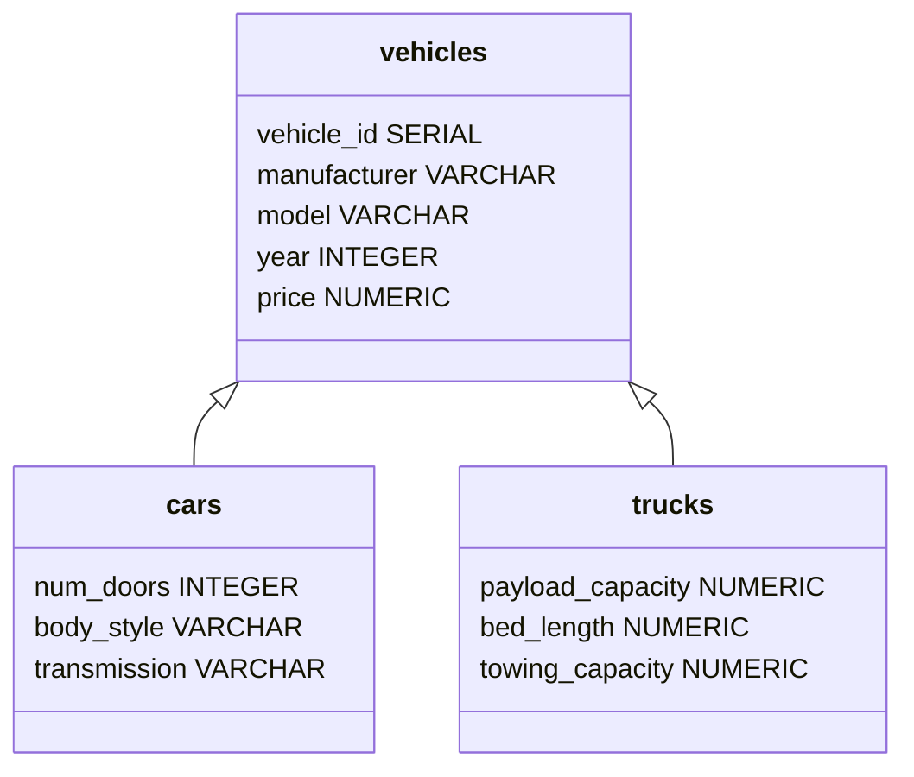
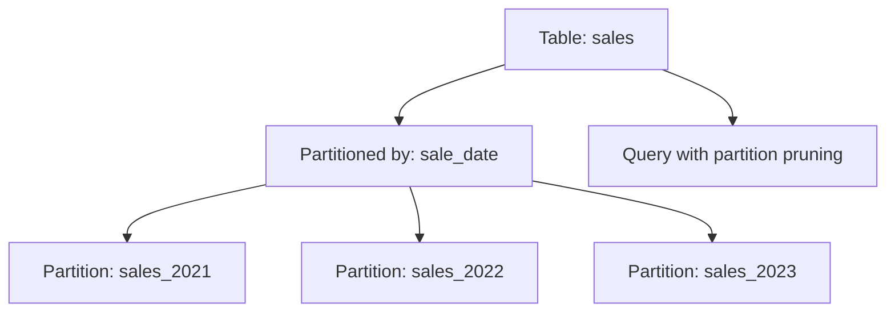
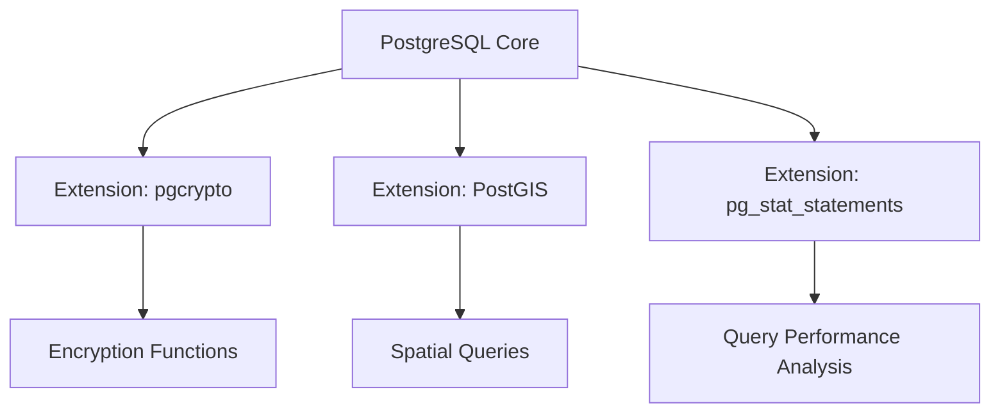
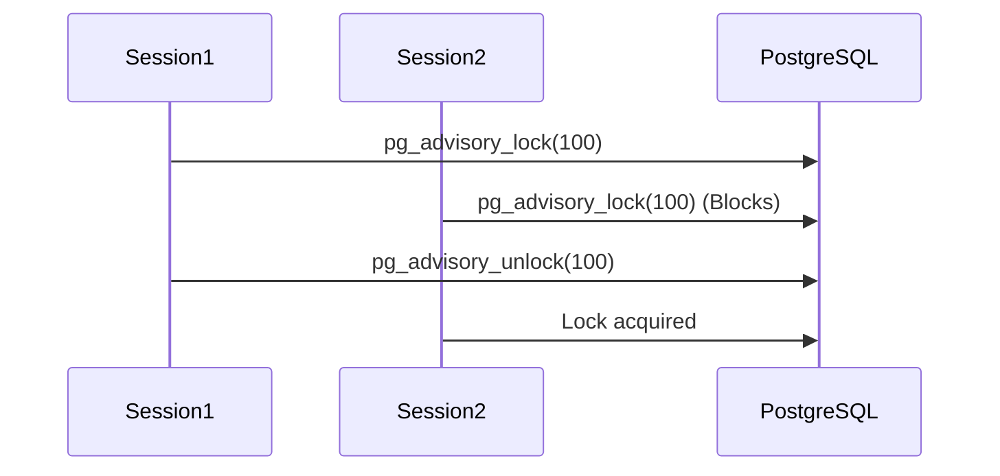

# Day 1: Advanced PostgreSQL Features

Welcome to the first day of exploring advanced PostgreSQL features! This guide is designed to help you understand powerful PostgreSQL capabilities with clear explanations, practical examples, and visual diagrams created using Mermaid.js. Whether you're new to PostgreSQL or looking to deepen your knowledge, this document will walk you through each topic step-by-step, making complex concepts approachable and engaging. Let's dive into the world of PostgreSQL!

## Topics Covered

1. **Custom Data Types**
   - Domain Types
   - Composite Types
   - Enumerated Types (ENUM)
   - Range Types

2. **Inheritance**
   - Table Inheritance
   - Benefits and Limitations
   - Querying Inherited Tables

3. **Partitioning**
   - Range Partitioning
   - List Partitioning
   - Hash Partitioning
   - Managing Partitions
   - Partition Pruning

4. **Extensions**
   - Overview of Popular Extensions
   - Installing and Using Extensions
   - PostGIS for Spatial Data
   - pg_stat_statements for Query Analysis
   - pgcrypto for Encryption

5. **Advisory Locks**
   - Understanding Advisory Locks
   - Application-Level Locking Mechanisms
   - Use Cases for Advisory Locks

## 1. Custom Data Types

PostgreSQL allows you to create custom data types to model your data more precisely. These types help enforce consistency, simplify queries, and make your database schema more robust. Let’s explore the four main types of custom data types with detailed explanations and examples.

### Domain Types

**Definition**: A domain type is a base data type (like `VARCHAR` or `NUMERIC`) with additional constraints to enforce specific rules. It ensures consistent validation across multiple tables without repeating constraints.

**Why Use It?**
- Enforces rules like valid email formats or positive numbers.
- Reusable across multiple tables, reducing redundancy.
- Simplifies schema maintenance.

**Mermaid Diagram**:


**Examples**:
1. **Email Address Validation**:
   ```sql
   -- Create a domain for valid email addresses
   CREATE DOMAIN email_address AS VARCHAR(255)
       CHECK (VALUE ~ '^[a-zA-Z0-9._%+-]+@[a-zA-Z0-9.-]+\.[a-zA-Z]{2,}$');

   -- Create a table using the domain
   CREATE TABLE employees (
       employee_id SERIAL PRIMARY KEY,
       name VARCHAR(100) NOT NULL,
       email email_address NOT NULL UNIQUE
   );

   -- Insert valid data
   INSERT INTO employees (name, email) VALUES ('Alice Brown', 'alice.brown@company.com');

   -- Invalid insert (will fail due to domain constraint)
   -- INSERT INTO employees (name, email) VALUES ('Bob Smith', 'invalid-email');
   ```

2. **Positive Integer Domain**:
   ```sql
   -- Create a domain for positive integers
   CREATE DOMAIN positive_int AS INTEGER
       CHECK (VALUE > 0);

   -- Create a table for product quantities
   CREATE TABLE inventory (
       item_id SERIAL PRIMARY KEY,
       item_name VARCHAR(100) NOT NULL,
       quantity positive_int NOT NULL
   );

   -- Insert valid data
   INSERT INTO inventory (item_name, quantity) VALUES ('Laptop', 10);

   -- Invalid insert (will fail)
   -- INSERT INTO inventory (item_name, quantity) VALUES ('Tablet', -5);
   ```

3. **Percentage Domain**:
   ```sql
   -- Create a domain for percentages (0-100)
   CREATE DOMAIN percentage AS NUMERIC(5,2)
       CHECK (VALUE >= 0 AND VALUE <= 100);

   -- Create a table for exam scores
   CREATE TABLE exam_results (
       student_id SERIAL PRIMARY KEY,
       subject VARCHAR(50) NOT NULL,
       score percentage NOT NULL
   );

   -- Insert valid data
   INSERT INTO exam_results (subject, score) VALUES ('Math', 85.50);

   -- Invalid insert (will fail)
   -- INSERT INTO exam_results (subject, score) VALUES ('Science', 101);
   ```

4. **Non-Empty String Domain**:
   ```sql
   -- Create a domain for non-empty strings
   CREATE DOMAIN non_empty_string AS TEXT
       CHECK (VALUE IS NOT NULL AND VALUE <> '');

   -- Create a table for categories
   CREATE TABLE product_categories (
       category_id SERIAL PRIMARY KEY,
       category_name non_empty_string NOT NULL
   );

   -- Insert valid data
   INSERT INTO product_categories (category_name) VALUES ('Electronics');

   -- Invalid insert (will fail)
   -- INSERT INTO product_categories (category_name) VALUES ('');
   ```

5. **Valid Phone Number Domain**:
   ```sql
   -- Create a domain for US phone numbers
   CREATE DOMAIN us_phone AS VARCHAR(12)
       CHECK (VALUE ~ '^\d{3}-\d{3}-\d{4}$');

   -- Create a table for contacts
   CREATE TABLE contacts (
       contact_id SERIAL PRIMARY KEY,
       name VARCHAR(100) NOT NULL,
       phone us_phone NOT NULL
   );

   -- Insert valid data
   INSERT INTO contacts (name, phone) VALUES ('Charlie Davis', '123-456-7890');

   -- Invalid insert (will fail)
   -- INSERT INTO contacts (name, phone) VALUES ('Eve Garcia', '123-456-789');
   ```

### Composite Types

**Definition**: Composite types allow you to group multiple fields into a single type, similar to a struct or record in programming languages. They are useful for representing complex data structures like addresses or coordinates.

**Why Use It?**
- Groups related fields together.
- Simplifies queries and updates for complex data.
- Improves readability and maintainability.

**Mermaid Diagram**:


**Examples**:
1. **Address Type**:
   ```sql
   -- Create a composite type for addresses
   CREATE TYPE address AS (
       street VARCHAR(100),
       city VARCHAR(50),
       state CHAR(2),
       zip VARCHAR(10)
   );

   -- Create a table using the composite type
   CREATE TABLE customers (
       customer_id SERIAL PRIMARY KEY,
       name VARCHAR(100) NOT NULL,
       shipping_address address,
       billing_address address
   );

   -- Insert data
   INSERT INTO customers (name, shipping_address, billing_address)
   VALUES (
       'Jane Smith',
       ROW('123 Main St', 'Boston', 'MA', '02108'),
       ROW('456 Oak Ave', 'Boston', 'MA', '02109')
   );

   -- Query composite fields
   SELECT name, (shipping_address).street AS street FROM customers;
   ```

2. **Coordinates Type**:
   ```sql
   -- Create a composite type for geographic coordinates
   CREATE TYPE coordinates AS (
       latitude NUMERIC(9,6),
       longitude NUMERIC(9,6)
   );

   -- Create a table for locations
   CREATE TABLE points_of_interest (
       poi_id SERIAL PRIMARY KEY,
       name VARCHAR(100) NOT NULL,
       location coordinates
   );

   -- Insert data
   INSERT INTO points_of_interest (name, location)
   VALUES ('Central Park', ROW(40.7829, -73.9654));

   -- Query coordinates
   SELECT name, (location).latitude AS lat FROM points_of_interest;
   ```

3. **Person Info Type**:
   ```sql
   -- Create a composite type for person details
   CREATE TYPE person_info AS (
       first_name VARCHAR(50),
       last_name VARCHAR(50),
       date_of_birth DATE
   );

   -- Create a table for employees
   CREATE TABLE employees (
       emp_id SERIAL PRIMARY KEY,
       info person_info
   );

   -- Insert data
   INSERT INTO employees (info)
   VALUES (ROW('John', 'Doe', '1980-01-15'));

   -- Query specific fields
   SELECT (info).first_name AS first_name FROM employees;
   ```

4. **Contact Info Type**:
   ```sql
   -- Create a composite type for contact details
   CREATE TYPE contact_info AS (
       email VARCHAR(255),
       phone VARCHAR(12)
   );

   -- Create a table for vendors
   CREATE TABLE vendors (
       vendor_id SERIAL PRIMARY KEY,
       vendor_name VARCHAR(100) NOT NULL,
       contact contact_info
   );

   -- Insert data
   INSERT INTO vendors (vendor_name, contact)
   VALUES ('Tech Supplies', ROW('contact@techsupplies.com', '555-123-4567'));

   -- Update a field
   UPDATE vendors SET contact.phone = '555-987-6543' WHERE vendor moderator_id = 1;
   ```

5. **Product Specs Type**:
   ```sql
   -- Create a composite type for product specifications
   CREATE TYPE product_specs AS (
       weight NUMERIC(6,2),
       dimensions VARCHAR(50),
       color VARCHAR(20)
   );

   -- Create a table for products
   CREATE TABLE products (
       product_id SERIAL PRIMARY KEY,
       name VARCHAR(100) NOT NULL,
       specs product_specs
   );

   -- Insert data
   INSERT INTO products (name, specs)
   VALUES ('Smartphone', ROW(0.15, '140x70x7 mm', 'Black'));

   -- Query specific specs
   SELECT name, (specs).color AS color FROM products;
   ```

### Enumerated Types (ENUM)

**Definition**: ENUM types define a fixed set of values, ideal for columns that can only have specific states, like order statuses or categories.

**Why Use It?**
- Restricts values to a predefined list.
- Improves data integrity and query simplicity.
- Ordered by creation sequence, useful for sorting.

**Mermaid Diagram**:


**Examples**:
1. **Order Status ENUM**:
   ```sql
   -- Create an ENUM type for order status
   CREATE TYPE order_status AS ENUM ('pending', 'processing', 'shipped', 'delivered', 'cancelled');

   -- Create a table
   CREATE TABLE orders (
       order_id SERIAL PRIMARY KEY,
       customer_id INTEGER NOT NULL,
       status order_status NOT NULL DEFAULT 'pending'
   );

   -- Insert data
   INSERT INTO orders (customer_id, status) VALUES (1, 'shipped');

   -- Query by status
   SELECT * FROM orders WHERE status = 'shipped';
   ```

2. **Priority Levels ENUM**:
   ```sql
   -- Create an ENUM type for task priorities
   CREATE TYPE task_priority AS ENUM ('low', 'medium', 'high', 'urgent');

   -- Create a table for tasks
   CREATE TABLE tasks (
       task_id SERIAL PRIMARY KEY,
       description TEXT NOT NULL,
       priority task_priority NOT NULL
   );

   -- Insert data
   INSERT INTO tasks (description, priority) VALUES ('Fix bug', 'high');

   -- Query high-priority tasks
   SELECT * FROM tasks WHERE priority = 'high';
   ```

3. **Payment Status ENUM**:
   ```sql
   -- Create an ENUM type for payment status
   CREATE TYPE payment_status AS ENUM ('pending', 'completed', 'failed', 'refunded');

   -- Create a table for payments
   CREATE TABLE payments (
       payment_id SERIAL PRIMARY KEY,
       amount NUMERIC(10,2) NOT NULL,
       status payment_status NOT NULL
   );

   -- Insert data
   INSERT INTO payments (amount, status) VALUES (99.99, 'completed');

   -- Query completed payments
   SELECT * FROM payments WHERE status = 'completed';
   ```

4. **User Roles ENUM**:
   ```sql
   -- Create an ENUM type for user roles
   CREATE TYPE user_role AS ENUM ('admin', 'editor', 'viewer');

   -- Create a table for users
   CREATE TABLE users (
       user_id SERIAL PRIMARY KEY,
       username VARCHAR(50) NOT NULL,
       role user_role NOT NULL
   );

   -- Insert data
   INSERT INTO users (username, role) VALUES ('alice', 'admin');

   -- Query admins
   SELECT * FROM users WHERE role = 'admin';
   ```

5. **Product Categories ENUM**:
   ```sql
   -- Create an ENUM type for product categories
   CREATE TYPE product_category AS ENUM ('electronics', 'clothing', 'books', 'home');

   -- Create a table for products
   CREATE TABLE products (
       product_id SERIAL PRIMARY KEY,
       name VARCHAR(100) NOT NULL,
       category product_category NOT NULL
   );

   -- Insert data
   INSERT INTO products (name, category) VALUES ('Laptop', 'electronics');

   -- Add a new ENUM value
   ALTER TYPE product_category ADD VALUE 'toys' AFTER 'home';

   -- Query electronics
   SELECT * FROM products WHERE category = 'electronics';
   ```

### Range Types

**Definition**: Range types represent a range of values, such as dates or numbers, allowing efficient range-based queries.

**Why Use It?**
- Simplifies queries involving intervals (e.g., date ranges).
- Supports range operators like overlap (`&&`), contains (`@>`), etc.
- Ideal for scheduling or resource allocation.

**Mermaid Diagram**:


**Examples**:
1. **Date Range for Reservations**:
   ```sql
   -- Create a table with a date range
   CREATE TABLE hotel_bookings (
       booking_id SERIAL PRIMARY KEY,
       room_id INTEGER NOT NULL,
       reserved_during DATERANGE NOT NULL
   );

   -- Insert data
   INSERT INTO hotel_bookings (room_id, reserved_during)
   VALUES (101, '[2023-01-10, 2023-01-15)');

   -- Query bookings for a specific date
   SELECT * FROM hotel_bookings WHERE reserved_during @> '2023-01-12'::DATE;
   ```

2. **Numeric Range for Prices**:
   ```sql
   -- Create a table with a numeric range
   CREATE TABLE product_prices (
       product_id SERIAL PRIMARY KEY,
       name VARCHAR(100) NOT NULL,
       price_range NUMRANGE NOT NULL
   );

   -- Insert data
   INSERT INTO product_prices (name, price_range)
   VALUES ('Smartphone', '[500, 700)');

   -- Query products in a price range
   SELECT * FROM product_prices WHERE price_range @> 600;
   ```

3. **Custom Temperature Range**:
   ```sql
   -- Create a custom range type
   CREATE TYPE temperature_range AS RANGE (SUBTYPE = NUMERIC);

   -- Create a table for climate data
   CREATE TABLE climate_data (
       reading_id SERIAL PRIMARY KEY,
       location VARCHAR(100) NOT NULL,
       temp_range temperature_range NOT NULL
   );

   -- Insert data
   INSERT INTO climate_data (location, temp_range)
   VALUES ('Miami', '[20, 30]');

   -- Query temperature ranges
   SELECT * FROM climate_data WHERE temp_range && '[25, 35]';
   ```

4. **Event Time Range**:
   ```sql
   -- Create a table for events
   CREATE TABLE events (
       event_id SERIAL PRIMARY KEY,
       event_name VARCHAR(100) NOT NULL,
       duration TSTZRANGE NOT NULL
   );

   -- Insert data
   INSERT INTO events (event_name, duration)
   VALUES ('Conference', '[2023-06-01 09:00, 2023-06-01 17:00)');

   -- Query overlapping events
   SELECT * FROM events WHERE duration && '[2023-06-01 12:00, 2023-06-01 14:00)';
   ```

5. **Inventory Stock Range**:
   ```sql
   -- Create a table for inventory
   CREATE TABLE inventory (
       item_id SERIAL PRIMARY KEY,
       item_name VARCHAR(100) NOT NULL,
       stock_range INTRANGE NOT NULL
   );

   -- Insert data
   INSERT INTO inventory (item_name, stock_range)
   VALUES ('Laptop', '[10, 50)');

   -- Query items with stock in range
   SELECT * FROM inventory WHERE stock_range @> 25;
   ```

## 2. Inheritance

**Definition**: Table inheritance allows child tables to inherit columns from a parent table, modeling "is-a" relationships (e.g., a car is a vehicle).

**Why Use It?**
- Organizes related tables hierarchically.
- Simplifies queries across related tables.
- Useful for modeling object-oriented-like structures.

**Limitations**:
- Constraints on parent tables don’t apply to child tables.
- Not ideal for performance optimization (use partitioning instead).

**Mermaid Diagram**:


**Examples**:
1. **Vehicle Inheritance**:
   ```sql
   -- Create parent table
   CREATE TABLE vehicles (
       vehicle_id SERIAL PRIMARY KEY,
       manufacturer VARCHAR(100) NOT NULL,
       model VARCHAR(100) NOT NULL,
       year INTEGER NOT NULL
   );

   -- Create child table
   CREATE TABLE cars (
       num_doors INTEGER NOT NULL
   ) INHERITS (vehicles);

   -- Insert data
   INSERT INTO cars (manufacturer, model, year, num_doors)
   VALUES ('Toyota', 'Camry', 2022, 4);

   -- Query all vehicles
   SELECT * FROM vehicles;
   ```

2. **Employee Types**:
   ```sql
   -- Create parent table
   CREATE TABLE employees (
       emp_id SERIAL PRIMARY KEY,
       name VARCHAR(100) NOT NULL,
       hire_date DATE NOT NULL
   );

   -- Create child table
   CREATE TABLE managers (
       department VARCHAR(50) NOT NULL
   ) INHERITS (employees);

   -- Insert data
   INSERT INTO managers (name, hire_date, department)
   VALUES ('Alice', '2020-01-10', 'Sales');

   -- Query all employees
   SELECT * FROM employees;
   ```

3. **Products Inheritance**:
   ```sql
   -- Create parent table
   CREATE TABLE products (
       product_id SERIAL PRIMARY KEY,
       name VARCHAR(100) NOT NULL,
       price NUMERIC(10,2) NOT NULL
   );

   -- Create child table
   CREATE TABLE electronics (
       warranty_years INTEGER NOT NULL
   ) INHERITS (products);

   -- Insert data
   INSERT INTO electronics (name, price, warranty_years)
   VALUES ('Laptop', 999.99, 2);

   -- Query with TABLEOID
   SELECT tableoid::regclass, name FROM products;
   ```

4. **Accounts Inheritance**:
   ```sql
   -- Create parent table
   CREATE TABLE accounts (
       account_id SERIAL PRIMARY KEY,
       username VARCHAR(50) NOT NULL
   );

   -- Create child table
   CREATE TABLE premium_accounts (
       subscription_type VARCHAR(20) NOT NULL
   ) INHERITS (accounts);

   -- Insert data
   INSERT INTO premium_accounts (username, subscription_type)
   VALUES ('john_doe', 'Gold');

   -- Query specific child table
   SELECT * FROM premium_accounts;
   ```

5. **Assets Inheritance**:
   ```sql
   -- Create parent table
   CREATE TABLE assets (
       asset_id SERIAL PRIMARY KEY,
       name VARCHAR(100) NOT NULL,
       value NUMERIC(10,2) NOT NULL
   );

   -- Create child table
   CREATE TABLE real_estate (
       address VARCHAR(200) NOT NULL
   ) INHERITS (assets);

   -- Insert data
   INSERT INTO real_estate (name, value, address)
   VALUES ('Office Building', 500000.00, '123 Main St');

   -- Join with parent
   SELECT a.name, r.address FROM assets a JOIN real_estate r ON a.asset_id = r.asset_id;
   ```

## 3. Partitioning

**Definition**: Partitioning splits a large table into smaller, manageable pieces (partitions) based on a key, improving query performance.

**Why Use It?**
- Enhances query performance through partition pruning.
- Simplifies maintenance of large datasets.
- Supports range, list, and hash partitioning strategies.

**Mermaid Diagram**:


**Examples**:
1. **Range Partitioning (Sales by Year)**:
   ```sql
   -- Create partitioned table
   CREATE TABLE sales (
       sale_id SERIAL,
       sale_date DATE NOT NULL,
       amount NUMERIC(10,2) NOT NULL,
       PRIMARY KEY (sale_id, sale_date)
   ) PARTITION BY RANGE (sale_date);

   -- Create partitions
   CREATE TABLE sales_2021 PARTITION OF sales
       FOR VALUES FROM ('2021-01-01') TO ('2022-01-01');

   -- Insert data
   INSERT INTO sales (sale_date, amount) VALUES ('2021-06-15', 200.00);

   -- Query with partition pruning
   SELECT * FROM sales WHERE sale_date = '2021-06-15';
   ```

2. **List Partitioning (Customers by Region)**:
   ```sql
   -- Create partitioned table
   CREATE TABLE customers (
       customer_id SERIAL,
       region VARCHAR(2) NOT NULL,
       name VARCHAR(100) NOT NULL,
       PRIMARY KEY (customer_id, region)
   ) PARTITION BY LIST (region);

   -- Create partitions
   CREATE TABLE customers_east PARTITION OF customers FOR VALUES IN ('EA');

   -- Insert data
   INSERT INTO customers (region, name) VALUES ('EA', 'John');

   -- Query specific region
   SELECT * FROM customers WHERE region = 'EA';
   ```

3. **Hash Partitioning (Reviews by Product)**:
   ```sql
   -- Create partitioned table
   CREATE TABLE product_reviews (
       review_id SERIAL,
       product_id INTEGER NOT NULL,
       rating INTEGER NOT NULL,
       PRIMARY KEY (review_id, product_id)
   ) PARTITION BY HASH (product_id);

   -- Create partitions
   CREATE TABLE reviews_p0 PARTITION OF product_reviews FOR VALUES WITH (MODULUS 2, REMAINDER 0);

   -- Insert data
   INSERT INTO product_reviews (product_id, rating) VALUES (101, 5);

   -- View partition distribution
   SELECT tableoid::regclass, count(*) FROM product_reviews GROUP BY tableoid;
   ```

4. **Default Partition**:
   ```sql
   -- Create partitioned table
   CREATE TABLE orders (
       order_id SERIAL,
       order_date DATE NOT NULL,
       amount NUMERIC(10,2) NOT NULL,
       PRIMARY KEY (order_id, order_date)
   ) PARTITION BY RANGE (order_date);

   -- Create partitions
   CREATE TABLE orders_2023 PARTITION OF orders
       FOR VALUES FROM ('2023-01-01') TO ('2024-01-01');
   CREATE TABLE orders_default PARTITION OF orders DEFAULT;

   -- Insert data
   INSERT INTO orders (order_date, amount) VALUES ('2025-01-01', 300.00);

   -- Query default partition
   SELECT * FROM orders_default;
   ```

5. **Managing Partitions**:
   ```sql
   -- Create partitioned table
   CREATE TABLE logs (
       log_id SERIAL,
       log_date DATE NOT NULL,
       message TEXT,
       PRIMARY KEY (log_id, log_date)
   ) PARTITION BY RANGE (log_date);

   -- Create partitions
   CREATE TABLE logs_2022 PARTITION OF logs
       FOR VALUES FROM ('2022-01-01') TO ('2023-01-01');

   -- Detach and reattach partition
   ALTER TABLE logs DETACH PARTITION logs_2022;
   ALTER TABLE logs ATTACH PARTITION logs_2022
       FOR VALUES FROM ('2022-01-01') TO ('2023-01-01');

   -- Insert and query
   INSERT INTO logs (log_date, message) VALUES ('2022-05-10', 'Error occurred');
   SELECT * FROM logs WHERE log_date = '2022-05-10';
   ```

## 4. Extensions

**Definition**: Extensions add specialized functionality to PostgreSQL, such as encryption, spatial data support, or query analysis.

**Why Use It?**
- Extends PostgreSQL’s capabilities without modifying core code.
- Simplifies complex tasks like geospatial queries or encryption.
- Well-tested extensions are maintained by the community.

**Mermaid Diagram**:


**Examples**:
1. **pgcrypto for Password Hashing**:
   ```sql
   -- Install pgcrypto
   CREATE EXTENSION IF NOT EXISTS pgcrypto;

   -- Hash a password
   SELECT crypt('password123', gen_salt('bf')) AS hashed_password;
   ```

2. **pg_stat_statements for Query Analysis**:
   ```sql
   -- Install pg_stat_statements
   CREATE EXTENSION IF NOT EXISTS pg_stat_statements;

   -- View query performance
   SELECT query, total_exec_time FROM pg_stat_statements LIMIT 5;
   ```

3. **hstore for Key-Value Storage**:
   ```sql
   -- Install hstore
   CREATE EXTENSION IF NOT EXISTS hstore;

   -- Create table with hstore
   CREATE TABLE items (
       item_id SERIAL PRIMARY KEY,
       attributes hstore
   );

   -- Insert data
   INSERT INTO items (attributes)
   VALUES ('color => "blue", size => "large"');

   -- Query attributes
   SELECT attributes -> 'color' AS color FROM items;
   ```

4. **uuid-ossp for UUID Generation**:
   ```sql
   -- Install uuid-ossp
   CREATE EXTENSION IF NOT EXISTS uuid_ossp;

   -- Generate a UUID
   SELECT uuid_generate_v4() AS unique_id;
   ```

5. **PostGIS for Spatial Data** (Note: Requires additional setup):
   ```sql
   -- Install PostGIS (simplified example)
   -- CREATE EXTENSION IF NOT EXISTS postgis;

   -- Create spatial table
   -- CREATE TABLE cities (
   --     city_id SERIAL PRIMARY KEY,
   --     name VARCHAR(100),
   --     location GEOMETRY(Point, 4326)
   -- );

   -- Insert data
   -- INSERT INTO cities (name, location)
   -- VALUES ('New York', ST_SetSRID(ST_MakePoint(-74.0060, 40.7128), 4326));
   ```

## 5. Advisory Locks

**Definition**: Advisory locks provide application-level locking mechanisms to coordinate activities across sessions, independent of table rows.

**Why Use It?**
- Prevents conflicts in application logic (e.g., unique counter increments).
- Flexible with session or transaction-level locks.
- Lightweight compared to row-level locks.

**Mermaid Diagram**:


**Examples**:
1. **Basic Advisory Lock**:
   ```sql
   -- Acquire lock
   SELECT pg_advisory_lock(100);

   -- Release lock
   SELECT pg_advisory_unlock(100);
   ```

2. **Non-Blocking Lock**:
   ```sql
   -- Try to acquire lock
   SELECT pg_try_advisory_lock(101) AS lock_acquired;
   ```

3. **Transaction-Level Lock**:
   ```sql
   BEGIN;
   SELECT pg_advisory_xact_lock(102);
   -- Perform operations
   COMMIT; -- Lock released
   ```

4. **Two-Key Lock**:
   ```sql
   -- Acquire lock with two keys
   SELECT pg_advisory_lock(1, 2);

   -- Release lock
   SELECT pg_advisory_unlock(1, 2);
   ```

5. **Safe Counter Increment**:
   ```sql
   -- Create counters table
   CREATE TABLE counters (
       id SERIAL PRIMARY KEY,
       name TEXT UNIQUE NOT NULL,
       value INTEGER NOT NULL DEFAULT 0
   );

   -- Create function with advisory lock
   CREATE OR REPLACE FUNCTION safe_increment_counter(counter_name TEXT)
   RETURNS INTEGER AS $$
   DECLARE
       counter_id INTEGER;
       current_value INTEGER;
   BEGIN
       SELECT id INTO counter_id FROM counters WHERE name = counter_name;
       IF NOT FOUND THEN
           INSERT INTO counters (name, value) VALUES (counter_name, 0) RETURNING id INTO counter_id;
       END IF;
       PERFORM pg_advisory_lock(counter_id);
       SELECT value INTO current_value FROM counters WHERE id = counter_id;
       UPDATE counters SET value = value + 1 WHERE id = counter_id;
       PERFORM pg_advisory_unlock(counter_id);
       RETURN current_value + 1;
   END;
   $$ LANGUAGE plpgsql;

   -- Use function
   SELECT safe_increment_counter('visitors');
   ```

## Best Practices

1. **Custom Data Types**:
   - Use domain types for reusable constraints.
   - Use ENUMs for fixed, stable value sets.
   - Leverage composite types for structured data.
   - Use range types for interval-based queries.

2. **Inheritance**:
   - Use for logical "is-a" relationships.
   - Avoid relying on parent table constraints for children.
   - Consider partitioning for performance.

3. **Partitioning**:
   - Choose partitioning strategy based on query patterns.
   - Keep partition counts reasonable (hundreds, not thousands).
   - Use default partitions for unexpected values.

4. **Extensions**:
   - Install only necessary extensions.
   - Test extensions in development environments.
   - Monitor extension performance impacts.

5. **Advisory Locks**:
   - Use for application-level coordination.
   - Ensure locks are released to avoid deadlocks.
   - Use consistent lock IDs across the application.

## Exercises

Complete the exercises in the `exercises.sql` file to practice these concepts hands-on.

## Additional Resources

- **PostgreSQL Documentation**:
  - [User-Defined Types](https://www.postgresql.org/docs/current/xtypes.html)
  - [Inheritance](https://www.postgresql.org/docs/current/ddl-inherit.html)
  - [Table Partitioning](https://www.postgresql.org/docs/current/ddl-partitioning.html)
  - [Extensions](https://www.postgresql.org/docs/current/external-extensions.html)
  - [Advisory Locks](https://www.postgresql.org/docs/current/functions-admin.html#FUNCTIONS-ADVISORY-LOCKS)

- **Books**:
  - *PostgreSQL 14 Administration Cookbook* by Simon Riggs, Gianni Ciolli
  - *Mastering PostgreSQL 13* by Hans-Jürgen Schönig

