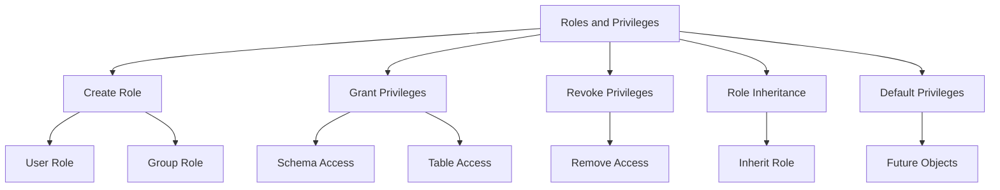
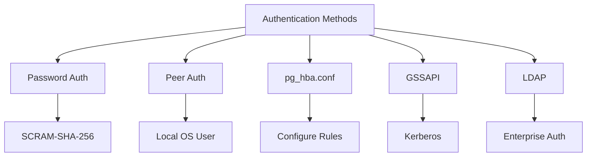
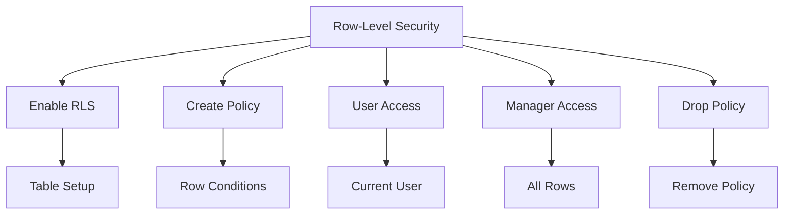
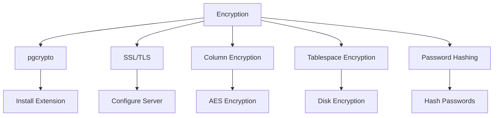
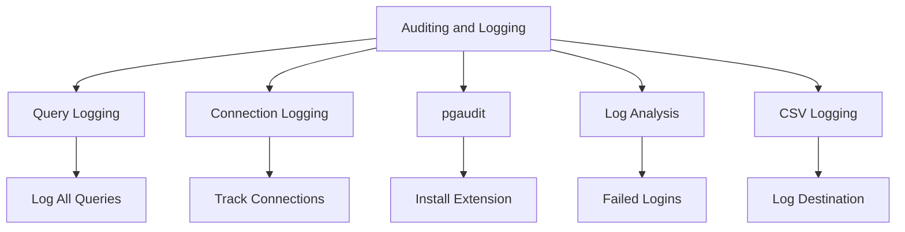
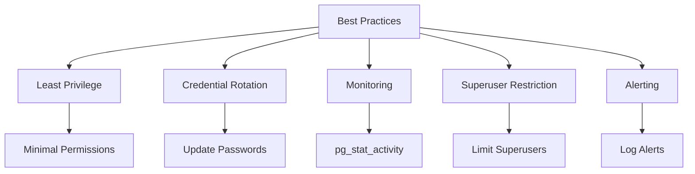

# Day 3: Database Security and User Management in PostgreSQL

This document provides a detailed guide to securing a PostgreSQL database, tailored for students learning database administration. Each topic is explained clearly with at least five practical examples and a Mermaid.js diagram to visualize the concept. The document includes exercises and practice questions to reinforce learning through hands-on practice.

## Topics Covered

### 1. Roles and Privileges
**Definition**: Roles in PostgreSQL manage database access permissions. A role can represent a user or a group and can inherit privileges from other roles. Privileges define actions (e.g., SELECT, INSERT) a role can perform on database objects.

**Key Concepts**:
- **Creating Roles**: Use `CREATE ROLE` to define users or groups.
- **Granting Privileges**: Use `GRANT` to assign permissions.
- **Revoking Privileges**: Use `REVOKE` to remove permissions.
- **Role Inheritance**: A role can inherit privileges from another role.
- **Default Privileges**: Set permissions for future objects with `ALTER DEFAULT PRIVILEGES`.

**Mermaid Diagram**:


**Examples**:
1. **Creating a Role with Login**:
   ```sql
   CREATE ROLE data_analyst LOGIN PASSWORD 'SecurePass123';
   ```
   Creates a role `data_analyst` that can log in with a password.

2. **Granting Schema Access**:
   ```sql
   GRANT USAGE ON SCHEMA public TO data_analyst;
   ```
   Allows `data_analyst` to access objects in the `public` schema.

3. **Granting Table Privileges**:
   ```sql
   GRANT SELECT, INSERT ON employees TO data_analyst;
   ```
   Permits `data_analyst` to read and insert data into the `employees` table.

4. **Setting Default Privileges**:
   ```sql
   ALTER DEFAULT PRIVILEGES IN SCHEMA public GRANT SELECT ON TABLES TO data_analyst;
   ```
   Grants SELECT on all future tables in the `public` schema to `data_analyst`.

5. **Role Inheritance**:
   ```sql
   CREATE ROLE team_lead;
   GRANT data_analyst TO team_lead;
   ```
   `team_lead` inherits all privileges of `data_analyst`.

---

### 2. Authentication Methods
**Definition**: Authentication methods verify user identity during database connections. The `pg_hba.conf` file controls authentication rules based on user, database, and connection type.

**Key Concepts**:
- **Password Authentication**: Uses encrypted passwords (e.g., SCRAM-SHA-256).
- **Peer Authentication**: Trusts OS user for local connections.
- **Other Methods**: Includes GSSAPI, LDAP for enterprise setups.
- **pg_hba.conf**: Configures authentication rules.

**Mermaid Diagram**:


**Examples**:
1. **Creating a Role with Password**:
   ```sql
   CREATE ROLE app_user LOGIN ENCRYPTED PASSWORD 'AppPass2025';
   ```
   Creates a role with a SCRAM-SHA-256 encrypted password.

2. **Configuring pg_hba.conf for Peer Authentication**:
   ```
   # TYPE  DATABASE  USER  ADDRESS  METHOD
   local   all       all            peer
   ```
   Allows local connections without a password if OS username matches a role.

3. **Configuring pg_hba.conf for Host Authentication**:
   ```
   # TYPE  DATABASE  USER  ADDRESS         METHOD
   host    all       all   192.168.1.0/24  scram-sha-256
   ```
   Requires password for connections from the specified IP range.

4. **Testing Authentication**:
   ```sql
   \c postgres app_user
   ```
   Connects as `app_user`, prompting for the password.

5. **GSSAPI Authentication** (conceptual):
   ```
   # TYPE  DATABASE  USER  ADDRESS  METHOD
   hostgssenc all      all   0.0.0.0/0  gss
   ```
   Configures GSSAPI for encrypted connections.

---

### 3. Row-Level Security (RLS)
**Definition**: Row-Level Security restricts access to specific table rows based on user identity or conditions, enhancing data privacy.

**Key Concepts**:
- **Enabling RLS**: Use `ALTER TABLE ... ENABLE ROW LEVEL SECURITY`.
- **Creating Policies**: Define row access rules with `CREATE POLICY`.
- **Use Cases**: Restrict users to their own data.

**Mermaid Diagram**:


**Examples**:
1. **Creating a Table with RLS**:
   ```sql
   CREATE TABLE employee_records (
       id SERIAL PRIMARY KEY,
       username TEXT,
       salary INTEGER
   );
   ALTER TABLE employee_records ENABLE ROW LEVEL SECURITY;
   ```

2. **Policy for User-Specific Access**:
   ```sql
   CREATE POLICY employee_access ON employee_records
       USING (username = current_user);
   ```
   Users see only rows where `username` matches their role.

3. **Policy for Managers**:
   ```sql
   CREATE ROLE manager;
   CREATE POLICY manager_access ON employee_records
       FOR SELECT TO manager
       USING (TRUE);
   ```
   Managers can view all rows.

4. **Testing RLS**:
   ```sql
   SET ROLE data_analyst;
   INSERT INTO employee_records (username, salary) VALUES ('data_analyst', 50000);
   SELECT * FROM employee_records;
   ```
   The user sees only their own record.

5. **Dropping a Policy**:
   ```sql
   DROP POLICY employee_access ON employee_records;
   ```
   Removes the `employee_access` policy.

---

### 4. Encryption
**Definition**: PostgreSQL supports encryption for data at rest (stored) and in transit (network). The `pgcrypto` extension enables column-level encryption.

**Key Concepts**:
- **Data at Rest**: Encrypt tablespaces or disks.
- **Data in Transit**: Use SSL/TLS for secure connections.
- **Column-Level Encryption**: Use `pgcrypto` for specific columns.

**Mermaid Diagram**:


**Examples**:
1. **Installing pgcrypto**:
   ```sql
   CREATE EXTENSION IF NOT EXISTS pgcrypto;
   ```

2. **Encrypting a Password**:
   ```sql
   CREATE TABLE users (
       user_id SERIAL PRIMARY KEY,
       username TEXT,
       password_hash TEXT
   );
   INSERT INTO users (username, password_hash)
   VALUES ('bob', crypt('BobPass123', gen_salt('bf')));
   ```

3. **Verifying a Password**:
   ```sql
   SELECT username FROM users
   WHERE password_hash = crypt('BobPass123', password_hash);
   ```

4. **Encrypting a Column with AES**:
   ```sql
   INSERT INTO users (username, password_hash)
   VALUES ('charlie', pgp_sym_encrypt('SecretData', 'my_key'));
   ```

5. **Enabling SSL** (conceptual):
   ```
   # In postgresql.conf:
   ssl = on
   ssl_cert_file = 'server.crt'
   ssl_key_file = 'server.key'
   ```

---

### 5. Auditing and Logging
**Definition**: Auditing tracks database activities, and logging records events like queries and connections for monitoring and debugging.

**Key Concepts**:
- **Logging Settings**: Configure in `postgresql.conf` (e.g., `log_statement`).
- **Extensions**: Use `pgaudit` for detailed auditing.
- **Use Cases**: Monitor unauthorized access or performance.

**Mermaid Diagram**:


**Examples**:
1. **Enabling Query Logging**:
   ```sql
   -- In postgresql.conf:
   log_statement = 'all'
   ```

2. **Logging Connections**:
   ```sql
   -- In postgresql.conf:
   log_connections = on
   log_disconnections = on
   ```

3. **Installing pgaudit**:
   ```sql
   CREATE EXTENSION pgaudit;
   ```

4. **Querying Logs for Failed Logins**:
   ```sql
   -- Check PostgreSQL log file for entries with "FATAL: password authentication failed"
   ```

5. **Setting Log Destination**:
   ```sql
   -- In postgresql.conf:
   log_destination = 'csvlog'
   logging_collector = on
   ```

---

### 6. Best Practices
**Definition**: Security best practices ensure a robust PostgreSQL database by minimizing risks and maintaining control.

**Key Concepts**:
- **Principle of Least Privilege**: Grant only necessary permissions.
- **Credential Rotation**: Regularly update passwords.
- **Monitoring and Alerting**: Detect anomalies with tools.

**Mermaid Diagram**:


**Examples**:
1. **Applying Least Privilege**:
   ```sql
   GRANT SELECT ON employees TO readonly;
   ```

2. **Rotating Passwords**:
   ```sql
   ALTER ROLE data_analyst WITH PASSWORD 'NewPass2025';
   ```

3. **Restricting Superuser Access**:
   ```sql
   ALTER ROLE admin WITH NOSUPERUSER;
   ```

4. **Monitoring Active Connections**:
   ```sql
   SELECT * FROM pg_stat_activity WHERE state = 'active';
   ```

5. **Enabling Alerts** (conceptual):
   ```sql
   -- Use tools like pgBadger to analyze logs for anomalies
   ```

---

## Exercises

Practice these exercises to apply PostgreSQL security concepts:

1. **Create a Role and Assign Privileges**:
   Create a role `appuser` with login and a secure password. Grant it SELECT and INSERT on the `customers` table.

2. **Revoke Privileges**:
   Revoke INSERT from `appuser` on the `customers` table.

3. **Implement Row-Level Security**:
   Create a table `employee_data` with `id`, `username`, and `salary`. Enable RLS so only the employee (by username) sees their record.

4. **Use pgcrypto for Passwords**:
   Create a table for user credentials and use `pgcrypto` to encrypt and verify passwords.

5. **List Roles and Privileges**:
   Write a query to show all roles and their privileges in the current database.

6. **Enable SSL Connections**:
   Describe the steps to configure SSL in PostgreSQL (no code required).

7. **Configure Query Logging**:
   Enable logging of all queries and explain how to find failed login attempts.

8. **Create a Manager Role**:
   Create a `manager` role that inherits `appuser` privileges and add UPDATE on `customers`.

9. **Test RLS with Multiple Users**:
   Insert data into `employee_data` for two users, then test RLS by querying as each.

10. **Monitor Connections**:
    Use `pg_stat_activity` to monitor active database connections.

---

## Practice Questions

1. What is the purpose of the `LOGIN` attribute in a PostgreSQL role?
2. How does `pg_hba.conf` manage different authentication methods?
3. Why is Row-Level Security critical for multi-user applications?
4. What advantages does `pgcrypto` provide for data encryption?
5. How does the principle of least privilege enhance database security?

---

## Getting Started

1. **Install PostgreSQL**: Ensure PostgreSQL is running.
2. **Run Examples**: Execute the SQL examples in a PostgreSQL client (e.g., psql).
3. **Complete Exercises**: Work through the exercises to practice.
4. **Check Logs**: Review PostgreSQL logs for auditing insights.
5. **Study Diagrams**: Use the Mermaid diagrams to visualize each topic.

This document equips you with the knowledge and tools to secure a PostgreSQL database effectively. Practice the examples and exercises to build expertise.