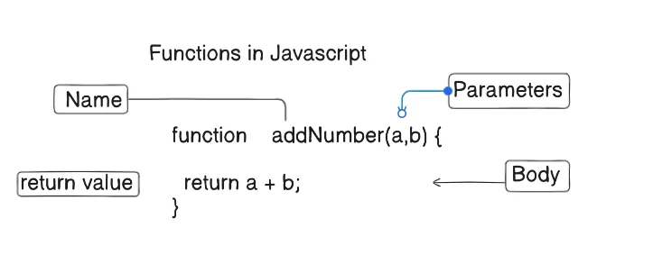

# Variables and Data Types

**let** allows reassigning values; **const** does not.  
**var** is an older way of declaring variables and is not recommended.


---

## 1. Primitive Data Types

- **String**: Text enclosed in `' '` or `" "`
- **Number**: Integers or floating-point values
- **Boolean**: `true` or `false`
- **Null**: Intentional absence of any object value
- **Undefined**: Declared but not yet assigned

```js
let name = "John Doe";
let age = 25;
let height = 5.9;
let isStudent = true;
let emptyValue = null;
let notAssigned;
```

---

## 2. Reference Types

### Object  
A collection of key–value pairs.

```js
let person = {
    name: "John Doe",
    age: 25,
    isStudent: true
};
console.log(person);
console.log(person.name);
console.log(person.age);
```

### Array  
An ordered list of values.

```js
let fruits = ["apple", "banana", "orange", "grape", "mango", "kiwi"];
console.log(fruits);
console.log(fruits[0]); // apple
console.log(fruits[3]); // grape
```

### Function  
A reusable block of code.



```js
function helloWorld() {
    console.log("Hello, World!");
}

helloWorld();
```

#### Functions with Parameters and Return Values

```js
function greet(name) {
    console.log("Hello, " + name + "!");
}
greet("John Doe");

function add(a, b) {
    return a + b;
}
console.log(add(5, 10)); // 15

const multiply = (a, b) => a * b;
console.log(multiply(5, 10)); // 50
```

---

## 3. var vs let vs const

```js
function exampleVar() {
    let y = 10;
    var x = 20;
    const z = 30;

    if (true) {
        var x = 10;   // overrides function-scoped x
        let y = 20;   // block-scoped
        // z = 40;    // error: cannot reassign const
    }

    console.log(x); // 10
    console.log(y); // 10
    console.log(z); // 30
}

exampleVar();
```

---

## 4. Conditional Statements

### if / else if / else

```js
let name = "EXAMPLE NAME";

if (name === "John Doe") {
    console.log("from if");
} else if (name === "Jane Doe") {
    console.log("from else if");
} else {
    console.log("from else");
}
```

### switch

```js
let fruit = "banana";

switch (fruit) {
    case "apple":
        console.log("This is an apple.");
        break;
    case "banana":
        console.log("This is a banana.");
        break;
    case "orange":
        console.log("This is an orange.");
        break;
    default:
        console.log("Unknown fruit.");
}
```

---

## 5. Nested Statements

### Nested if

```js
let age = 16;
let hasLicense = false;

if (age >= 18) {
    if (hasLicense) {
        console.log("You are eligible to drive.");
    } else {
        console.log("You do not have a license.");
    }
} else {
    console.log("You are too young to drive.");
}
```

### Nested Functions

```js
function outerFunction() {
    let outerVariable = "I am outer";
    function innerFunction() {
        console.log(outerVariable);
    }
    innerFunction();
}

outerFunction();
```

## Practice Questions

1. What is the main difference between `let` and `const` in JavaScript?  
2. Declare a string variable called `city` and assign it the value `"Paris"`.  
3. What will be the output of the following code?
    ```js
    let x;
    console.log(typeof x);
    ```
4. Explain the difference between `null` and `undefined`.  
5. Given `const pi = 3.14;`, what happens if you try to reassign `pi = 3.14159`?  
6. Create an object `book` with properties `title`, `author`, and `pages`.  
7. How do you access the `author` property of the `book` object you created?  
8. Write an array of three numbers and log the second element.  
9. What is the difference between primitive data types and reference types?  
10. Given this code, what is the value of `z`?
     ```js
     var x = 5;
     if (true) {
        var x = 10;
     }
     let y = x + 5;
     const z = y;
     console.log(z);
     ```
11. Convert the following function to an arrow function:
     ```js
     function sum(a, b) {
        return a + b;
     }
     ```
12. Predict the output of:
     ```js
     console.log(typeof []);
     console.log(typeof {});
     ```
13. Write an `if/else if/else` statement that checks a variable `score` and logs:
     - "A" for 90 and above  
     - "B" for 80–89  
     - "C" for 70–79  
     - "F" for below 70  
14. Rewrite the following `if/else` as a `switch` statement:
     ```js
     let color = "green";
     if (color === "red") {
        console.log("Stop");
     } else if (color === "yellow") {
        console.log("Caution");
     } else {
        console.log("Go");
     }
     ```
15. Explain block scope vs function scope with examples using `let` and `var`.  
16. Write a nested `if` statement that checks if a number is positive and even.  
17. What will the following code log, and why?
     ```js
     function test() {
        console.log(a);
        let a = 2;
     }
     test();
     ```
18. Create an `outerFunction` that defines a variable and an `innerFunction` that logs it. Call `outerFunction()`.  
19. What is hoisting, and which declarations are hoisted in JavaScript?  
20. Write a function `multiply` using arrow syntax that takes three parameters and returns their product.  
21. Fill in the blank: “The `______` keyword declares a function-scoped variable.”  
22. Given:
     ```js
     const fruits = ["apple", "banana"];
     fruits.push("orange");
     console.log(fruits);
     ```
     Is this valid? Explain why or why not.  
